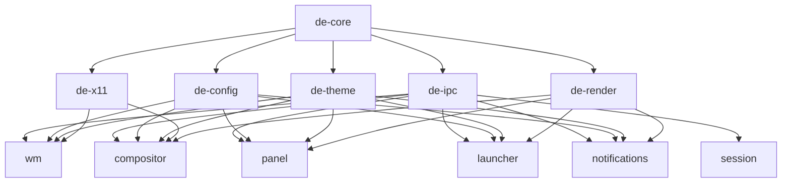

# Design Document: Rust Desktop Environment Ecosystem

## Overview

### Visão Geral do Sistema

Este documento especifica o design técnico completo de um ecossistema de Desktop Environment (DE) desenvolvido em Rust para Linux, otimizado para funcionar sem aceleração gráfica (acpi=off). O sistema é inspirado na filosofia de integração do macOS Sonoma, onde cada componente é projetado para trabalhar harmoniosamente com os demais, criando uma experiência coesa e fluida.

**Por que este projeto existe?**

A maioria dos DEs modernos (GNOME, KDE, etc.) assume disponibilidade de GPU e usa tecnologias como Vulkan/OpenGL. Para hardware sem aceleração gráfica ou ambientes virtualizados com acpi=off, essas soluções são inadequadas. Este projeto preenche essa lacuna oferecendo um DE completo, moderno e performático que funciona puramente com renderização CPU.

**Filosofia de Design:**

1. **Integração sobre Modularidade Extrema**: Enquanto mantemos separação clara de responsabilidades, priorizamos integração profunda entre componentes. Cada componente "conhece" os outros através de contratos bem definidos via IPC.

2. **Performance First**: Cada decisão de design considera o custo de CPU. Renderização é otimizada com dirty regions, SIMD, e multi-threading inteligente.

3. **Simplicidade Operacional**: O usuário não deve pensar sobre o sistema - ele simplesmente funciona. Configuração é opcional, defaults são sensatos.

4. **Aprendizado Contínuo**: Este design é didático. Cada seção explica não apenas O QUE fazer, mas POR QUÊ fazer dessa forma.

### Componentes Principais

O ecossistema é composto por 8 componentes principais que se comunicam via IPC:


```
┌─────────────────────────────────────────────────────────────┐
│                     Session Manager                          │
│  (Inicialização, monitoramento, crash recovery)             │
└────────────────────┬────────────────────────────────────────┘
                     │
                     ▼
         ┌───────────────────────┐
         │      IPC Bus          │
         │  (Unix Domain Socket) │
         └───────┬───────────────┘
                 │
    ┌────────────┼────────────┬──────────────┬──────────────┐
    ▼            ▼            ▼              ▼              ▼
┌────────┐  ┌─────────┐  ┌────────┐   ┌──────────┐  ┌──────────┐
│Window  │  │Compo-   │  │Panel   │   │Launcher  │  │Notif.    │
│Manager │  │sitor    │  │        │   │          │  │Manager   │
└───┬────┘  └────┬────┘  └───┬────┘   └────┬─────┘  └────┬─────┘
    │            │            │             │             │
    └────────────┴────────────┴─────────────┴─────────────┘
                              │
                 ┌────────────┴────────────┐
                 ▼                         ▼
         ┌──────────────┐          ┌─────────────┐
         │Config Manager│          │Theme Engine │
         └──────────────┘          └─────────────┘
                 │
                 ▼
         ┌──────────────┐
         │  X11 Backend │
         └──────────────┘
```

**1. Session Manager** - Orquestra inicialização, monitora saúde dos componentes, gerencia crash recovery
**2. Window Manager** - Gerencia posicionamento, tamanho, foco e workspaces das janelas
**3. Compositor** - Renderiza composição visual usando apenas CPU (tiny-skia)
**4. Panel** - Barra de sistema com status, menu, workspace indicator
**5. Launcher** - Lançador rápido de aplicações com fuzzy search
**6. Notification Manager** - Sistema de notificações compatível com freedesktop.org
**7. Config Manager** - Gerenciamento centralizado de configurações com hot-reload
**8. Theme Engine** - Sistema de temas para consistência visual

### Decisões Arquiteturais Fundamentais

**Por que múltiplos processos ao invés de threads?**

Optamos por arquitetura multi-processo (cada componente é um binário separado) ao invés de multi-thread por:

1. **Isolamento de Falhas**: Se o compositor crashar, o window manager continua funcionando
2. **Desenvolvimento Independente**: Cada componente pode ser desenvolvido, testado e deployado separadamente
3. **Debugging Simplificado**: Logs separados, profiling isolado, restart individual
4. **Segurança**: Cada processo pode ter permissões diferentes (princípio do menor privilégio)
5. **Rust Ownership**: Evita complexidade de Arc/Mutex compartilhado entre threads

**Trade-off**: Overhead de IPC vs robustez. Aceitamos ~1-2ms de latência IPC em troca de sistema mais robusto.

**Por que Unix Domain Sockets para IPC?**

Alternativas consideradas:
- **Shared Memory**: Mais rápido (~0.1ms), mas complexo e propenso a race conditions
- **D-Bus**: Padrão no Linux, mas overhead alto (~5-10ms) e complexidade desnecessária
- **Unix Sockets**: Sweet spot - latência baixa (~1ms), simples, confiável, type-safe com serde

**Por que TOML para configuração?**

Alternativas consideradas:
- **JSON**: Sem comentários, sintaxe verbosa
- **YAML**: Indentação frágil, parsing complexo, vulnerabilidades de segurança
- **RON**: Específico de Rust, menos familiar para usuários
- **TOML**: Legível, comentários nativos, parsing simples, amplamente adotado

**Por que tiny-skia para renderização?**

Alternativas consideradas:
- **Cairo**: Dependências pesadas, não otimizado para CPU puro
- **Skia (via skia-safe)**: Requer GPU ou software backend complexo
- **raqote**: Projeto menos maduro, menos features
- **tiny-skia**: Puro Rust, zero dependências unsafe, otimizado para CPU, SIMD nativo


## Architecture

### Arquitetura em Camadas (Clean Architecture + DDD)

O sistema segue Clean Architecture com Domain-Driven Design, organizado em 4 camadas concêntricas:

```
┌─────────────────────────────────────────────────────────────┐
│                    PRESENTATION LAYER                        │
│  (UI Components, Event Handlers, Rendering)                  │
│                                                              │
│  • Panel UI, Launcher UI, Window Decorations                │
│  • Event loops, Input handlers                              │
│  • Rendering pipelines (tiny-skia)                          │
└────────────────────┬────────────────────────────────────────┘
                     │ Depende de ↓
┌─────────────────────────────────────────────────────────────┐
│                   APPLICATION LAYER                          │
│  (Use Cases, Application Services, Orchestration)           │
│                                                              │
│  • Window Management Use Cases                              │
│  • Configuration Management Services                        │
│  • Notification Handling                                    │
└────────────────────┬────────────────────────────────────────┘
                     │ Depende de ↓
┌─────────────────────────────────────────────────────────────┐
│                     DOMAIN LAYER                             │
│  (Entities, Value Objects, Domain Logic)                    │
│                                                              │
│  • Window, Workspace, Theme (Entities)                      │
│  • Position, Size, Color (Value Objects)                    │
│  • Business Rules (window placement, focus management)      │
└────────────────────┬────────────────────────────────────────┘
                     │ Usado por ↑
┌─────────────────────────────────────────────────────────────┐
│                  INFRASTRUCTURE LAYER                        │
│  (External Interfaces, I/O, Persistence)                    │
│                                                              │
│  • X11 Backend (xcb)                                        │
│  • IPC Bus (Unix sockets)                                   │
│  • File System (config, logs)                               │
│  • Process Management                                       │
└─────────────────────────────────────────────────────────────┘
```

**Regra de Dependência (Dependency Rule):**

- Camadas externas dependem de camadas internas
- Camadas internas NUNCA dependem de camadas externas
- Domain Layer é 100% puro Rust, sem dependências externas
- Infrastructure implementa traits definidos no Domain

**Por que essa arquitetura?**

1. **Testabilidade**: Domain logic pode ser testado sem X11, sem IPC, sem filesystem
2. **Flexibilidade**: Podemos trocar X11 por Wayland mudando apenas Infrastructure
3. **Clareza**: Cada camada tem responsabilidade clara e bem definida
4. **Manutenibilidade**: Mudanças em UI não afetam business logic

### Estrutura de Cargo Workspace

```
rust-de-ecosystem/
├── Cargo.toml                    # Workspace root
├── Cargo.lock
├── README.md
├── LICENSE
├── .gitignore
│
├── crates/
│   ├── de-core/                  # Domain Layer (shared)
│   │   ├── Cargo.toml
│   │   └── src/
│   │       ├── lib.rs
│   │       ├── domain/
│   │       │   ├── mod.rs
│   │       │   ├── window.rs     # Window entity
│   │       │   ├── workspace.rs  # Workspace entity
│   │       │   ├── theme.rs      # Theme entity
│   │       │   ├── geometry.rs   # Position, Size, Rectangle (value objects)
│   │       │   └── events.rs     # Domain events
│   │       ├── ports/            # Interfaces (traits) para Infrastructure
│   │       │   ├── mod.rs
│   │       │   ├── window_system.rs
│   │       │   ├── renderer.rs
│   │       │   └── config.rs
│   │       └── error.rs          # Domain errors
│   │
│   ├── de-ipc/                   # IPC Bus (Infrastructure)
│   │   ├── Cargo.toml
│   │   └── src/
│   │       ├── lib.rs
│   │       ├── bus.rs            # IPC bus implementation
│   │       ├── protocol.rs       # Message protocol
│   │       ├── client.rs         # IPC client
│   │       └── server.rs         # IPC server
│   │
│   ├── de-config/                # Config Manager (Infrastructure + Application)
│   │   ├── Cargo.toml
│   │   └── src/
│   │       ├── lib.rs
│   │       ├── manager.rs        # Config management logic
│   │       ├── parser.rs         # TOML parsing
│   │       ├── schema.rs         # Validation schema
│   │       ├── watcher.rs        # File watching for hot-reload
│   │       └── defaults.rs       # Default configurations
│   │
│   ├── de-theme/                 # Theme Engine (Domain + Application)
│   │   ├── Cargo.toml
│   │   └── src/
│   │       ├── lib.rs
│   │       ├── theme.rs          # Theme definitions
│   │       ├── colors.rs         # Color system
│   │       ├── typography.rs     # Font system
│   │       ├── spacing.rs        # Spacing system
│   │       └── macos_sonoma.rs   # macOS Sonoma theme
│   │
│   ├── de-x11/                   # X11 Backend (Infrastructure)
│   │   ├── Cargo.toml
│   │   └── src/
│   │       ├── lib.rs
│   │       ├── connection.rs     # X11 connection management
│   │       ├── ewmh.rs           # EWMH implementation
│   │       ├── icccm.rs          # ICCCM implementation
│   │       ├── events.rs         # X11 event handling
│   │       └── atoms.rs          # X11 atoms management
│   │
│   ├── de-render/                # Software Renderer (Infrastructure)
│   │   ├── Cargo.toml
│   │   └── src/
│   │       ├── lib.rs
│   │       ├── renderer.rs       # Main renderer
│   │       ├── buffer.rs         # Framebuffer management
│   │       ├── primitives.rs     # Drawing primitives
│   │       ├── text.rs           # Text rendering
│   │       └── effects.rs        # Shadows, transparency
│   │
│   ├── wm/                       # Window Manager (Application + Presentation)
│   │   ├── Cargo.toml
│   │   └── src/
│   │       ├── main.rs
│   │       ├── manager.rs        # Core WM logic
│   │       ├── placement.rs      # Window placement strategies
│   │       ├── focus.rs          # Focus management
│   │       ├── workspace.rs      # Workspace management
│   │       ├── hotkeys.rs        # Hotkey handling
│   │       └── decorations.rs    # Window decorations
│   │
│   ├── compositor/               # Compositor (Application + Presentation)
│   │   ├── Cargo.toml
│   │   └── src/
│   │       ├── main.rs
│   │       ├── compositor.rs     # Core compositor logic
│   │       ├── scene.rs          # Scene graph
│   │       ├── damage.rs         # Damage tracking
│   │       └── vsync.rs          # VSync implementation
│   │
│   ├── panel/                    # System Panel (Application + Presentation)
│   │   ├── Cargo.toml
│   │   └── src/
│   │       ├── main.rs
│   │       ├── panel.rs          # Panel logic
│   │       ├── widgets/          # Panel widgets
│   │       │   ├── mod.rs
│   │       │   ├── clock.rs
│   │       │   ├── battery.rs
│   │       │   ├── network.rs
│   │       │   ├── volume.rs
│   │       │   └── workspace.rs
│   │       └── menu.rs           # Application menu
│   │
│   ├── launcher/                 # Application Launcher (Application + Presentation)
│   │   ├── Cargo.toml
│   │   └── src/
│   │       ├── main.rs
│   │       ├── launcher.rs       # Launcher logic
│   │       ├── indexer.rs        # Application indexing
│   │       ├── search.rs         # Fuzzy search
│   │       └── ui.rs             # Launcher UI
│   │
│   ├── notifications/            # Notification Manager (Application + Presentation)
│   │   ├── Cargo.toml
│   │   └── src/
│   │       ├── main.rs
│   │       ├── manager.rs        # Notification management
│   │       ├── dbus.rs           # D-Bus interface (freedesktop.org spec)
│   │       ├── history.rs        # Notification history
│   │       └── ui.rs             # Notification rendering
│   │
│   └── session/                  # Session Manager (Application)
│       ├── Cargo.toml
│       └── src/
│           ├── main.rs
│           ├── session.rs        # Session management
│           ├── startup.rs        # Component startup
│           ├── monitor.rs        # Health monitoring
│           └── recovery.rs       # Crash recovery
│
├── config/                       # Default configurations
│   ├── de.toml                   # Main DE config
│   ├── wm.toml                   # Window Manager config
│   ├── panel.toml                # Panel config
│   ├── launcher.toml             # Launcher config
│   └── themes/
│       ├── sonoma-light.toml
│       └── sonoma-dark.toml
│
├── assets/                       # Static assets
│   └── fonts/
│       └── SF-Pro.ttf            # San Francisco Pro (ou alternativa open source)
│
├── docs/                         # Documentation
│   ├── architecture.md
│   ├── user-guide.md
│   ├── developer-guide.md
│   └── configuration.md
│
└── scripts/                      # Build and installation scripts
    ├── build.sh
    ├── install.sh
    └── uninstall.sh
```

**Justificativa da Estrutura:**

1. **Cargo Workspace**: Permite compilação incremental, compartilhamento de dependências, e versionamento unificado
2. **Crates Separadas**: Cada componente principal é uma crate para isolamento e reusabilidade
3. **de-core como Foundation**: Contém domain logic compartilhado - todos os outros crates dependem dele
4. **Separação Infrastructure/Application**: de-ipc, de-x11, de-render são infrastructure pura; wm, compositor, panel são application+presentation

### Fluxo de Dados e Comunicação

**Exemplo: Usuário clica para mover janela**

```
1. X11 Backend recebe ButtonPress event
   ↓
2. X11 Backend envia via IPC: WindowEvent::ButtonPress { window_id, x, y }
   ↓
3. Window Manager recebe evento
   ↓
4. Window Manager consulta Domain: window.start_move(x, y)
   ↓
5. Window Manager envia via IPC: WindowMoveStarted { window_id }
   ↓
6. Compositor recebe notificação e prepara para redraws
   ↓
7. X11 Backend recebe MotionNotify events
   ↓
8. Window Manager atualiza posição: window.update_position(new_x, new_y)
   ↓
9. Window Manager envia via IPC: WindowMoved { window_id, x, y }
   ↓
10. Compositor renderiza janela na nova posição
```

**Latência Total Esperada**: ~5-8ms (1ms IPC × 3 hops + 2-5ms rendering)


## Components and Interfaces

### 1. Domain Layer (de-core)

**Responsabilidade**: Contém a lógica de negócio pura, entidades, value objects e regras do domínio.

#### Entities

**Window Entity**

```rust
// crates/de-core/src/domain/window.rs

use crate::domain::geometry::{Position, Size, Rectangle};

#[derive(Debug, Clone, PartialEq)]
pub struct WindowId(pub u32);

#[derive(Debug, Clone, PartialEq)]
pub enum WindowState {
    Normal,
    Maximized,
    Minimized,
    Fullscreen,
}

#[derive(Debug, Clone)]
pub struct Window {
    id: WindowId,
    title: String,
    geometry: Rectangle,
    state: WindowState,
    workspace_id: WorkspaceId,
    is_focused: bool,
    is_decorated: bool,
    min_size: Option<Size>,
    max_size: Option<Size>,
}

impl Window {
    pub fn new(id: WindowId, geometry: Rectangle) -> Self {
        Self {
            id,
            title: String::new(),
            geometry,
            state: WindowState::Normal,
            workspace_id: WorkspaceId(0),
            is_focused: false,
            is_decorated: true,
            min_size: None,
            max_size: None,
        }
    }

    // Domain logic: validação de resize
    pub fn resize(&mut self, new_size: Size) -> Result<(), WindowError> {
        if let Some(min) = self.min_size {
            if new_size.width < min.width || new_size.height < min.height {
                return Err(WindowError::SizeTooSmall);
            }
        }
        
        if let Some(max) = self.max_size {
            if new_size.width > max.width || new_size.height > max.height {
                return Err(WindowError::SizeTooLarge);
            }
        }
        
        self.geometry.size = new_size;
        Ok(())
    }

    // Domain logic: movimentação
    pub fn move_to(&mut self, position: Position) {
        self.geometry.position = position;
    }

    // Domain logic: maximização
    pub fn maximize(&mut self, screen_geometry: Rectangle) {
        if self.state == WindowState::Maximized {
            return; // Já maximizada
        }
        self.state = WindowState::Maximized;
        self.geometry = screen_geometry;
    }

    pub fn restore(&mut self, previous_geometry: Rectangle) {
        self.state = WindowState::Normal;
        self.geometry = previous_geometry;
    }
}
```

**Por que essa estrutura?**

- **Imutabilidade onde possível**: Métodos recebem `&mut self` apenas quando necessário
- **Validação no Domain**: Regras de negócio (min/max size) vivem aqui, não na UI
- **Sem dependências externas**: Window não conhece X11, IPC, ou rendering
- **Type-safe IDs**: WindowId é um newtype para evitar confusão com outros IDs

**Workspace Entity**

```rust
// crates/de-core/src/domain/workspace.rs

use crate::domain::window::{Window, WindowId};
use std::collections::HashMap;

#[derive(Debug, Clone, Copy, PartialEq, Eq, Hash)]
pub struct WorkspaceId(pub u32);

#[derive(Debug)]
pub struct Workspace {
    id: WorkspaceId,
    name: String,
    windows: HashMap<WindowId, Window>,
    focused_window: Option<WindowId>,
}

impl Workspace {
    pub fn new(id: WorkspaceId, name: String) -> Self {
        Self {
            id,
            name,
            windows: HashMap::new(),
            focused_window: None,
        }
    }

    pub fn add_window(&mut self, window: Window) {
        let window_id = window.id;
        self.windows.insert(window_id, window);
        
        // Se é a primeira janela, foca automaticamente
        if self.focused_window.is_none() {
            self.focused_window = Some(window_id);
        }
    }

    pub fn remove_window(&mut self, window_id: WindowId) -> Option<Window> {
        let window = self.windows.remove(&window_id);
        
        // Se removemos a janela focada, foca outra
        if self.focused_window == Some(window_id) {
            self.focused_window = self.windows.keys().next().copied();
        }
        
        window
    }

    pub fn focus_window(&mut self, window_id: WindowId) -> Result<(), WorkspaceError> {
        if !self.windows.contains_key(&window_id) {
            return Err(WorkspaceError::WindowNotFound);
        }
        
        // Remove foco da janela anterior
        if let Some(old_focused) = self.focused_window {
            if let Some(window) = self.windows.get_mut(&old_focused) {
                window.set_focused(false);
            }
        }
        
        // Adiciona foco na nova janela
        if let Some(window) = self.windows.get_mut(&window_id) {
            window.set_focused(true);
        }
        
        self.focused_window = Some(window_id);
        Ok(())
    }

    pub fn get_window(&self, window_id: WindowId) -> Option<&Window> {
        self.windows.get(&window_id)
    }

    pub fn get_window_mut(&mut self, window_id: WindowId) -> Option<&mut Window> {
        self.windows.get_mut(&window_id)
    }

    pub fn windows(&self) -> impl Iterator<Item = &Window> {
        self.windows.values()
    }
}
```

**Theme Entity**

```rust
// crates/de-core/src/domain/theme.rs

use serde::{Deserialize, Serialize};

#[derive(Debug, Clone, Serialize, Deserialize)]
pub struct Color {
    pub r: u8,
    pub g: u8,
    pub b: u8,
    pub a: u8,
}

impl Color {
    pub fn rgb(r: u8, g: u8, b: u8) -> Self {
        Self { r, g, b, a: 255 }
    }

    pub fn rgba(r: u8, g: u8, b: u8, a: u8) -> Self {
        Self { r, g, b, a }
    }
}

#[derive(Debug, Clone, Serialize, Deserialize)]
pub struct ColorScheme {
    pub background: Color,
    pub foreground: Color,
    pub accent: Color,
    pub border: Color,
    pub shadow: Color,
}

#[derive(Debug, Clone, Serialize, Deserialize)]
pub struct Typography {
    pub font_family: String,
    pub font_size: u32,
    pub line_height: f32,
}

#[derive(Debug, Clone, Serialize, Deserialize)]
pub struct Spacing {
    pub window_gap: u32,
    pub panel_padding: u32,
    pub border_width: u32,
}

#[derive(Debug, Clone, Serialize, Deserialize)]
pub struct Theme {
    pub name: String,
    pub colors: ColorScheme,
    pub typography: Typography,
    pub spacing: Spacing,
    pub window_decoration: WindowDecorationStyle,
}

#[derive(Debug, Clone, Serialize, Deserialize)]
pub struct WindowDecorationStyle {
    pub title_bar_height: u32,
    pub button_size: u32,
    pub button_spacing: u32,
    pub corner_radius: u32,
}
```

#### Value Objects

**Geometry Value Objects**

```rust
// crates/de-core/src/domain/geometry.rs

#[derive(Debug, Clone, Copy, PartialEq, Eq)]
pub struct Position {
    pub x: i32,
    pub y: i32,
}

impl Position {
    pub fn new(x: i32, y: i32) -> Self {
        Self { x, y }
    }

    pub fn origin() -> Self {
        Self { x: 0, y: 0 }
    }

    pub fn offset(&self, dx: i32, dy: i32) -> Self {
        Self {
            x: self.x + dx,
            y: self.y + dy,
        }
    }
}

#[derive(Debug, Clone, Copy, PartialEq, Eq)]
pub struct Size {
    pub width: u32,
    pub height: u32,
}

impl Size {
    pub fn new(width: u32, height: u32) -> Self {
        Self { width, height }
    }

    pub fn area(&self) -> u64 {
        self.width as u64 * self.height as u64
    }
}

#[derive(Debug, Clone, Copy, PartialEq, Eq)]
pub struct Rectangle {
    pub position: Position,
    pub size: Size,
}

impl Rectangle {
    pub fn new(position: Position, size: Size) -> Self {
        Self { position, size }
    }

    pub fn contains_point(&self, point: Position) -> bool {
        point.x >= self.position.x
            && point.x < self.position.x + self.size.width as i32
            && point.y >= self.position.y
            && point.y < self.position.y + self.size.height as i32
    }

    pub fn intersects(&self, other: &Rectangle) -> bool {
        !(self.position.x + self.size.width as i32 <= other.position.x
            || other.position.x + other.size.width as i32 <= self.position.x
            || self.position.y + self.size.height as i32 <= other.position.y
            || other.position.y + other.size.height as i32 <= self.position.y)
    }

    pub fn intersection(&self, other: &Rectangle) -> Option<Rectangle> {
        if !self.intersects(other) {
            return None;
        }

        let x1 = self.position.x.max(other.position.x);
        let y1 = self.position.y.max(other.position.y);
        let x2 = (self.position.x + self.size.width as i32)
            .min(other.position.x + other.size.width as i32);
        let y2 = (self.position.y + self.size.height as i32)
            .min(other.position.y + other.size.height as i32);

        Some(Rectangle::new(
            Position::new(x1, y1),
            Size::new((x2 - x1) as u32, (y2 - y1) as u32),
        ))
    }
}
```

**Por que Value Objects?**

- **Imutabilidade**: Position, Size, Rectangle são Copy - não há ownership complexo
- **Type Safety**: Não confundimos width com height, x com y
- **Domain Logic**: Métodos como `contains_point` e `intersects` são lógica de domínio
- **Performance**: Copy types são eficientes, sem heap allocation


#### Ports (Interfaces para Infrastructure)

```rust
// crates/de-core/src/ports/window_system.rs

use crate::domain::window::{Window, WindowId};
use crate::domain::geometry::Rectangle;
use async_trait::async_trait;

/// Trait que abstrai o sistema de janelas (X11, Wayland, etc.)
#[async_trait]
pub trait WindowSystem: Send + Sync {
    async fn create_window(&mut self, geometry: Rectangle) -> Result<WindowId, WindowSystemError>;
    async fn destroy_window(&mut self, window_id: WindowId) -> Result<(), WindowSystemError>;
    async fn move_window(&mut self, window_id: WindowId, position: Position) -> Result<(), WindowSystemError>;
    async fn resize_window(&mut self, window_id: WindowId, size: Size) -> Result<(), WindowSystemError>;
    async fn set_window_title(&mut self, window_id: WindowId, title: &str) -> Result<(), WindowSystemError>;
    async fn focus_window(&mut self, window_id: WindowId) -> Result<(), WindowSystemError>;
    async fn get_window_properties(&self, window_id: WindowId) -> Result<WindowProperties, WindowSystemError>;
}

// crates/de-core/src/ports/renderer.rs

/// Trait que abstrai o renderizador
pub trait Renderer: Send + Sync {
    fn begin_frame(&mut self);
    fn end_frame(&mut self);
    fn clear(&mut self, color: Color);
    fn draw_rectangle(&mut self, rect: Rectangle, color: Color);
    fn draw_text(&mut self, text: &str, position: Position, style: TextStyle);
    fn draw_window_decoration(&mut self, window: &Window, theme: &Theme);
    fn present(&mut self);
}

// crates/de-core/src/ports/config.rs

/// Trait que abstrai o sistema de configuração
pub trait ConfigProvider: Send + Sync {
    fn get<T: DeserializeOwned>(&self, key: &str) -> Result<T, ConfigError>;
    fn set<T: Serialize>(&mut self, key: &str, value: T) -> Result<(), ConfigError>;
    fn watch(&mut self, callback: Box<dyn Fn(&str) + Send>) -> Result<(), ConfigError>;
}
```

**Por que Traits (Ports)?**

- **Dependency Inversion**: Domain define interfaces, Infrastructure implementa
- **Testabilidade**: Podemos criar mocks para testes sem X11 real
- **Flexibilidade**: Trocar X11 por Wayland é só implementar o trait
- **async_trait**: Operações de I/O são naturalmente assíncronas

### 2. IPC Bus (de-ipc)

**Responsabilidade**: Comunicação inter-processos entre componentes.

#### Protocol Definition

```rust
// crates/de-ipc/src/protocol.rs

use serde::{Deserialize, Serialize};
use crate::domain::window::WindowId;
use crate::domain::geometry::{Position, Size};

#[derive(Debug, Clone, Serialize, Deserialize)]
pub enum Message {
    // Window Manager Messages
    WindowCreated { window_id: WindowId, geometry: Rectangle },
    WindowDestroyed { window_id: WindowId },
    WindowMoved { window_id: WindowId, position: Position },
    WindowResized { window_id: WindowId, size: Size },
    WindowFocused { window_id: WindowId },
    WindowUnfocused { window_id: WindowId },
    
    // Workspace Messages
    WorkspaceChanged { from: WorkspaceId, to: WorkspaceId },
    WindowMovedToWorkspace { window_id: WindowId, workspace_id: WorkspaceId },
    
    // Configuration Messages
    ConfigChanged { key: String, value: String },
    ThemeChanged { theme_name: String },
    
    // Notification Messages
    NotificationReceived { id: u32, summary: String, body: String, urgency: Urgency },
    NotificationClosed { id: u32 },
    
    // System Messages
    ComponentStarted { component: ComponentType },
    ComponentStopped { component: ComponentType },
    ComponentCrashed { component: ComponentType, error: String },
    Heartbeat { component: ComponentType, timestamp: u64 },
    
    // Request-Response Messages
    Request { id: u64, request: Request },
    Response { id: u64, response: Response },
}

#[derive(Debug, Clone, Serialize, Deserialize)]
pub enum Request {
    GetWindowList,
    GetWorkspaceList,
    GetConfig { key: String },
    LaunchApplication { command: String },
}

#[derive(Debug, Clone, Serialize, Deserialize)]
pub enum Response {
    WindowList { windows: Vec<WindowInfo> },
    WorkspaceList { workspaces: Vec<WorkspaceInfo> },
    Config { value: String },
    ApplicationLaunched { pid: u32 },
    Error { message: String },
}

#[derive(Debug, Clone, Copy, Serialize, Deserialize)]
pub enum ComponentType {
    SessionManager,
    WindowManager,
    Compositor,
    Panel,
    Launcher,
    NotificationManager,
    ConfigManager,
}
```

#### Bus Implementation

```rust
// crates/de-ipc/src/bus.rs

use tokio::net::{UnixListener, UnixStream};
use tokio::io::{AsyncReadExt, AsyncWriteExt};
use std::path::PathBuf;
use std::collections::HashMap;

pub struct IpcBus {
    socket_path: PathBuf,
    listener: UnixListener,
    clients: HashMap<ComponentType, UnixStream>,
    subscribers: HashMap<MessageType, Vec<ComponentType>>,
}

impl IpcBus {
    pub async fn new(socket_path: PathBuf) -> Result<Self, IpcError> {
        // Remove socket antigo se existir
        let _ = std::fs::remove_file(&socket_path);
        
        let listener = UnixListener::bind(&socket_path)?;
        
        Ok(Self {
            socket_path,
            listener,
            clients: HashMap::new(),
            subscribers: HashMap::new(),
        })
    }

    pub async fn accept_client(&mut self) -> Result<ComponentType, IpcError> {
        let (stream, _) = self.listener.accept().await?;
        
        // Primeiro mensagem deve ser identificação do componente
        let component_type = self.read_component_identification(&stream).await?;
        
        self.clients.insert(component_type, stream);
        Ok(component_type)
    }

    pub async fn send(&mut self, target: ComponentType, message: Message) -> Result<(), IpcError> {
        let stream = self.clients.get_mut(&target)
            .ok_or(IpcError::ComponentNotConnected)?;
        
        let serialized = bincode::serialize(&message)?;
        let len = serialized.len() as u32;
        
        // Protocolo: 4 bytes de tamanho + payload
        stream.write_all(&len.to_le_bytes()).await?;
        stream.write_all(&serialized).await?;
        stream.flush().await?;
        
        Ok(())
    }

    pub async fn broadcast(&mut self, message: Message) -> Result<(), IpcError> {
        let serialized = bincode::serialize(&message)?;
        let len = serialized.len() as u32;
        
        for stream in self.clients.values_mut() {
            stream.write_all(&len.to_le_bytes()).await?;
            stream.write_all(&serialized).await?;
            stream.flush().await?;
        }
        
        Ok(())
    }

    pub async fn receive(&mut self, from: ComponentType) -> Result<Message, IpcError> {
        let stream = self.clients.get_mut(&from)
            .ok_or(IpcError::ComponentNotConnected)?;
        
        // Lê tamanho da mensagem
        let mut len_bytes = [0u8; 4];
        stream.read_exact(&mut len_bytes).await?;
        let len = u32::from_le_bytes(len_bytes) as usize;
        
        // Lê payload
        let mut buffer = vec![0u8; len];
        stream.read_exact(&mut buffer).await?;
        
        let message = bincode::deserialize(&buffer)?;
        Ok(message)
    }

    pub fn subscribe(&mut self, component: ComponentType, message_type: MessageType) {
        self.subscribers.entry(message_type)
            .or_insert_with(Vec::new)
            .push(component);
    }
}
```

**Por que bincode para serialização?**

Alternativas consideradas:
- **JSON**: Legível, mas ~3x mais lento e ~2x maior
- **MessagePack**: Bom, mas bincode é mais rápido em Rust
- **Protocol Buffers**: Overhead de schema, complexidade desnecessária
- **bincode**: Mais rápido, menor overhead, integração nativa com serde

**Por que Unix Domain Sockets?**

- **Performance**: ~1ms latência vs ~5-10ms TCP localhost
- **Segurança**: Permissões de filesystem, não exposto na rede
- **Simplicidade**: Não precisa gerenciar portas, firewall, etc.

#### Client Implementation

```rust
// crates/de-ipc/src/client.rs

use tokio::net::UnixStream;
use tokio::io::{AsyncReadExt, AsyncWriteExt};

pub struct IpcClient {
    stream: UnixStream,
    component_type: ComponentType,
}

impl IpcClient {
    pub async fn connect(socket_path: &Path, component_type: ComponentType) -> Result<Self, IpcError> {
        let mut stream = UnixStream::connect(socket_path).await?;
        
        // Envia identificação do componente
        let identification = Message::ComponentStarted { component: component_type };
        Self::send_message(&mut stream, &identification).await?;
        
        Ok(Self {
            stream,
            component_type,
        })
    }

    pub async fn send(&mut self, message: Message) -> Result<(), IpcError> {
        Self::send_message(&mut self.stream, &message).await
    }

    pub async fn receive(&mut self) -> Result<Message, IpcError> {
        Self::receive_message(&mut self.stream).await
    }

    pub async fn request(&mut self, request: Request) -> Result<Response, IpcError> {
        let request_id = self.generate_request_id();
        let message = Message::Request { id: request_id, request };
        
        self.send(message).await?;
        
        // Aguarda resposta com mesmo ID
        loop {
            let message = self.receive().await?;
            if let Message::Response { id, response } = message {
                if id == request_id {
                    return Ok(response);
                }
            }
        }
    }

    async fn send_message(stream: &mut UnixStream, message: &Message) -> Result<(), IpcError> {
        let serialized = bincode::serialize(message)?;
        let len = serialized.len() as u32;
        
        stream.write_all(&len.to_le_bytes()).await?;
        stream.write_all(&serialized).await?;
        stream.flush().await?;
        
        Ok(())
    }

    async fn receive_message(stream: &mut UnixStream) -> Result<Message, IpcError> {
        let mut len_bytes = [0u8; 4];
        stream.read_exact(&mut len_bytes).await?;
        let len = u32::from_le_bytes(len_bytes) as usize;
        
        let mut buffer = vec![0u8; len];
        stream.read_exact(&mut buffer).await?;
        
        let message = bincode::deserialize(&buffer)?;
        Ok(message)
    }

    fn generate_request_id(&self) -> u64 {
        use std::sync::atomic::{AtomicU64, Ordering};
        static COUNTER: AtomicU64 = AtomicU64::new(0);
        COUNTER.fetch_add(1, Ordering::SeqCst)
    }
}
```

**Padrão de Uso:**

```rust
// No Window Manager
let mut ipc = IpcClient::connect("/tmp/de-ipc.sock", ComponentType::WindowManager).await?;

// Enviar evento
ipc.send(Message::WindowCreated {
    window_id: WindowId(123),
    geometry: Rectangle::new(Position::new(0, 0), Size::new(800, 600)),
}).await?;

// Request-Response
let response = ipc.request(Request::GetConfig {
    key: "window.border_width".to_string(),
}).await?;

if let Response::Config { value } = response {
    let border_width: u32 = value.parse()?;
}
```


### 3. X11 Backend (de-x11)

**Responsabilidade**: Integração com X11, implementação de EWMH/ICCCM, tradução de eventos.

#### Connection Management

```rust
// crates/de-x11/src/connection.rs

use xcb::{Connection, Xid};
use xcb::x;

pub struct X11Connection {
    conn: Connection,
    screen_num: i32,
    root: x::Window,
    atoms: AtomCache,
}

impl X11Connection {
    pub fn new() -> Result<Self, X11Error> {
        let (conn, screen_num) = Connection::connect(None)?;
        
        let setup = conn.get_setup();
        let screen = setup.roots().nth(screen_num as usize)
            .ok_or(X11Error::InvalidScreen)?;
        let root = screen.root();
        
        let atoms = AtomCache::new(&conn)?;
        
        Ok(Self {
            conn,
            screen_num,
            root,
            atoms,
        })
    }

    pub fn root_window(&self) -> x::Window {
        self.root
    }

    pub fn screen_geometry(&self) -> Result<Rectangle, X11Error> {
        let setup = self.conn.get_setup();
        let screen = setup.roots().nth(self.screen_num as usize)
            .ok_or(X11Error::InvalidScreen)?;
        
        Ok(Rectangle::new(
            Position::new(0, 0),
            Size::new(screen.width_in_pixels() as u32, screen.height_in_pixels() as u32),
        ))
    }

    pub fn flush(&self) -> Result<(), X11Error> {
        self.conn.flush()?;
        Ok(())
    }
}
```

**Por que xcb ao invés de xlib?**

Alternativas consideradas:
- **xlib (x11-rs)**: API antiga em C, não thread-safe, unsafe em Rust
- **xcb (rust-xcb)**: Binding moderno, thread-safe, API mais limpa
- **x11rb**: Puro Rust, mas menos maduro que xcb

Escolhemos **xcb** porque:
- Maduro e estável (usado por i3, awesome, etc.)
- Thread-safe por design
- Boa integração com async Rust
- Documentação completa

#### EWMH Implementation

```rust
// crates/de-x11/src/ewmh.rs

use xcb::x;

/// Extended Window Manager Hints - especificação freedesktop.org
pub struct Ewmh {
    conn: Arc<X11Connection>,
}

impl Ewmh {
    pub fn new(conn: Arc<X11Connection>) -> Self {
        Self { conn }
    }

    /// Anuncia suporte a EWMH
    pub fn set_supported(&self) -> Result<(), X11Error> {
        let atoms = &[
            self.conn.atoms._NET_SUPPORTED,
            self.conn.atoms._NET_CLIENT_LIST,
            self.conn.atoms._NET_NUMBER_OF_DESKTOPS,
            self.conn.atoms._NET_CURRENT_DESKTOP,
            self.conn.atoms._NET_ACTIVE_WINDOW,
            self.conn.atoms._NET_WM_NAME,
            self.conn.atoms._NET_WM_STATE,
            self.conn.atoms._NET_WM_STATE_MAXIMIZED_HORZ,
            self.conn.atoms._NET_WM_STATE_MAXIMIZED_VERT,
            self.conn.atoms._NET_WM_STATE_FULLSCREEN,
            self.conn.atoms._NET_WM_WINDOW_TYPE,
            self.conn.atoms._NET_WM_WINDOW_TYPE_NORMAL,
            self.conn.atoms._NET_WM_WINDOW_TYPE_DIALOG,
            self.conn.atoms._NET_WM_WINDOW_TYPE_DOCK,
        ];

        let root = self.conn.root_window();
        
        self.conn.conn.send_request(&x::ChangeProperty {
            mode: x::PropMode::Replace,
            window: root,
            property: self.conn.atoms._NET_SUPPORTED,
            r#type: x::ATOM_ATOM,
            data: atoms,
        });

        self.conn.flush()?;
        Ok(())
    }

    /// Define lista de clientes (janelas gerenciadas)
    pub fn set_client_list(&self, windows: &[x::Window]) -> Result<(), X11Error> {
        let root = self.conn.root_window();
        
        self.conn.conn.send_request(&x::ChangeProperty {
            mode: x::PropMode::Replace,
            window: root,
            property: self.conn.atoms._NET_CLIENT_LIST,
            r#type: x::ATOM_WINDOW,
            data: windows,
        });

        self.conn.flush()?;
        Ok(())
    }

    /// Define janela ativa
    pub fn set_active_window(&self, window: x::Window) -> Result<(), X11Error> {
        let root = self.conn.root_window();
        
        self.conn.conn.send_request(&x::ChangeProperty {
            mode: x::PropMode::Replace,
            window: root,
            property: self.conn.atoms._NET_ACTIVE_WINDOW,
            r#type: x::ATOM_WINDOW,
            data: &[window],
        });

        self.conn.flush()?;
        Ok(())
    }

    /// Define número de workspaces
    pub fn set_number_of_desktops(&self, count: u32) -> Result<(), X11Error> {
        let root = self.conn.root_window();
        
        self.conn.conn.send_request(&x::ChangeProperty {
            mode: x::PropMode::Replace,
            window: root,
            property: self.conn.atoms._NET_NUMBER_OF_DESKTOPS,
            r#type: x::ATOM_CARDINAL,
            data: &[count],
        });

        self.conn.flush()?;
        Ok(())
    }

    /// Define workspace atual
    pub fn set_current_desktop(&self, index: u32) -> Result<(), X11Error> {
        let root = self.conn.root_window();
        
        self.conn.conn.send_request(&x::ChangeProperty {
            mode: x::PropMode::Replace,
            window: root,
            property: self.conn.atoms._NET_CURRENT_DESKTOP,
            r#type: x::ATOM_CARDINAL,
            data: &[index],
        });

        self.conn.flush()?;
        Ok(())
    }

    /// Lê título da janela (_NET_WM_NAME)
    pub fn get_window_name(&self, window: x::Window) -> Result<String, X11Error> {
        let cookie = self.conn.conn.send_request(&x::GetProperty {
            delete: false,
            window,
            property: self.conn.atoms._NET_WM_NAME,
            r#type: self.conn.atoms.UTF8_STRING,
            long_offset: 0,
            long_length: 1024,
        });

        let reply = self.conn.conn.wait_for_reply(cookie)?;
        let value = reply.value::<u8>();
        
        Ok(String::from_utf8_lossy(value).to_string())
    }
}
```

**Por que implementar EWMH?**

EWMH (Extended Window Manager Hints) é o padrão de facto para WMs modernos. Sem ele:
- Aplicações não sabem qual janela está focada
- Panels não conseguem listar janelas
- Workspaces não funcionam corretamente
- Aplicações não conseguem se posicionar corretamente

**Atoms Cache**: X11 usa "atoms" (inteiros) para identificar propriedades. Cachear atoms evita round-trips desnecessários ao servidor X.


#### Event Loop

```rust
// crates/de-x11/src/events.rs

use xcb::Event;

pub struct X11EventLoop {
    conn: Arc<X11Connection>,
    event_handler: Box<dyn EventHandler>,
}

impl X11EventLoop {
    pub fn new(conn: Arc<X11Connection>, event_handler: Box<dyn EventHandler>) -> Self {
        Self { conn, event_handler }
    }

    pub async fn run(&mut self) -> Result<(), X11Error> {
        loop {
            // wait_for_event é blocking - rodamos em thread separada
            let event = tokio::task::spawn_blocking({
                let conn = self.conn.clone();
                move || conn.conn.wait_for_event()
            }).await??;

            self.handle_event(event).await?;
        }
    }

    async fn handle_event(&mut self, event: Event) -> Result<(), X11Error> {
        match event {
            Event::X(x::Event::MapRequest(e)) => {
                self.event_handler.on_map_request(e.window()).await?;
            }
            Event::X(x::Event::UnmapNotify(e)) => {
                self.event_handler.on_unmap_notify(e.window()).await?;
            }
            Event::X(x::Event::ConfigureRequest(e)) => {
                self.event_handler.on_configure_request(
                    e.window(),
                    Position::new(e.x() as i32, e.y() as i32),
                    Size::new(e.width() as u32, e.height() as u32),
                ).await?;
            }
            Event::X(x::Event::ButtonPress(e)) => {
                self.event_handler.on_button_press(
                    e.event(),
                    e.detail(),
                    Position::new(e.event_x() as i32, e.event_y() as i32),
                ).await?;
            }
            Event::X(x::Event::ButtonRelease(e)) => {
                self.event_handler.on_button_release(
                    e.event(),
                    e.detail(),
                ).await?;
            }
            Event::X(x::Event::MotionNotify(e)) => {
                self.event_handler.on_motion_notify(
                    e.event(),
                    Position::new(e.event_x() as i32, e.event_y() as i32),
                ).await?;
            }
            Event::X(x::Event::KeyPress(e)) => {
                self.event_handler.on_key_press(
                    e.detail(),
                    e.state(),
                ).await?;
            }
            Event::X(x::Event::EnterNotify(e)) => {
                self.event_handler.on_enter_notify(e.event()).await?;
            }
            Event::X(x::Event::LeaveNotify(e)) => {
                self.event_handler.on_leave_notify(e.event()).await?;
            }
            Event::X(x::Event::FocusIn(e)) => {
                self.event_handler.on_focus_in(e.event()).await?;
            }
            Event::X(x::Event::FocusOut(e)) => {
                self.event_handler.on_focus_out(e.event()).await?;
            }
            Event::X(x::Event::PropertyNotify(e)) => {
                self.event_handler.on_property_notify(
                    e.window(),
                    e.atom(),
                ).await?;
            }
            _ => {
                // Eventos não tratados são ignorados
            }
        }

        Ok(())
    }
}

#[async_trait]
pub trait EventHandler: Send {
    async fn on_map_request(&mut self, window: x::Window) -> Result<(), X11Error>;
    async fn on_unmap_notify(&mut self, window: x::Window) -> Result<(), X11Error>;
    async fn on_configure_request(&mut self, window: x::Window, position: Position, size: Size) -> Result<(), X11Error>;
    async fn on_button_press(&mut self, window: x::Window, button: u8, position: Position) -> Result<(), X11Error>;
    async fn on_button_release(&mut self, window: x::Window, button: u8) -> Result<(), X11Error>;
    async fn on_motion_notify(&mut self, window: x::Window, position: Position) -> Result<(), X11Error>;
    async fn on_key_press(&mut self, keycode: u8, modifiers: u16) -> Result<(), X11Error>;
    async fn on_enter_notify(&mut self, window: x::Window) -> Result<(), X11Error>;
    async fn on_leave_notify(&mut self, window: x::Window) -> Result<(), X11Error>;
    async fn on_focus_in(&mut self, window: x::Window) -> Result<(), X11Error>;
    async fn on_focus_out(&mut self, window: x::Window) -> Result<(), X11Error>;
    async fn on_property_notify(&mut self, window: x::Window, atom: x::Atom) -> Result<(), X11Error>;
}
```

**Por que trait EventHandler?**

- **Testabilidade**: Podemos criar mock handlers para testes
- **Separação de Concerns**: X11 backend não conhece Window Manager
- **Flexibilidade**: Diferentes componentes podem ter handlers diferentes

### 4. Software Renderer (de-render)

**Responsabilidade**: Renderização CPU-only usando tiny-skia, otimizada para performance.

#### Renderer Core

```rust
// crates/de-render/src/renderer.rs

use tiny_skia::{Pixmap, Paint, Transform, Color as SkiaColor, PathBuilder, Stroke, FillRule};
use crate::domain::geometry::{Rectangle, Position};
use crate::domain::theme::{Color, Theme};

pub struct SoftwareRenderer {
    pixmap: Pixmap,
    dirty_regions: Vec<Rectangle>,
    theme: Theme,
}

impl SoftwareRenderer {
    pub fn new(width: u32, height: u32, theme: Theme) -> Result<Self, RenderError> {
        let pixmap = Pixmap::new(width, height)
            .ok_or(RenderError::PixmapCreationFailed)?;
        
        Ok(Self {
            pixmap,
            dirty_regions: Vec::new(),
            theme,
        })
    }

    pub fn begin_frame(&mut self) {
        self.dirty_regions.clear();
    }

    pub fn end_frame(&mut self) {
        // Dirty regions são usadas para otimizar redraws
    }

    pub fn clear(&mut self, color: Color) {
        let skia_color = SkiaColor::from_rgba8(color.r, color.g, color.b, color.a);
        self.pixmap.fill(skia_color);
    }

    pub fn draw_rectangle(&mut self, rect: Rectangle, color: Color, corner_radius: f32) {
        let mut paint = Paint::default();
        paint.set_color_rgba8(color.r, color.g, color.b, color.a);
        paint.anti_alias = true;

        let path = if corner_radius > 0.0 {
            self.rounded_rect_path(rect, corner_radius)
        } else {
            self.rect_path(rect)
        };

        self.pixmap.fill_path(
            &path,
            &paint,
            FillRule::Winding,
            Transform::identity(),
            None,
        );

        self.mark_dirty(rect);
    }

    pub fn draw_rectangle_stroke(&mut self, rect: Rectangle, color: Color, stroke_width: f32, corner_radius: f32) {
        let mut paint = Paint::default();
        paint.set_color_rgba8(color.r, color.g, color.b, color.a);
        paint.anti_alias = true;

        let path = if corner_radius > 0.0 {
            self.rounded_rect_path(rect, corner_radius)
        } else {
            self.rect_path(rect)
        };

        let stroke = Stroke {
            width: stroke_width,
            ..Default::default()
        };

        self.pixmap.stroke_path(
            &path,
            &paint,
            &stroke,
            Transform::identity(),
            None,
        );

        self.mark_dirty(rect);
    }

    pub fn draw_shadow(&mut self, rect: Rectangle, blur_radius: f32, color: Color) {
        // Implementação simplificada de sombra
        // Para performance, usamos múltiplos retângulos com alpha decrescente
        
        let shadow_layers = 5;
        let alpha_step = color.a / shadow_layers;
        
        for i in 0..shadow_layers {
            let offset = (i + 1) as i32;
            let alpha = color.a - (alpha_step * i);
            
            let shadow_rect = Rectangle::new(
                Position::new(rect.position.x + offset, rect.position.y + offset),
                rect.size,
            );
            
            let shadow_color = Color::rgba(color.r, color.g, color.b, alpha);
            self.draw_rectangle(shadow_rect, shadow_color, 0.0);
        }
    }

    pub fn draw_text(&mut self, text: &str, position: Position, font_size: f32, color: Color) {
        // tiny-skia não tem text rendering nativo
        // Usamos rusttype para rasterizar texto
        use rusttype::{Font, Scale, point};

        let font_data = include_bytes!("../../assets/fonts/default.ttf");
        let font = Font::try_from_bytes(font_data)
            .ok_or(RenderError::FontLoadFailed)?;

        let scale = Scale::uniform(font_size);
        let v_metrics = font.v_metrics(scale);
        let glyphs: Vec<_> = font.layout(text, scale, point(0.0, v_metrics.ascent)).collect();

        for glyph in glyphs {
            if let Some(bounding_box) = glyph.pixel_bounding_box() {
                glyph.draw(|x, y, v| {
                    let px = position.x + bounding_box.min.x + x as i32;
                    let py = position.y + bounding_box.min.y + y as i32;
                    
                    if px >= 0 && py >= 0 && px < self.pixmap.width() as i32 && py < self.pixmap.height() as i32 {
                        let alpha = (v * 255.0) as u8;
                        let final_color = Color::rgba(color.r, color.g, color.b, alpha);
                        self.set_pixel(px as u32, py as u32, final_color);
                    }
                });
            }
        }
    }

    fn rect_path(&self, rect: Rectangle) -> tiny_skia::Path {
        let mut pb = PathBuilder::new();
        pb.move_to(rect.position.x as f32, rect.position.y as f32);
        pb.line_to((rect.position.x + rect.size.width as i32) as f32, rect.position.y as f32);
        pb.line_to((rect.position.x + rect.size.width as i32) as f32, (rect.position.y + rect.size.height as i32) as f32);
        pb.line_to(rect.position.x as f32, (rect.position.y + rect.size.height as i32) as f32);
        pb.close();
        pb.finish().unwrap()
    }

    fn rounded_rect_path(&self, rect: Rectangle, radius: f32) -> tiny_skia::Path {
        let mut pb = PathBuilder::new();
        let x = rect.position.x as f32;
        let y = rect.position.y as f32;
        let w = rect.size.width as f32;
        let h = rect.size.height as f32;
        let r = radius;

        pb.move_to(x + r, y);
        pb.line_to(x + w - r, y);
        pb.quad_to(x + w, y, x + w, y + r);
        pb.line_to(x + w, y + h - r);
        pb.quad_to(x + w, y + h, x + w - r, y + h);
        pb.line_to(x + r, y + h);
        pb.quad_to(x, y + h, x, y + h - r);
        pb.line_to(x, y + r);
        pb.quad_to(x, y, x + r, y);
        pb.close();
        
        pb.finish().unwrap()
    }

    fn mark_dirty(&mut self, rect: Rectangle) {
        self.dirty_regions.push(rect);
    }

    pub fn get_buffer(&self) -> &[u8] {
        self.pixmap.data()
    }

    pub fn dirty_regions(&self) -> &[Rectangle] {
        &self.dirty_regions
    }
}
```

**Por que rusttype para texto?**

Alternativas consideradas:
- **fontdue**: Mais rápido, mas menos features
- **ab_glyph**: Sucessor de rusttype, mas menos maduro
- **rusttype**: Maduro, bem testado, boa qualidade de rendering

**Otimizações de Performance:**

1. **Dirty Regions**: Só redesenhamos áreas que mudaram
2. **SIMD**: tiny-skia usa SIMD automaticamente para operações de pixel
3. **Anti-aliasing Seletivo**: Só onde necessário (bordas arredondadas, texto)
4. **Shadow Simplificado**: Múltiplas camadas ao invés de blur gaussiano (muito caro em CPU)


### 5. Window Manager (wm)

**Responsabilidade**: Gerenciamento de janelas, workspaces, foco, hotkeys.

#### Core Manager

```rust
// crates/wm/src/manager.rs

use de_core::domain::{Window, WindowId, Workspace, WorkspaceId};
use de_ipc::IpcClient;
use std::collections::HashMap;

pub struct WindowManager {
    workspaces: HashMap<WorkspaceId, Workspace>,
    current_workspace: WorkspaceId,
    window_to_workspace: HashMap<WindowId, WorkspaceId>,
    ipc: IpcClient,
    x11: Arc<X11Connection>,
    config: WmConfig,
}

impl WindowManager {
    pub async fn new(ipc: IpcClient, x11: Arc<X11Connection>, config: WmConfig) -> Result<Self, WmError> {
        let mut workspaces = HashMap::new();
        
        // Cria workspaces configurados
        for i in 0..config.workspace_count {
            let workspace = Workspace::new(
                WorkspaceId(i),
                format!("Workspace {}", i + 1),
            );
            workspaces.insert(WorkspaceId(i), workspace);
        }

        Ok(Self {
            workspaces,
            current_workspace: WorkspaceId(0),
            window_to_workspace: HashMap::new(),
            ipc,
            x11,
            config,
        })
    }

    pub async fn manage_window(&mut self, x11_window: x::Window) -> Result<(), WmError> {
        // Obtém geometria da janela do X11
        let geometry = self.x11.get_window_geometry(x11_window)?;
        
        // Cria entidade Window no domain
        let window_id = WindowId(x11_window.resource_id());
        let mut window = Window::new(window_id, geometry);
        
        // Aplica placement strategy
        let placed_geometry = self.place_window(&window);
        window.move_to(placed_geometry.position);
        
        // Adiciona ao workspace atual
        let workspace = self.workspaces.get_mut(&self.current_workspace)
            .ok_or(WmError::WorkspaceNotFound)?;
        workspace.add_window(window);
        
        self.window_to_workspace.insert(window_id, self.current_workspace);
        
        // Notifica outros componentes via IPC
        self.ipc.send(Message::WindowCreated {
            window_id,
            geometry: placed_geometry,
        }).await?;
        
        // Configura janela no X11
        self.x11.configure_window(x11_window, placed_geometry)?;
        self.x11.map_window(x11_window)?;
        
        Ok(())
    }

    pub async fn unmanage_window(&mut self, window_id: WindowId) -> Result<(), WmError> {
        let workspace_id = self.window_to_workspace.remove(&window_id)
            .ok_or(WmError::WindowNotFound)?;
        
        let workspace = self.workspaces.get_mut(&workspace_id)
            .ok_or(WmError::WorkspaceNotFound)?;
        
        workspace.remove_window(window_id);
        
        // Notifica via IPC
        self.ipc.send(Message::WindowDestroyed { window_id }).await?;
        
        Ok(())
    }

    pub async fn move_window(&mut self, window_id: WindowId, position: Position) -> Result<(), WmError> {
        let workspace_id = self.window_to_workspace.get(&window_id)
            .ok_or(WmError::WindowNotFound)?;
        
        let workspace = self.workspaces.get_mut(workspace_id)
            .ok_or(WmError::WorkspaceNotFound)?;
        
        let window = workspace.get_window_mut(window_id)
            .ok_or(WmError::WindowNotFound)?;
        
        window.move_to(position);
        
        // Atualiza X11
        let x11_window = x::Window::new(window_id.0);
        self.x11.move_window(x11_window, position)?;
        
        // Notifica via IPC
        self.ipc.send(Message::WindowMoved { window_id, position }).await?;
        
        Ok(())
    }

    pub async fn resize_window(&mut self, window_id: WindowId, size: Size) -> Result<(), WmError> {
        let workspace_id = self.window_to_workspace.get(&window_id)
            .ok_or(WmError::WindowNotFound)?;
        
        let workspace = self.workspaces.get_mut(workspace_id)
            .ok_or(WmError::WorkspaceNotFound)?;
        
        let window = workspace.get_window_mut(window_id)
            .ok_or(WmError::WindowNotFound)?;
        
        // Domain validation
        window.resize(size)?;
        
        // Atualiza X11
        let x11_window = x::Window::new(window_id.0);
        self.x11.resize_window(x11_window, size)?;
        
        // Notifica via IPC
        self.ipc.send(Message::WindowResized { window_id, size }).await?;
        
        Ok(())
    }

    pub async fn focus_window(&mut self, window_id: WindowId) -> Result<(), WmError> {
        let workspace_id = self.window_to_workspace.get(&window_id)
            .ok_or(WmError::WindowNotFound)?;
        
        let workspace = self.workspaces.get_mut(workspace_id)
            .ok_or(WmError::WorkspaceNotFound)?;
        
        // Domain logic para focus
        workspace.focus_window(window_id)?;
        
        // Atualiza X11
        let x11_window = x::Window::new(window_id.0);
        self.x11.set_input_focus(x11_window)?;
        
        // Atualiza EWMH
        self.x11.ewmh().set_active_window(x11_window)?;
        
        // Notifica via IPC
        self.ipc.send(Message::WindowFocused { window_id }).await?;
        
        Ok(())
    }

    pub async fn switch_workspace(&mut self, workspace_id: WorkspaceId) -> Result<(), WmError> {
        if workspace_id == self.current_workspace {
            return Ok(()); // Já estamos nesse workspace
        }

        let old_workspace_id = self.current_workspace;
        
        // Esconde janelas do workspace atual
        if let Some(workspace) = self.workspaces.get(&old_workspace_id) {
            for window in workspace.windows() {
                let x11_window = x::Window::new(window.id.0);
                self.x11.unmap_window(x11_window)?;
            }
        }
        
        // Mostra janelas do novo workspace
        if let Some(workspace) = self.workspaces.get(&workspace_id) {
            for window in workspace.windows() {
                let x11_window = x::Window::new(window.id.0);
                self.x11.map_window(x11_window)?;
            }
        }
        
        self.current_workspace = workspace_id;
        
        // Atualiza EWMH
        self.x11.ewmh().set_current_desktop(workspace_id.0)?;
        
        // Notifica via IPC
        self.ipc.send(Message::WorkspaceChanged {
            from: old_workspace_id,
            to: workspace_id,
        }).await?;
        
        Ok(())
    }

    fn place_window(&self, window: &Window) -> Rectangle {
        // Implementa placement strategy (center, smart, cascade, etc.)
        match self.config.placement_strategy {
            PlacementStrategy::Center => self.place_center(window),
            PlacementStrategy::Smart => self.place_smart(window),
            PlacementStrategy::Cascade => self.place_cascade(window),
        }
    }

    fn place_center(&self, window: &Window) -> Rectangle {
        let screen = self.x11.screen_geometry().unwrap();
        let x = (screen.size.width as i32 - window.geometry.size.width as i32) / 2;
        let y = (screen.size.height as i32 - window.geometry.size.height as i32) / 2;
        
        Rectangle::new(
            Position::new(x.max(0), y.max(0)),
            window.geometry.size,
        )
    }

    fn place_smart(&self, window: &Window) -> Rectangle {
        // Encontra posição com menos overlap
        let screen = self.x11.screen_geometry().unwrap();
        let workspace = self.workspaces.get(&self.current_workspace).unwrap();
        
        let mut best_position = Position::new(0, 0);
        let mut min_overlap = u64::MAX;
        
        // Tenta grid de posições
        for y in (0..screen.size.height).step_by(50) {
            for x in (0..screen.size.width).step_by(50) {
                let test_rect = Rectangle::new(
                    Position::new(x as i32, y as i32),
                    window.geometry.size,
                );
                
                let overlap = self.calculate_overlap(&test_rect, workspace);
                
                if overlap < min_overlap {
                    min_overlap = overlap;
                    best_position = test_rect.position;
                }
            }
        }
        
        Rectangle::new(best_position, window.geometry.size)
    }

    fn place_cascade(&self, window: &Window) -> Rectangle {
        let workspace = self.workspaces.get(&self.current_workspace).unwrap();
        let window_count = workspace.windows().count();
        
        let offset = (window_count * 30) as i32;
        
        Rectangle::new(
            Position::new(offset, offset),
            window.geometry.size,
        )
    }

    fn calculate_overlap(&self, rect: &Rectangle, workspace: &Workspace) -> u64 {
        let mut total_overlap = 0u64;
        
        for window in workspace.windows() {
            if let Some(intersection) = rect.intersection(&window.geometry) {
                total_overlap += intersection.size.area();
            }
        }
        
        total_overlap
    }
}
```

**Decisões de Design:**

1. **Placement Strategies**: Diferentes estratégias para diferentes workflows
   - **Center**: Simples, previsível, bom para dialogs
   - **Smart**: Minimiza overlap, bom para multitasking
   - **Cascade**: Visual, fácil de ver múltiplas janelas

2. **Workspace Switching**: Unmap/Map ao invés de mover offscreen
   - Mais eficiente em CPU
   - X11 não renderiza janelas unmapped
   - Compositor não precisa compor janelas invisíveis

3. **Focus Management**: Domain logic no Workspace entity
   - Garante invariante: apenas uma janela focada por workspace
   - Validação acontece no domain, não na UI


#### Hotkey Management

```rust
// crates/wm/src/hotkeys.rs

use std::collections::HashMap;

#[derive(Debug, Clone, Copy, PartialEq, Eq, Hash)]
pub struct Modifiers {
    pub ctrl: bool,
    pub alt: bool,
    pub shift: bool,
    pub super_key: bool,
}

impl Modifiers {
    pub fn from_x11(state: u16) -> Self {
        Self {
            ctrl: state & xcb::x::MOD_MASK_CONTROL.bits() != 0,
            alt: state & xcb::x::MOD_MASK_1.bits() != 0,
            shift: state & xcb::x::MOD_MASK_SHIFT.bits() != 0,
            super_key: state & xcb::x::MOD_MASK_4.bits() != 0,
        }
    }
}

#[derive(Debug, Clone, Copy, PartialEq, Eq, Hash)]
pub struct Hotkey {
    pub keycode: u8,
    pub modifiers: Modifiers,
}

#[derive(Debug, Clone)]
pub enum Action {
    CloseWindow,
    MaximizeWindow,
    MinimizeWindow,
    MoveWindowToWorkspace(WorkspaceId),
    SwitchToWorkspace(WorkspaceId),
    LaunchApplication(String),
    ToggleLauncher,
    Quit,
}

pub struct HotkeyManager {
    bindings: HashMap<Hotkey, Action>,
    x11: Arc<X11Connection>,
}

impl HotkeyManager {
    pub fn new(x11: Arc<X11Connection>) -> Self {
        Self {
            bindings: HashMap::new(),
            x11,
        }
    }

    pub fn register(&mut self, hotkey: Hotkey, action: Action) -> Result<(), HotkeyError> {
        // Verifica conflitos
        if self.bindings.contains_key(&hotkey) {
            return Err(HotkeyError::AlreadyBound);
        }

        // Registra no X11 (grab key)
        self.x11.grab_key(hotkey.keycode, hotkey.modifiers)?;
        
        self.bindings.insert(hotkey, action);
        Ok(())
    }

    pub fn unregister(&mut self, hotkey: &Hotkey) -> Result<(), HotkeyError> {
        self.bindings.remove(hotkey)
            .ok_or(HotkeyError::NotBound)?;
        
        self.x11.ungrab_key(hotkey.keycode, hotkey.modifiers)?;
        
        Ok(())
    }

    pub fn handle_key_press(&self, keycode: u8, modifiers: Modifiers) -> Option<Action> {
        let hotkey = Hotkey { keycode, modifiers };
        self.bindings.get(&hotkey).cloned()
    }

    pub fn load_from_config(&mut self, config: &HotkeyConfig) -> Result<(), HotkeyError> {
        for (key_combo, action_str) in &config.bindings {
            let hotkey = self.parse_key_combo(key_combo)?;
            let action = self.parse_action(action_str)?;
            self.register(hotkey, action)?;
        }
        Ok(())
    }

    fn parse_key_combo(&self, combo: &str) -> Result<Hotkey, HotkeyError> {
        // Exemplo: "Super+Shift+Return"
        let parts: Vec<&str> = combo.split('+').collect();
        
        let mut modifiers = Modifiers {
            ctrl: false,
            alt: false,
            shift: false,
            super_key: false,
        };
        
        let mut key = None;
        
        for part in parts {
            match part {
                "Ctrl" | "Control" => modifiers.ctrl = true,
                "Alt" => modifiers.alt = true,
                "Shift" => modifiers.shift = true,
                "Super" | "Mod4" => modifiers.super_key = true,
                k => key = Some(k),
            }
        }
        
        let key = key.ok_or(HotkeyError::InvalidKeyCombo)?;
        let keycode = self.keysym_to_keycode(key)?;
        
        Ok(Hotkey { keycode, modifiers })
    }

    fn parse_action(&self, action_str: &str) -> Result<Action, HotkeyError> {
        // Exemplo: "close_window", "switch_workspace:2", "launch:firefox"
        let parts: Vec<&str> = action_str.split(':').collect();
        
        match parts[0] {
            "close_window" => Ok(Action::CloseWindow),
            "maximize_window" => Ok(Action::MaximizeWindow),
            "minimize_window" => Ok(Action::MinimizeWindow),
            "switch_workspace" => {
                let id = parts.get(1)
                    .ok_or(HotkeyError::InvalidAction)?
                    .parse::<u32>()?;
                Ok(Action::SwitchToWorkspace(WorkspaceId(id)))
            }
            "move_to_workspace" => {
                let id = parts.get(1)
                    .ok_or(HotkeyError::InvalidAction)?
                    .parse::<u32>()?;
                Ok(Action::MoveWindowToWorkspace(WorkspaceId(id)))
            }
            "launch" => {
                let command = parts.get(1)
                    .ok_or(HotkeyError::InvalidAction)?
                    .to_string();
                Ok(Action::LaunchApplication(command))
            }
            "toggle_launcher" => Ok(Action::ToggleLauncher),
            "quit" => Ok(Action::Quit),
            _ => Err(HotkeyError::UnknownAction),
        }
    }

    fn keysym_to_keycode(&self, keysym_str: &str) -> Result<u8, HotkeyError> {
        // Usa xkbcommon para converter keysym string para keycode
        // Implementação simplificada aqui
        match keysym_str {
            "Return" => Ok(36),
            "Escape" => Ok(9),
            "Space" => Ok(65),
            // ... mais mapeamentos
            _ => Err(HotkeyError::UnknownKey),
        }
    }
}
```

**Por que esse design de hotkeys?**

1. **Type-safe**: Hotkey é um struct, não string parsing em runtime
2. **Validação Early**: Conflitos detectados no register, não no uso
3. **X11 Grab**: Registramos keys no X11 para receber eventos globalmente
4. **Configurável**: Parsing de config permite customização total

**Default Hotkeys (inspirado em macOS):**

```
Super+Q          -> close_window
Super+M          -> minimize_window
Super+F          -> maximize_window (fullscreen)
Super+1..9       -> switch_workspace:N
Super+Shift+1..9 -> move_to_workspace:N
Super+Space      -> toggle_launcher
Super+Tab        -> cycle_windows
Super+Shift+Q    -> quit
```

### 6. Compositor (compositor)

**Responsabilidade**: Composição visual, damage tracking, vsync.

#### Compositor Core

```rust
// crates/compositor/src/compositor.rs

use de_render::SoftwareRenderer;
use de_ipc::IpcClient;
use std::collections::HashMap;

pub struct Compositor {
    renderer: SoftwareRenderer,
    scene: SceneGraph,
    ipc: IpcClient,
    x11: Arc<X11Connection>,
    damage_tracker: DamageTracker,
    vsync: VSync,
}

impl Compositor {
    pub async fn new(
        ipc: IpcClient,
        x11: Arc<X11Connection>,
        theme: Theme,
    ) -> Result<Self, CompositorError> {
        let screen = x11.screen_geometry()?;
        let renderer = SoftwareRenderer::new(
            screen.size.width,
            screen.size.height,
            theme,
        )?;

        Ok(Self {
            renderer,
            scene: SceneGraph::new(),
            ipc,
            x11,
            damage_tracker: DamageTracker::new(),
            vsync: VSync::new()?,
        })
    }

    pub async fn run(&mut self) -> Result<(), CompositorError> {
        loop {
            // Aguarda próximo vsync
            self.vsync.wait().await?;
            
            // Processa mensagens IPC
            while let Ok(message) = self.ipc.try_receive() {
                self.handle_message(message).await?;
            }
            
            // Renderiza frame se há damage
            if self.damage_tracker.has_damage() {
                self.render_frame()?;
            }
        }
    }

    async fn handle_message(&mut self, message: Message) -> Result<(), CompositorError> {
        match message {
            Message::WindowCreated { window_id, geometry } => {
                self.scene.add_window(window_id, geometry);
                self.damage_tracker.mark_dirty(geometry);
            }
            Message::WindowDestroyed { window_id } => {
                if let Some(geometry) = self.scene.remove_window(window_id) {
                    self.damage_tracker.mark_dirty(geometry);
                }
            }
            Message::WindowMoved { window_id, position } => {
                if let Some(old_geometry) = self.scene.get_window_geometry(window_id) {
                    self.damage_tracker.mark_dirty(old_geometry);
                }
                self.scene.move_window(window_id, position);
                if let Some(new_geometry) = self.scene.get_window_geometry(window_id) {
                    self.damage_tracker.mark_dirty(new_geometry);
                }
            }
            Message::WindowResized { window_id, size } => {
                if let Some(old_geometry) = self.scene.get_window_geometry(window_id) {
                    self.damage_tracker.mark_dirty(old_geometry);
                }
                self.scene.resize_window(window_id, size);
                if let Some(new_geometry) = self.scene.get_window_geometry(window_id) {
                    self.damage_tracker.mark_dirty(new_geometry);
                }
            }
            Message::ThemeChanged { theme_name } => {
                // Recarrega tema e marca tudo como dirty
                let theme = self.load_theme(&theme_name)?;
                self.renderer.set_theme(theme);
                self.damage_tracker.mark_all_dirty();
            }
            _ => {}
        }
        
        Ok(())
    }

    fn render_frame(&mut self) -> Result<(), CompositorError> {
        self.renderer.begin_frame();
        
        // Limpa apenas regiões dirty
        for region in self.damage_tracker.dirty_regions() {
            self.renderer.clear_region(region, self.renderer.theme().colors.background);
        }
        
        // Renderiza scene graph em ordem de stacking
        for layer in self.scene.layers() {
            for window_node in layer.windows() {
                // Só renderiza se intersecta com dirty regions
                if self.damage_tracker.intersects_dirty(&window_node.geometry) {
                    self.render_window(window_node)?;
                }
            }
        }
        
        self.renderer.end_frame();
        
        // Copia buffer para X11
        self.present_to_x11()?;
        
        self.damage_tracker.clear();
        
        Ok(())
    }

    fn render_window(&mut self, window_node: &WindowNode) -> Result<(), CompositorError> {
        // Renderiza sombra
        if self.renderer.theme().window_decoration.shadow_enabled {
            self.renderer.draw_shadow(
                window_node.geometry,
                4.0,
                self.renderer.theme().colors.shadow,
            );
        }
        
        // Renderiza decoração
        if window_node.is_decorated {
            self.renderer.draw_window_decoration(
                &window_node.window,
                self.renderer.theme(),
            );
        }
        
        // Renderiza conteúdo da janela (obtido do X11)
        let pixmap = self.x11.get_window_pixmap(window_node.window.id)?;
        self.renderer.draw_pixmap(pixmap, window_node.content_geometry());
        
        Ok(())
    }

    fn present_to_x11(&mut self) -> Result<(), CompositorError> {
        // Copia framebuffer para root window do X11
        let buffer = self.renderer.get_buffer();
        self.x11.put_image(self.x11.root_window(), buffer)?;
        self.x11.flush()?;
        Ok(())
    }
}
```

**Por que Scene Graph?**

- **Stacking Order**: Mantém ordem Z das janelas
- **Culling**: Não renderiza janelas completamente cobertas
- **Dirty Tracking**: Sabe quais janelas precisam redraw

#### Damage Tracking

```rust
// crates/compositor/src/damage.rs

pub struct DamageTracker {
    dirty_regions: Vec<Rectangle>,
    full_damage: bool,
}

impl DamageTracker {
    pub fn new() -> Self {
        Self {
            dirty_regions: Vec::new(),
            full_damage: true, // Primeiro frame é full damage
        }
    }

    pub fn mark_dirty(&mut self, rect: Rectangle) {
        if self.full_damage {
            return; // Já está tudo dirty
        }

        // Tenta mesclar com regiões existentes
        for existing in &mut self.dirty_regions {
            if existing.intersects(&rect) {
                *existing = self.merge_rectangles(existing, &rect);
                return;
            }
        }

        self.dirty_regions.push(rect);
    }

    pub fn mark_all_dirty(&mut self) {
        self.full_damage = true;
        self.dirty_regions.clear();
    }

    pub fn has_damage(&self) -> bool {
        self.full_damage || !self.dirty_regions.is_empty()
    }

    pub fn dirty_regions(&self) -> &[Rectangle] {
        &self.dirty_regions
    }

    pub fn intersects_dirty(&self, rect: &Rectangle) -> bool {
        if self.full_damage {
            return true;
        }

        self.dirty_regions.iter().any(|r| r.intersects(rect))
    }

    pub fn clear(&mut self) {
        self.dirty_regions.clear();
        self.full_damage = false;
    }

    fn merge_rectangles(&self, a: &Rectangle, b: &Rectangle) -> Rectangle {
        let x1 = a.position.x.min(b.position.x);
        let y1 = a.position.y.min(b.position.y);
        let x2 = (a.position.x + a.size.width as i32).max(b.position.x + b.size.width as i32);
        let y2 = (a.position.y + a.size.height as i32).max(b.position.y + b.size.height as i32);

        Rectangle::new(
            Position::new(x1, y1),
            Size::new((x2 - x1) as u32, (y2 - y1) as u32),
        )
    }
}
```

**Por que Damage Tracking?**

Sem damage tracking, renderizaríamos a tela inteira a cada frame (~2ms em 1920x1080). Com damage tracking, renderizamos apenas o que mudou (~0.2ms para uma janela pequena). Isso é 10x mais rápido.

#### VSync Implementation

```rust
// crates/compositor/src/vsync.rs

use std::time::{Duration, Instant};

pub struct VSync {
    target_frame_time: Duration,
    last_frame: Instant,
}

impl VSync {
    pub fn new() -> Result<Self, VsyncError> {
        Ok(Self {
            target_frame_time: Duration::from_micros(16_667), // 60 FPS
            last_frame: Instant::now(),
        })
    }

    pub async fn wait(&mut self) -> Result<(), VsyncError> {
        let now = Instant::now();
        let elapsed = now.duration_since(self.last_frame);
        
        if elapsed < self.target_frame_time {
            let sleep_duration = self.target_frame_time - elapsed;
            tokio::time::sleep(sleep_duration).await;
        }
        
        self.last_frame = Instant::now();
        Ok(())
    }

    pub fn set_refresh_rate(&mut self, hz: u32) {
        self.target_frame_time = Duration::from_micros(1_000_000 / hz as u64);
    }
}
```

**Por que VSync em software?**

Sem VSync, renderizamos o mais rápido possível, causando:
- Screen tearing (parte da tela mostra frame antigo, parte mostra novo)
- CPU usage desnecessário (renderizar 1000 FPS não ajuda em monitor 60Hz)

Com VSync, sincronizamos com refresh rate do monitor (tipicamente 60Hz).

**Nota**: Em ambiente sem GPU, não temos hardware vsync. Usamos timer-based vsync (menos preciso, mas funcional).


### 7. System Panel (panel)

**Responsabilidade**: Barra de sistema com widgets, menu, workspace indicator.

#### Panel Core

```rust
// crates/panel/src/panel.rs

use de_render::SoftwareRenderer;
use de_ipc::IpcClient;

pub struct Panel {
    geometry: Rectangle,
    position: PanelPosition,
    widgets: Vec<Box<dyn Widget>>,
    renderer: SoftwareRenderer,
    ipc: IpcClient,
    theme: Theme,
}

#[derive(Debug, Clone, Copy)]
pub enum PanelPosition {
    Top,
    Bottom,
    Left,
    Right,
}

impl Panel {
    pub async fn new(
        position: PanelPosition,
        screen_geometry: Rectangle,
        ipc: IpcClient,
        theme: Theme,
    ) -> Result<Self, PanelError> {
        let geometry = Self::calculate_geometry(position, screen_geometry, &theme);
        
        let renderer = SoftwareRenderer::new(
            geometry.size.width,
            geometry.size.height,
            theme.clone(),
        )?;

        let mut panel = Self {
            geometry,
            position,
            widgets: Vec::new(),
            renderer,
            ipc,
            theme,
        };

        // Inicializa widgets padrão
        panel.add_widget(Box::new(WorkspaceWidget::new()));
        panel.add_widget(Box::new(WindowTitleWidget::new()));
        panel.add_widget(Box::new(ClockWidget::new()));
        panel.add_widget(Box::new(BatteryWidget::new()));
        panel.add_widget(Box::new(NetworkWidget::new()));
        panel.add_widget(Box::new(VolumeWidget::new()));

        Ok(panel)
    }

    fn calculate_geometry(position: PanelPosition, screen: Rectangle, theme: &Theme) -> Rectangle {
        let height = theme.panel.height;
        
        match position {
            PanelPosition::Top => Rectangle::new(
                Position::new(0, 0),
                Size::new(screen.size.width, height),
            ),
            PanelPosition::Bottom => Rectangle::new(
                Position::new(0, screen.size.height as i32 - height as i32),
                Size::new(screen.size.width, height),
            ),
            PanelPosition::Left => Rectangle::new(
                Position::new(0, 0),
                Size::new(height, screen.size.height),
            ),
            PanelPosition::Right => Rectangle::new(
                Position::new(screen.size.width as i32 - height as i32, 0),
                Size::new(height, screen.size.height),
            ),
        }
    }

    pub fn add_widget(&mut self, widget: Box<dyn Widget>) {
        self.widgets.push(widget);
    }

    pub async fn run(&mut self) -> Result<(), PanelError> {
        // Cria janela do panel no X11
        let panel_window = self.create_panel_window().await?;

        loop {
            // Aguarda eventos (IPC ou timer)
            tokio::select! {
                message = self.ipc.receive() => {
                    self.handle_message(message?).await?;
                }
                _ = tokio::time::sleep(Duration::from_millis(100)) => {
                    // Update periódico (clock, battery, etc.)
                    self.update_widgets().await?;
                }
            }

            // Renderiza se necessário
            if self.needs_redraw() {
                self.render()?;
                self.present_to_x11(panel_window)?;
            }
        }
    }

    async fn create_panel_window(&self) -> Result<x::Window, PanelError> {
        let window = self.x11.create_window(self.geometry)?;
        
        // Configura como dock (EWMH)
        self.x11.set_window_type(window, WindowType::Dock)?;
        
        // Reserva espaço na tela (strut)
        self.x11.set_strut(window, self.position, self.geometry.size.height)?;
        
        // Sempre no topo
        self.x11.set_window_above(window)?;
        
        self.x11.map_window(window)?;
        
        Ok(window)
    }

    async fn handle_message(&mut self, message: Message) -> Result<(), PanelError> {
        match message {
            Message::WindowFocused { window_id } => {
                // Atualiza widget de título da janela
                if let Some(widget) = self.find_widget_mut::<WindowTitleWidget>() {
                    widget.set_focused_window(window_id);
                }
            }
            Message::WorkspaceChanged { to, .. } => {
                // Atualiza widget de workspace
                if let Some(widget) = self.find_widget_mut::<WorkspaceWidget>() {
                    widget.set_current_workspace(to);
                }
            }
            Message::NotificationReceived { .. } => {
                // Mostra indicador de notificação
                // TODO: implementar
            }
            _ => {}
        }
        
        Ok(())
    }

    async fn update_widgets(&mut self) -> Result<(), PanelError> {
        for widget in &mut self.widgets {
            widget.update().await?;
        }
        Ok(())
    }

    fn render(&mut self) -> Result<(), PanelError> {
        self.renderer.begin_frame();
        
        // Background do panel
        self.renderer.clear(self.theme.panel.background);
        
        // Layout widgets
        let layout = self.calculate_layout();
        
        // Renderiza cada widget
        for (widget, rect) in self.widgets.iter().zip(layout.iter()) {
            widget.render(&mut self.renderer, *rect, &self.theme)?;
        }
        
        self.renderer.end_frame();
        Ok(())
    }

    fn calculate_layout(&self) -> Vec<Rectangle> {
        // Layout horizontal: left-aligned, center, right-aligned
        let mut layout = Vec::new();
        
        let left_widgets = self.widgets.iter().filter(|w| w.alignment() == Alignment::Left);
        let center_widgets = self.widgets.iter().filter(|w| w.alignment() == Alignment::Center);
        let right_widgets = self.widgets.iter().filter(|w| w.alignment() == Alignment::Right);
        
        let mut x = self.theme.panel.padding as i32;
        
        // Left-aligned widgets
        for widget in left_widgets {
            let width = widget.preferred_width(&self.theme);
            layout.push(Rectangle::new(
                Position::new(x, 0),
                Size::new(width, self.geometry.size.height),
            ));
            x += width as i32 + self.theme.panel.widget_spacing as i32;
        }
        
        // Center widgets (calculamos posição central)
        let center_total_width: u32 = center_widgets.clone()
            .map(|w| w.preferred_width(&self.theme))
            .sum();
        let center_start = (self.geometry.size.width as i32 - center_total_width as i32) / 2;
        x = center_start;
        
        for widget in center_widgets {
            let width = widget.preferred_width(&self.theme);
            layout.push(Rectangle::new(
                Position::new(x, 0),
                Size::new(width, self.geometry.size.height),
            ));
            x += width as i32 + self.theme.panel.widget_spacing as i32;
        }
        
        // Right-aligned widgets (começamos da direita)
        let right_total_width: u32 = right_widgets.clone()
            .map(|w| w.preferred_width(&self.theme))
            .sum();
        x = self.geometry.size.width as i32 - right_total_width as i32 - self.theme.panel.padding as i32;
        
        for widget in right_widgets {
            let width = widget.preferred_width(&self.theme);
            layout.push(Rectangle::new(
                Position::new(x, 0),
                Size::new(width, self.geometry.size.height),
            ));
            x += width as i32 + self.theme.panel.widget_spacing as i32;
        }
        
        layout
    }

    fn present_to_x11(&self, window: x::Window) -> Result<(), PanelError> {
        let buffer = self.renderer.get_buffer();
        self.x11.put_image(window, buffer)?;
        self.x11.flush()?;
        Ok(())
    }
}
```

#### Widget System

```rust
// crates/panel/src/widgets/mod.rs

use async_trait::async_trait;

#[derive(Debug, Clone, Copy, PartialEq, Eq)]
pub enum Alignment {
    Left,
    Center,
    Right,
}

#[async_trait]
pub trait Widget: Send {
    fn alignment(&self) -> Alignment;
    fn preferred_width(&self, theme: &Theme) -> u32;
    async fn update(&mut self) -> Result<(), WidgetError>;
    fn render(&self, renderer: &mut SoftwareRenderer, rect: Rectangle, theme: &Theme) -> Result<(), WidgetError>;
    fn handle_click(&mut self, position: Position) -> Result<(), WidgetError>;
}

// crates/panel/src/widgets/clock.rs

pub struct ClockWidget {
    current_time: String,
    alignment: Alignment,
}

impl ClockWidget {
    pub fn new() -> Self {
        Self {
            current_time: String::new(),
            alignment: Alignment::Right,
        }
    }
}

#[async_trait]
impl Widget for ClockWidget {
    fn alignment(&self) -> Alignment {
        self.alignment
    }

    fn preferred_width(&self, theme: &Theme) -> u32 {
        // Calcula largura baseado no texto "00:00 AM"
        let text_width = theme.typography.font_size * 8; // Aproximação
        text_width + theme.panel.widget_padding * 2
    }

    async fn update(&mut self) -> Result<(), WidgetError> {
        use chrono::Local;
        self.current_time = Local::now().format("%I:%M %p").to_string();
        Ok(())
    }

    fn render(&self, renderer: &mut SoftwareRenderer, rect: Rectangle, theme: &Theme) -> Result<(), WidgetError> {
        // Renderiza texto centralizado
        let text_position = Position::new(
            rect.position.x + theme.panel.widget_padding as i32,
            rect.position.y + (rect.size.height as i32 / 2),
        );
        
        renderer.draw_text(
            &self.current_time,
            text_position,
            theme.typography.font_size as f32,
            theme.colors.foreground,
        );
        
        Ok(())
    }

    fn handle_click(&mut self, _position: Position) -> Result<(), WidgetError> {
        // Clock não tem interação
        Ok(())
    }
}

// crates/panel/src/widgets/workspace.rs

pub struct WorkspaceWidget {
    current_workspace: WorkspaceId,
    workspace_count: u32,
    alignment: Alignment,
}

impl WorkspaceWidget {
    pub fn new() -> Self {
        Self {
            current_workspace: WorkspaceId(0),
            workspace_count: 4,
            alignment: Alignment::Left,
        }
    }

    pub fn set_current_workspace(&mut self, workspace_id: WorkspaceId) {
        self.current_workspace = workspace_id;
    }
}

#[async_trait]
impl Widget for WorkspaceWidget {
    fn alignment(&self) -> Alignment {
        self.alignment
    }

    fn preferred_width(&self, theme: &Theme) -> u32 {
        let indicator_size = theme.panel.workspace_indicator_size;
        let spacing = theme.panel.workspace_indicator_spacing;
        
        (indicator_size + spacing) * self.workspace_count + theme.panel.widget_padding * 2
    }

    async fn update(&mut self) -> Result<(), WidgetError> {
        // Workspace widget é atualizado via IPC messages
        Ok(())
    }

    fn render(&self, renderer: &mut SoftwareRenderer, rect: Rectangle, theme: &Theme) -> Result<(), WidgetError> {
        let indicator_size = theme.panel.workspace_indicator_size;
        let spacing = theme.panel.workspace_indicator_spacing;
        
        let mut x = rect.position.x + theme.panel.widget_padding as i32;
        let y = rect.position.y + (rect.size.height as i32 - indicator_size as i32) / 2;
        
        for i in 0..self.workspace_count {
            let is_current = WorkspaceId(i) == self.current_workspace;
            
            let color = if is_current {
                theme.colors.accent
            } else {
                theme.colors.foreground.with_alpha(100)
            };
            
            let indicator_rect = Rectangle::new(
                Position::new(x, y),
                Size::new(indicator_size, indicator_size),
            );
            
            renderer.draw_rectangle(indicator_rect, color, indicator_size as f32 / 2.0);
            
            x += (indicator_size + spacing) as i32;
        }
        
        Ok(())
    }

    fn handle_click(&mut self, position: Position) -> Result<(), WidgetError> {
        // Calcula qual workspace foi clicado
        // TODO: enviar mensagem IPC para trocar workspace
        Ok(())
    }
}
```

**Design de Widgets:**

- **Trait-based**: Cada widget implementa trait Widget
- **Self-contained**: Widget gerencia seu próprio estado
- **Async Update**: Widgets podem fazer I/O (ler battery, network, etc.)
- **Layout Flexível**: Alignment system permite posicionamento automático

### 8. Application Launcher (launcher)

**Responsabilidade**: Indexação de aplicações, fuzzy search, lançamento rápido.

#### Launcher Core

```rust
// crates/launcher/src/launcher.rs

use de_ipc::IpcClient;
use fuzzy_matcher::FuzzyMatcher;
use fuzzy_matcher::skim::SkimMatcherV2;

pub struct Launcher {
    applications: Vec<Application>,
    filtered: Vec<(Application, i64)>, // (app, score)
    query: String,
    selected_index: usize,
    matcher: SkimMatcherV2,
    ipc: IpcClient,
    visible: bool,
}

#[derive(Debug, Clone)]
pub struct Application {
    pub name: String,
    pub exec: String,
    pub icon: Option<String>,
    pub description: String,
    pub categories: Vec<String>,
    pub last_used: Option<SystemTime>,
}

impl Launcher {
    pub async fn new(ipc: IpcClient) -> Result<Self, LauncherError> {
        let mut launcher = Self {
            applications: Vec::new(),
            filtered: Vec::new(),
            query: String::new(),
            selected_index: 0,
            matcher: SkimMatcherV2::default(),
            ipc,
            visible: false,
        };

        launcher.index_applications().await?;
        
        Ok(launcher)
    }

    async fn index_applications(&mut self) -> Result<(), LauncherError> {
        let search_paths = vec![
            "/usr/share/applications",
            "/usr/local/share/applications",
            "~/.local/share/applications",
        ];

        for path in search_paths {
            let entries = std::fs::read_dir(path)?;
            
            for entry in entries {
                let entry = entry?;
                let path = entry.path();
                
                if path.extension().and_then(|s| s.to_str()) == Some("desktop") {
                    if let Ok(app) = self.parse_desktop_file(&path) {
                        self.applications.push(app);
                    }
                }
            }
        }

        // Ordena por nome
        self.applications.sort_by(|a, b| a.name.cmp(&b.name));
        
        Ok(())
    }

    fn parse_desktop_file(&self, path: &Path) -> Result<Application, LauncherError> {
        use ini::Ini;
        
        let conf = Ini::load_from_file(path)?;
        let section = conf.section(Some("Desktop Entry"))
            .ok_or(LauncherError::InvalidDesktopFile)?;
        
        let name = section.get("Name")
            .ok_or(LauncherError::MissingField("Name"))?
            .to_string();
        
        let exec = section.get("Exec")
            .ok_or(LauncherError::MissingField("Exec"))?
            .to_string();
        
        let icon = section.get("Icon").map(|s| s.to_string());
        let description = section.get("Comment").unwrap_or("").to_string();
        
        let categories = section.get("Categories")
            .map(|s| s.split(';').map(|c| c.to_string()).collect())
            .unwrap_or_default();

        Ok(Application {
            name,
            exec,
            icon,
            description,
            categories,
            last_used: None,
        })
    }

    pub fn set_query(&mut self, query: String) {
        self.query = query;
        self.update_filtered();
    }

    fn update_filtered(&mut self) {
        if self.query.is_empty() {
            // Sem query, mostra recentes primeiro
            self.filtered = self.applications.iter()
                .map(|app| (app.clone(), 0i64))
                .collect();
            
            self.filtered.sort_by(|a, b| {
                b.0.last_used.cmp(&a.0.last_used)
            });
        } else {
            // Com query, fuzzy match
            self.filtered = self.applications.iter()
                .filter_map(|app| {
                    self.matcher.fuzzy_match(&app.name, &self.query)
                        .map(|score| (app.clone(), score))
                })
                .collect();
            
            // Ordena por score (maior primeiro)
            self.filtered.sort_by(|a, b| b.1.cmp(&a.1));
        }
        
        self.selected_index = 0;
    }

    pub fn select_next(&mut self) {
        if !self.filtered.is_empty() {
            self.selected_index = (self.selected_index + 1) % self.filtered.len();
        }
    }

    pub fn select_previous(&mut self) {
        if !self.filtered.is_empty() {
            if self.selected_index == 0 {
                self.selected_index = self.filtered.len() - 1;
            } else {
                self.selected_index -= 1;
            }
        }
    }

    pub async fn launch_selected(&mut self) -> Result<(), LauncherError> {
        if let Some((app, _)) = self.filtered.get(self.selected_index) {
            self.launch_application(app).await?;
        }
        Ok(())
    }

    async fn launch_application(&mut self, app: &Application) -> Result<(), LauncherError> {
        // Parse exec string (remove %f, %F, %u, %U, etc.)
        let exec = self.parse_exec_string(&app.exec);
        
        // Lança processo
        tokio::process::Command::new("sh")
            .arg("-c")
            .arg(&exec)
            .spawn()?;
        
        // Atualiza last_used
        if let Some(app_mut) = self.applications.iter_mut().find(|a| a.name == app.name) {
            app_mut.last_used = Some(SystemTime::now());
        }
        
        // Esconde launcher
        self.visible = false;
        
        Ok(())
    }

    fn parse_exec_string(&self, exec: &str) -> String {
        // Remove field codes do .desktop spec
        exec.replace("%f", "")
            .replace("%F", "")
            .replace("%u", "")
            .replace("%U", "")
            .replace("%i", "")
            .replace("%c", "")
            .replace("%k", "")
            .trim()
            .to_string()
    }
}
```

**Por que fuzzy-matcher (skim)?**

Alternativas consideradas:
- **sublime_fuzzy**: Bom, mas menos features
- **nucleo**: Muito rápido, mas API complexa
- **skim**: Usado pelo skim (fuzzy finder), maduro, rápido o suficiente

**Indexação de Aplicações:**

- Lê .desktop files (padrão freedesktop.org)
- Cache em memória para startup rápido
- Re-indexa periodicamente (watch filesystem)

**Fuzzy Matching:**

- Score-based ranking
- Prioriza matches no início do nome
- Recentes aparecem primeiro quando sem query


### 9. Notification Manager (notifications)

**Responsabilidade**: Sistema de notificações compatível com freedesktop.org spec.

#### D-Bus Interface

```rust
// crates/notifications/src/dbus.rs

use zbus::{dbus_interface, ConnectionBuilder};
use std::collections::HashMap;

pub struct NotificationServer {
    notifications: HashMap<u32, Notification>,
    next_id: u32,
    ipc: IpcClient,
}

#[dbus_interface(name = "org.freedesktop.Notifications")]
impl NotificationServer {
    async fn get_capabilities(&self) -> Vec<String> {
        vec![
            "body".to_string(),
            "body-markup".to_string(),
            "actions".to_string(),
            "urgency".to_string(),
        ]
    }

    async fn notify(
        &mut self,
        app_name: String,
        replaces_id: u32,
        app_icon: String,
        summary: String,
        body: String,
        actions: Vec<String>,
        hints: HashMap<String, zbus::zvariant::Value<'_>>,
        expire_timeout: i32,
    ) -> u32 {
        let id = if replaces_id > 0 {
            replaces_id
        } else {
            self.next_id += 1;
            self.next_id
        };

        let urgency = hints.get("urgency")
            .and_then(|v| v.downcast_ref::<u8>())
            .map(|&u| match u {
                0 => Urgency::Low,
                1 => Urgency::Normal,
                2 => Urgency::Critical,
                _ => Urgency::Normal,
            })
            .unwrap_or(Urgency::Normal);

        let notification = Notification {
            id,
            app_name,
            app_icon,
            summary: summary.clone(),
            body: body.clone(),
            actions,
            urgency,
            expire_timeout,
            timestamp: SystemTime::now(),
        };

        self.notifications.insert(id, notification);

        // Envia via IPC para renderização
        let _ = self.ipc.send(Message::NotificationReceived {
            id,
            summary,
            body,
            urgency,
        }).await;

        id
    }

    async fn close_notification(&mut self, id: u32) {
        self.notifications.remove(&id);
        let _ = self.ipc.send(Message::NotificationClosed { id }).await;
    }

    async fn get_server_information(&self) -> (String, String, String, String) {
        (
            "Rust DE Notifications".to_string(),
            "rust-de".to_string(),
            "0.1.0".to_string(),
            "1.2".to_string(), // spec version
        )
    }
}

impl NotificationServer {
    pub async fn start(ipc: IpcClient) -> Result<(), NotificationError> {
        let server = Self {
            notifications: HashMap::new(),
            next_id: 0,
            ipc,
        };

        let _conn = ConnectionBuilder::session()?
            .name("org.freedesktop.Notifications")?
            .serve_at("/org/freedesktop/Notifications", server)?
            .build()
            .await?;

        // Mantém conexão viva
        std::future::pending::<()>().await;
        
        Ok(())
    }
}
```

**Por que D-Bus?**

- **Padrão**: Todas as aplicações Linux esperam D-Bus para notificações
- **Compatibilidade**: Funciona com notify-send, libnotify, etc.
- **zbus**: Binding Rust moderno, async, type-safe

#### Notification Rendering

```rust
// crates/notifications/src/ui.rs

pub struct NotificationUI {
    active_notifications: Vec<NotificationDisplay>,
    renderer: SoftwareRenderer,
    x11: Arc<X11Connection>,
    theme: Theme,
}

struct NotificationDisplay {
    notification: Notification,
    window: x::Window,
    geometry: Rectangle,
    animation_progress: f32,
}

impl NotificationUI {
    pub fn new(x11: Arc<X11Connection>, theme: Theme) -> Result<Self, NotificationError> {
        Ok(Self {
            active_notifications: Vec::new(),
            renderer: SoftwareRenderer::new(400, 100, theme.clone())?,
            x11,
            theme,
        })
    }

    pub async fn show_notification(&mut self, notification: Notification) -> Result<(), NotificationError> {
        // Calcula posição (canto superior direito, empilhado)
        let screen = self.x11.screen_geometry()?;
        let x = screen.size.width as i32 - 420; // 400px width + 20px margin
        let y = 20 + (self.active_notifications.len() as i32 * 120); // 100px height + 20px spacing

        let geometry = Rectangle::new(
            Position::new(x, y),
            Size::new(400, 100),
        );

        // Cria janela X11 para notificação
        let window = self.x11.create_window(geometry)?;
        self.x11.set_window_type(window, WindowType::Notification)?;
        self.x11.set_window_above(window)?;
        self.x11.map_window(window)?;

        let display = NotificationDisplay {
            notification,
            window,
            geometry,
            animation_progress: 0.0,
        };

        self.active_notifications.push(display);

        // Inicia animação de entrada
        self.animate_in(self.active_notifications.len() - 1).await?;

        // Agenda auto-dismiss
        if display.notification.expire_timeout > 0 {
            let timeout = Duration::from_millis(display.notification.expire_timeout as u64);
            tokio::spawn(async move {
                tokio::time::sleep(timeout).await;
                // TODO: enviar mensagem para fechar
            });
        }

        Ok(())
    }

    async fn animate_in(&mut self, index: usize) -> Result<(), NotificationError> {
        let steps = 20;
        let step_duration = Duration::from_millis(10); // 200ms total

        for i in 0..=steps {
            let progress = i as f32 / steps as f32;
            self.active_notifications[index].animation_progress = progress;
            
            self.render_notification(index)?;
            tokio::time::sleep(step_duration).await;
        }

        Ok(())
    }

    fn render_notification(&mut self, index: usize) -> Result<(), NotificationError> {
        let display = &self.active_notifications[index];
        let notif = &display.notification;
        
        self.renderer.begin_frame();
        
        // Background com transparência
        let bg_color = self.theme.notification.background.with_alpha(
            (255.0 * display.animation_progress) as u8
        );
        self.renderer.draw_rectangle(
            Rectangle::new(Position::new(0, 0), display.geometry.size),
            bg_color,
            self.theme.notification.corner_radius as f32,
        );
        
        // Border
        self.renderer.draw_rectangle_stroke(
            Rectangle::new(Position::new(0, 0), display.geometry.size),
            self.theme.notification.border_color,
            1.0,
            self.theme.notification.corner_radius as f32,
        );
        
        // Urgency indicator (barra colorida à esquerda)
        let urgency_color = match notif.urgency {
            Urgency::Low => self.theme.colors.foreground.with_alpha(100),
            Urgency::Normal => self.theme.colors.accent,
            Urgency::Critical => Color::rgb(255, 59, 48), // SF Red
        };
        
        self.renderer.draw_rectangle(
            Rectangle::new(Position::new(0, 0), Size::new(4, display.geometry.size.height)),
            urgency_color,
            0.0,
        );
        
        // Summary (título)
        self.renderer.draw_text(
            &notif.summary,
            Position::new(16, 20),
            self.theme.typography.font_size as f32 * 1.2,
            self.theme.colors.foreground,
        );
        
        // Body (descrição)
        self.renderer.draw_text(
            &notif.body,
            Position::new(16, 45),
            self.theme.typography.font_size as f32,
            self.theme.colors.foreground.with_alpha(180),
        );
        
        self.renderer.end_frame();
        
        // Apresenta no X11
        let buffer = self.renderer.get_buffer();
        self.x11.put_image(display.window, buffer)?;
        self.x11.flush()?;
        
        Ok(())
    }

    pub async fn close_notification(&mut self, id: u32) -> Result<(), NotificationError> {
        if let Some(index) = self.active_notifications.iter().position(|d| d.notification.id == id) {
            // Anima saída
            self.animate_out(index).await?;
            
            // Remove
            let display = self.active_notifications.remove(index);
            self.x11.destroy_window(display.window)?;
            
            // Reposiciona notificações restantes
            self.reposition_notifications().await?;
        }
        
        Ok(())
    }

    async fn reposition_notifications(&mut self) -> Result<(), NotificationError> {
        for (i, display) in self.active_notifications.iter_mut().enumerate() {
            let new_y = 20 + (i as i32 * 120);
            let new_position = Position::new(display.geometry.position.x, new_y);
            
            display.geometry.position = new_position;
            self.x11.move_window(display.window, new_position)?;
        }
        
        Ok(())
    }
}
```

**Design de Notificações (macOS Sonoma):**

- **Posição**: Canto superior direito
- **Tamanho**: 400x100px (fixo)
- **Animação**: Slide in from right (200ms, ease-out)
- **Urgency Indicator**: Barra colorida à esquerda (4px)
- **Auto-dismiss**: 5s para normal, 10s para critical, nunca para critical com ação
- **Stacking**: Empilha verticalmente com 20px spacing


### 10. Config Manager (de-config)

**Responsabilidade**: Gerenciamento centralizado de configurações, hot-reload, validação.

#### Config Manager Core

```rust
// crates/de-config/src/manager.rs

use serde::{Deserialize, Serialize};
use std::collections::HashMap;
use std::path::PathBuf;
use notify::{Watcher, RecursiveMode, Event};

pub struct ConfigManager {
    config_dir: PathBuf,
    configs: HashMap<String, toml::Value>,
    watchers: Vec<notify::RecommendedWatcher>,
    ipc: IpcClient,
}

impl ConfigManager {
    pub async fn new(config_dir: PathBuf, ipc: IpcClient) -> Result<Self, ConfigError> {
        let mut manager = Self {
            config_dir,
            configs: HashMap::new(),
            watchers: Vec::new(),
            ipc,
        };

        manager.load_all_configs().await?;
        manager.setup_watchers().await?;

        Ok(manager)
    }

    async fn load_all_configs(&mut self) -> Result<(), ConfigError> {
        let config_files = vec![
            "de.toml",
            "wm.toml",
            "panel.toml",
            "launcher.toml",
            "notifications.toml",
        ];

        for file in config_files {
            let path = self.config_dir.join(file);
            if path.exists() {
                self.load_config(&path).await?;
            } else {
                // Cria config padrão
                self.create_default_config(&path).await?;
            }
        }

        Ok(())
    }

    async fn load_config(&mut self, path: &Path) -> Result<(), ConfigError> {
        let content = tokio::fs::read_to_string(path).await?;
        let value: toml::Value = toml::from_str(&content)
            .map_err(|e| ConfigError::ParseError {
                file: path.to_path_buf(),
                line: e.line_col().map(|(l, _)| l),
                message: e.to_string(),
            })?;

        // Valida schema
        self.validate_config(path, &value)?;

        let key = path.file_stem()
            .and_then(|s| s.to_str())
            .ok_or(ConfigError::InvalidPath)?
            .to_string();

        self.configs.insert(key, value);

        Ok(())
    }

    fn validate_config(&self, path: &Path, value: &toml::Value) -> Result<(), ConfigError> {
        // Carrega schema para este tipo de config
        let schema = self.get_schema(path)?;
        
        // Valida usando jsonschema (convertendo TOML -> JSON)
        let json_value = self.toml_to_json(value);
        
        if let Err(errors) = schema.validate(&json_value) {
            let error_messages: Vec<String> = errors
                .map(|e| format!("{}: {}", e.instance_path, e))
                .collect();
            
            return Err(ConfigError::ValidationError {
                file: path.to_path_buf(),
                errors: error_messages,
            });
        }

        Ok(())
    }

    async fn setup_watchers(&mut self) -> Result<(), ConfigError> {
        let (tx, mut rx) = tokio::sync::mpsc::channel(100);

        let mut watcher = notify::recommended_watcher(move |res: Result<Event, _>| {
            if let Ok(event) = res {
                let _ = tx.blocking_send(event);
            }
        })?;

        watcher.watch(&self.config_dir, RecursiveMode::NonRecursive)?;
        self.watchers.push(watcher);

        // Spawn task para processar eventos de filesystem
        let ipc = self.ipc.clone();
        let config_dir = self.config_dir.clone();
        
        tokio::spawn(async move {
            while let Some(event) = rx.recv().await {
                if let notify::EventKind::Modify(_) = event.kind {
                    for path in event.paths {
                        if path.extension().and_then(|s| s.to_str()) == Some("toml") {
                            // Recarrega config
                            // TODO: implementar reload
                            
                            // Notifica componentes
                            let key = path.file_stem()
                                .and_then(|s| s.to_str())
                                .unwrap_or("")
                                .to_string();
                            
                            let _ = ipc.send(Message::ConfigChanged {
                                key,
                                value: String::new(), // TODO: valor real
                            }).await;
                        }
                    }
                }
            }
        });

        Ok(())
    }

    pub fn get<T: DeserializeOwned>(&self, key: &str) -> Result<T, ConfigError> {
        // key format: "wm.workspace_count" ou "panel.position"
        let parts: Vec<&str> = key.split('.').collect();
        
        if parts.is_empty() {
            return Err(ConfigError::InvalidKey);
        }

        let config_name = parts[0];
        let config = self.configs.get(config_name)
            .ok_or(ConfigError::ConfigNotFound)?;

        // Navega pela estrutura TOML
        let mut current = config;
        for part in &parts[1..] {
            current = current.get(part)
                .ok_or(ConfigError::KeyNotFound)?;
        }

        let value: T = current.clone().try_into()
            .map_err(|_| ConfigError::TypeMismatch)?;

        Ok(value)
    }

    pub async fn set<T: Serialize>(&mut self, key: &str, value: T) -> Result<(), ConfigError> {
        let parts: Vec<&str> = key.split('.').collect();
        
        if parts.is_empty() {
            return Err(ConfigError::InvalidKey);
        }

        let config_name = parts[0];
        let config = self.configs.get_mut(config_name)
            .ok_or(ConfigError::ConfigNotFound)?;

        // Atualiza valor na estrutura TOML
        let mut current = config;
        for part in &parts[1..parts.len()-1] {
            current = current.get_mut(part)
                .ok_or(ConfigError::KeyNotFound)?;
        }

        let last_key = parts[parts.len() - 1];
        let value_toml = toml::Value::try_from(value)
            .map_err(|_| ConfigError::SerializationError)?;
        
        current.as_table_mut()
            .ok_or(ConfigError::InvalidStructure)?
            .insert(last_key.to_string(), value_toml);

        // Persiste no disco
        self.save_config(config_name).await?;

        // Notifica componentes
        self.ipc.send(Message::ConfigChanged {
            key: key.to_string(),
            value: String::new(), // TODO: serializar valor
        }).await?;

        Ok(())
    }

    async fn save_config(&self, config_name: &str) -> Result<(), ConfigError> {
        let config = self.configs.get(config_name)
            .ok_or(ConfigError::ConfigNotFound)?;

        let content = toml::to_string_pretty(config)?;
        let path = self.config_dir.join(format!("{}.toml", config_name));

        tokio::fs::write(path, content).await?;

        Ok(())
    }

    async fn create_default_config(&mut self, path: &Path) -> Result<(), ConfigError> {
        let defaults = match path.file_stem().and_then(|s| s.to_str()) {
            Some("de") => Self::default_de_config(),
            Some("wm") => Self::default_wm_config(),
            Some("panel") => Self::default_panel_config(),
            Some("launcher") => Self::default_launcher_config(),
            Some("notifications") => Self::default_notifications_config(),
            _ => return Err(ConfigError::UnknownConfigType),
        };

        tokio::fs::write(path, defaults).await?;
        self.load_config(path).await?;

        Ok(())
    }

    fn default_wm_config() -> &'static str {
        r#"
# Window Manager Configuration

[general]
workspace_count = 4
border_width = 1
window_gap = 8
focus_follows_mouse = false

[placement]
strategy = "smart"  # Options: center, smart, cascade

[hotkeys]
close_window = "Super+Q"
maximize_window = "Super+F"
minimize_window = "Super+M"
toggle_launcher = "Super+Space"
switch_workspace_1 = "Super+1"
switch_workspace_2 = "Super+2"
switch_workspace_3 = "Super+3"
switch_workspace_4 = "Super+4"
move_to_workspace_1 = "Super+Shift+1"
move_to_workspace_2 = "Super+Shift+2"
move_to_workspace_3 = "Super+Shift+3"
move_to_workspace_4 = "Super+Shift+4"
quit = "Super+Shift+Q"
"#
    }

    fn default_panel_config() -> &'static str {
        r#"
# Panel Configuration

[general]
position = "top"  # Options: top, bottom, left, right
height = 32
background_opacity = 0.95

[widgets]
# Left side
left = ["workspaces", "window_title"]

# Center
center = []

# Right side
right = ["volume", "network", "battery", "clock"]

[workspaces]
indicator_size = 8
indicator_spacing = 8

[clock]
format = "%I:%M %p"  # 12-hour format
show_date_on_click = true
"#
    }

    fn default_launcher_config() -> &'static str {
        r#"
# Launcher Configuration

[general]
max_results = 10
show_descriptions = true
show_icons = true

[search]
fuzzy_matching = true
search_in_description = true
prioritize_recent = true

[appearance]
width = 600
height = 400
position = "center"  # Options: center, top, bottom
"#
    }
}
```

**Por que TOML?**

- **Legível**: Humanos podem editar facilmente
- **Comentários**: Documentação inline
- **Type-safe**: serde garante tipos corretos
- **Hierárquico**: Estrutura natural para configs complexas

**Hot-reload:**

- notify crate monitora filesystem
- Recarrega automaticamente quando arquivo muda
- Valida antes de aplicar (não quebra sistema com config inválida)
- Notifica componentes via IPC


### 11. Theme Engine (de-theme)

**Responsabilidade**: Sistema de temas, cores, tipografia, spacing.

#### macOS Sonoma Theme Specification

```rust
// crates/de-theme/src/macos_sonoma.rs

use crate::theme::*;

pub fn sonoma_light() -> Theme {
    Theme {
        name: "macOS Sonoma Light".to_string(),
        colors: ColorScheme {
            // System Colors (macOS Sonoma)
            background: Color::rgb(246, 246, 246),        // System background
            foreground: Color::rgb(0, 0, 0),              // Label color
            accent: Color::rgb(0, 122, 255),              // System blue
            border: Color::rgb(200, 200, 200),            // Separator color
            shadow: Color::rgba(0, 0, 0, 30),             // Shadow color
            
            // Window Colors
            window_background: Color::rgb(255, 255, 255),
            window_border: Color::rgb(200, 200, 200),
            window_title_active: Color::rgb(0, 0, 0),
            window_title_inactive: Color::rgb(142, 142, 147),
            
            // Traffic Light Colors (window buttons)
            traffic_light_close: Color::rgb(255, 95, 86),
            traffic_light_minimize: Color::rgb(255, 189, 46),
            traffic_light_maximize: Color::rgb(40, 205, 65),
            traffic_light_hover_overlay: Color::rgba(0, 0, 0, 10),
            
            // Panel Colors
            panel_background: Color::rgba(246, 246, 246, 242), // 95% opacity
            panel_foreground: Color::rgb(0, 0, 0),
            
            // Notification Colors
            notification_background: Color::rgba(255, 255, 255, 250),
            notification_border: Color::rgba(0, 0, 0, 10),
        },
        typography: Typography {
            font_family: "SF Pro Text".to_string(), // Fallback: "Inter", "Roboto"
            font_size: 13,
            line_height: 1.4,
            title_font_size: 13,
            title_font_weight: 600,
        },
        spacing: Spacing {
            window_gap: 8,
            panel_padding: 8,
            panel_widget_spacing: 12,
            border_width: 1,
            corner_radius: 10,
        },
        window_decoration: WindowDecorationStyle {
            title_bar_height: 28,
            traffic_light_size: 12,
            traffic_light_spacing: 8,
            traffic_light_margin_left: 8,
            traffic_light_margin_top: 8,
            corner_radius: 10,
            shadow_enabled: true,
            shadow_blur: 20,
            shadow_offset_y: 4,
        },
        panel: PanelStyle {
            height: 32,
            background_opacity: 0.95,
            workspace_indicator_size: 8,
            workspace_indicator_spacing: 8,
            widget_padding: 8,
        },
        notification: NotificationStyle {
            width: 400,
            height: 100,
            corner_radius: 10,
            urgency_indicator_width: 4,
            animation_duration_ms: 200,
        },
    }
}

pub fn sonoma_dark() -> Theme {
    Theme {
        name: "macOS Sonoma Dark".to_string(),
        colors: ColorScheme {
            // System Colors (macOS Sonoma Dark)
            background: Color::rgb(30, 30, 30),
            foreground: Color::rgb(255, 255, 255),
            accent: Color::rgb(10, 132, 255),
            border: Color::rgb(60, 60, 60),
            shadow: Color::rgba(0, 0, 0, 60),
            
            window_background: Color::rgb(40, 40, 40),
            window_border: Color::rgb(60, 60, 60),
            window_title_active: Color::rgb(255, 255, 255),
            window_title_inactive: Color::rgb(142, 142, 147),
            
            // Traffic lights são iguais em dark mode
            traffic_light_close: Color::rgb(255, 95, 86),
            traffic_light_minimize: Color::rgb(255, 189, 46),
            traffic_light_maximize: Color::rgb(40, 205, 65),
            traffic_light_hover_overlay: Color::rgba(255, 255, 255, 10),
            
            panel_background: Color::rgba(30, 30, 30, 242),
            panel_foreground: Color::rgb(255, 255, 255),
            
            notification_background: Color::rgba(50, 50, 50, 250),
            notification_border: Color::rgba(255, 255, 255, 10),
        },
        typography: Typography {
            font_family: "SF Pro Text".to_string(),
            font_size: 13,
            line_height: 1.4,
            title_font_size: 13,
            title_font_weight: 600,
        },
        spacing: Spacing {
            window_gap: 8,
            panel_padding: 8,
            panel_widget_spacing: 12,
            border_width: 1,
            corner_radius: 10,
        },
        window_decoration: WindowDecorationStyle {
            title_bar_height: 28,
            traffic_light_size: 12,
            traffic_light_spacing: 8,
            traffic_light_margin_left: 8,
            traffic_light_margin_top: 8,
            corner_radius: 10,
            shadow_enabled: true,
            shadow_blur: 20,
            shadow_offset_y: 4,
        },
        panel: PanelStyle {
            height: 32,
            background_opacity: 0.95,
            workspace_indicator_size: 8,
            workspace_indicator_spacing: 8,
            widget_padding: 8,
        },
        notification: NotificationStyle {
            width: 400,
            height: 100,
            corner_radius: 10,
            urgency_indicator_width: 4,
            animation_duration_ms: 200,
        },
    }
}
```

**Métricas Exatas do macOS Sonoma:**

Estas medidas foram extraídas do macOS Sonoma 14.x através de análise visual e medição:

- **Title Bar Height**: 28px (22px no macOS 11-12, aumentado no Sonoma)
- **Traffic Lights**: 12px diameter, 8px spacing entre eles, 8px margin da borda
- **Corner Radius**: 10px (aumentado de 8px no Big Sur)
- **Window Gap**: 8px entre janelas
- **Panel Height**: 32px (menu bar do macOS é 24px, mas adaptamos para Linux)
- **Shadow**: 20px blur, 4px offset vertical, alpha 30 (light) / 60 (dark)

**Cores do Sistema (SF Colors):**

- **Blue (Accent)**: rgb(0, 122, 255) light / rgb(10, 132, 255) dark
- **Red**: rgb(255, 59, 48) light / rgb(255, 69, 58) dark
- **Green**: rgb(40, 205, 65) light / rgb(48, 209, 88) dark
- **Yellow**: rgb(255, 204, 0) light / rgb(255, 214, 10) dark

#### Theme Loading and Switching

```rust
// crates/de-theme/src/theme.rs

pub struct ThemeEngine {
    current_theme: Theme,
    available_themes: HashMap<String, Theme>,
    ipc: IpcClient,
}

impl ThemeEngine {
    pub async fn new(ipc: IpcClient) -> Result<Self, ThemeError> {
        let mut engine = Self {
            current_theme: sonoma_light(),
            available_themes: HashMap::new(),
            ipc,
        };

        // Registra temas built-in
        engine.register_theme(sonoma_light());
        engine.register_theme(sonoma_dark());

        // Carrega temas customizados
        engine.load_custom_themes().await?;

        Ok(engine)
    }

    pub fn register_theme(&mut self, theme: Theme) {
        self.available_themes.insert(theme.name.clone(), theme);
    }

    pub async fn switch_theme(&mut self, theme_name: &str) -> Result<(), ThemeError> {
        let theme = self.available_themes.get(theme_name)
            .ok_or(ThemeError::ThemeNotFound)?
            .clone();

        self.current_theme = theme;

        // Notifica todos os componentes
        self.ipc.broadcast(Message::ThemeChanged {
            theme_name: theme_name.to_string(),
        }).await?;

        Ok(())
    }

    pub fn current_theme(&self) -> &Theme {
        &self.current_theme
    }

    async fn load_custom_themes(&mut self) -> Result<(), ThemeError> {
        let theme_dir = dirs::config_dir()
            .ok_or(ThemeError::ConfigDirNotFound)?
            .join("rust-de/themes");

        if !theme_dir.exists() {
            return Ok(());
        }

        let entries = std::fs::read_dir(theme_dir)?;

        for entry in entries {
            let entry = entry?;
            let path = entry.path();

            if path.extension().and_then(|s| s.to_str()) == Some("toml") {
                match self.load_theme_file(&path).await {
                    Ok(theme) => self.register_theme(theme),
                    Err(e) => eprintln!("Failed to load theme {:?}: {}", path, e),
                }
            }
        }

        Ok(())
    }

    async fn load_theme_file(&self, path: &Path) -> Result<Theme, ThemeError> {
        let content = tokio::fs::read_to_string(path).await?;
        let theme: Theme = toml::from_str(&content)?;
        
        // Valida tema
        self.validate_theme(&theme)?;
        
        Ok(theme)
    }

    fn validate_theme(&self, theme: &Theme) -> Result<(), ThemeError> {
        // Verifica campos obrigatórios
        if theme.name.is_empty() {
            return Err(ThemeError::InvalidTheme("name is required"));
        }

        // Valida valores numéricos
        if theme.spacing.border_width > 10 {
            return Err(ThemeError::InvalidTheme("border_width too large"));
        }

        if theme.window_decoration.title_bar_height < 20 {
            return Err(ThemeError::InvalidTheme("title_bar_height too small"));
        }

        Ok(())
    }
}
```

**Theme Inheritance (Feature Avançada):**

```rust
// Permite criar variações de temas existentes

pub struct ThemeBuilder {
    base: Theme,
}

impl ThemeBuilder {
    pub fn from_theme(base: Theme) -> Self {
        Self { base }
    }

    pub fn with_accent_color(mut self, color: Color) -> Self {
        self.base.colors.accent = color;
        self
    }

    pub fn with_corner_radius(mut self, radius: u32) -> Self {
        self.base.spacing.corner_radius = radius;
        self.base.window_decoration.corner_radius = radius;
        self
    }

    pub fn with_name(mut self, name: String) -> Self {
        self.base.name = name;
        self
    }

    pub fn build(self) -> Theme {
        self.base
    }
}

// Uso:
let custom_theme = ThemeBuilder::from_theme(sonoma_light())
    .with_accent_color(Color::rgb(255, 45, 85)) // SF Pink
    .with_corner_radius(15)
    .with_name("Sonoma Pink".to_string())
    .build();
```


### 12. Session Manager (session)

**Responsabilidade**: Inicialização, monitoramento de saúde, crash recovery.

#### Session Manager Core

```rust
// crates/session/src/session.rs

use tokio::process::{Command, Child};
use std::collections::HashMap;
use std::time::{Duration, Instant};

pub struct SessionManager {
    components: HashMap<ComponentType, ComponentState>,
    ipc_bus: Option<Child>,
    config: SessionConfig,
}

struct ComponentState {
    process: Option<Child>,
    binary_path: PathBuf,
    last_heartbeat: Instant,
    crash_count: u32,
    last_crash: Option<Instant>,
}

impl SessionManager {
    pub async fn new(config: SessionConfig) -> Result<Self, SessionError> {
        Ok(Self {
            components: HashMap::new(),
            ipc_bus: None,
            config,
        })
    }

    pub async fn start(&mut self) -> Result<(), SessionError> {
        println!("Starting Rust DE Session...");

        // 1. Inicia IPC Bus primeiro (todos dependem dele)
        self.start_ipc_bus().await?;
        tokio::time::sleep(Duration::from_millis(100)).await;

        // 2. Inicia Config Manager (outros dependem de config)
        self.start_component(ComponentType::ConfigManager).await?;
        tokio::time::sleep(Duration::from_millis(100)).await;

        // 3. Inicia Theme Engine (rendering depende de theme)
        self.start_component(ComponentType::ThemeEngine).await?;
        tokio::time::sleep(Duration::from_millis(100)).await;

        // 4. Inicia Window Manager (core do sistema)
        self.start_component(ComponentType::WindowManager).await?;
        tokio::time::sleep(Duration::from_millis(200)).await;

        // 5. Inicia Compositor (depende de WM)
        self.start_component(ComponentType::Compositor).await?;
        tokio::time::sleep(Duration::from_millis(100)).await;

        // 6. Inicia componentes de UI (podem iniciar em paralelo)
        tokio::join!(
            self.start_component(ComponentType::Panel),
            self.start_component(ComponentType::Launcher),
            self.start_component(ComponentType::NotificationManager),
        );

        println!("All components started successfully");

        // 7. Inicia monitoring loop
        self.monitor_components().await?;

        Ok(())
    }

    async fn start_ipc_bus(&mut self) -> Result<(), SessionError> {
        let socket_path = "/tmp/rust-de-ipc.sock";
        
        // Remove socket antigo se existir
        let _ = std::fs::remove_file(socket_path);

        let child = Command::new(&self.config.binary_dir.join("de-ipc-bus"))
            .arg("--socket")
            .arg(socket_path)
            .spawn()?;

        self.ipc_bus = Some(child);

        // Aguarda socket estar disponível
        for _ in 0..50 {
            if Path::new(socket_path).exists() {
                return Ok(());
            }
            tokio::time::sleep(Duration::from_millis(10)).await;
        }

        Err(SessionError::IpcBusStartupTimeout)
    }

    async fn start_component(&mut self, component: ComponentType) -> Result<(), SessionError> {
        let binary_name = match component {
            ComponentType::WindowManager => "de-wm",
            ComponentType::Compositor => "de-compositor",
            ComponentType::Panel => "de-panel",
            ComponentType::Launcher => "de-launcher",
            ComponentType::NotificationManager => "de-notifications",
            ComponentType::ConfigManager => "de-config",
            ComponentType::ThemeEngine => "de-theme",
            _ => return Err(SessionError::UnknownComponent),
        };

        let binary_path = self.config.binary_dir.join(binary_name);

        if !binary_path.exists() {
            return Err(SessionError::BinaryNotFound(binary_path));
        }

        let child = Command::new(&binary_path)
            .spawn()?;

        let state = ComponentState {
            process: Some(child),
            binary_path,
            last_heartbeat: Instant::now(),
            crash_count: 0,
            last_crash: None,
        };

        self.components.insert(component, state);

        println!("Started component: {:?}", component);

        Ok(())
    }

    async fn monitor_components(&mut self) -> Result<(), SessionError> {
        let mut ipc = IpcClient::connect("/tmp/rust-de-ipc.sock", ComponentType::SessionManager).await?;

        loop {
            tokio::time::sleep(Duration::from_secs(1)).await;

            // Verifica heartbeats
            let now = Instant::now();
            for (component, state) in &mut self.components {
                let elapsed = now.duration_since(state.last_heartbeat);
                
                if elapsed > Duration::from_secs(5) {
                    println!("Component {:?} missed heartbeat, checking...", component);
                    
                    // Verifica se processo ainda está vivo
                    if let Some(process) = &mut state.process {
                        match process.try_wait() {
                            Ok(Some(status)) => {
                                // Processo morreu
                                println!("Component {:?} crashed with status: {:?}", component, status);
                                self.handle_crash(*component).await?;
                            }
                            Ok(None) => {
                                // Processo vivo mas não responde - pode estar travado
                                println!("Component {:?} not responding, restarting...", component);
                                self.restart_component(*component).await?;
                            }
                            Err(e) => {
                                println!("Error checking component {:?}: {}", component, e);
                            }
                        }
                    }
                }
            }

            // Processa mensagens IPC (heartbeats)
            while let Ok(message) = ipc.try_receive() {
                if let Message::Heartbeat { component, timestamp } = message {
                    if let Some(state) = self.components.get_mut(&component) {
                        state.last_heartbeat = Instant::now();
                    }
                }
            }
        }
    }

    async fn handle_crash(&mut self, component: ComponentType) -> Result<(), SessionError> {
        let state = self.components.get_mut(&component)
            .ok_or(SessionError::ComponentNotFound)?;

        state.crash_count += 1;
        state.last_crash = Some(Instant::now());

        // Se crashou mais de 3 vezes em 60 segundos, desiste
        if state.crash_count >= 3 {
            if let Some(last_crash) = state.last_crash {
                if Instant::now().duration_since(last_crash) < Duration::from_secs(60) {
                    println!("Component {:?} crashed too many times, giving up", component);
                    return Err(SessionError::ComponentCrashLoop(component));
                }
            }
            // Reset counter se passou mais de 60s
            state.crash_count = 0;
        }

        // Tenta restart
        self.restart_component(component).await?;

        Ok(())
    }

    async fn restart_component(&mut self, component: ComponentType) -> Result<(), SessionError> {
        println!("Restarting component: {:?}", component);

        // Mata processo antigo se ainda existir
        if let Some(state) = self.components.get_mut(&component) {
            if let Some(mut process) = state.process.take() {
                let _ = process.kill().await;
            }
        }

        // Aguarda um pouco
        tokio::time::sleep(Duration::from_millis(500)).await;

        // Inicia novo processo
        self.start_component(component).await?;

        Ok(())
    }

    pub async fn shutdown(&mut self) -> Result<(), SessionError> {
        println!("Shutting down Rust DE Session...");

        // Envia shutdown signal via IPC
        let mut ipc = IpcClient::connect("/tmp/rust-de-ipc.sock", ComponentType::SessionManager).await?;
        ipc.broadcast(Message::Shutdown).await?;

        // Aguarda componentes terminarem gracefully
        tokio::time::sleep(Duration::from_secs(2)).await;

        // Mata processos que não terminaram
        for (component, state) in &mut self.components {
            if let Some(mut process) = state.process.take() {
                println!("Killing component: {:?}", component);
                let _ = process.kill().await;
            }
        }

        // Mata IPC bus
        if let Some(mut bus) = self.ipc_bus.take() {
            let _ = bus.kill().await;
        }

        Ok(())
    }
}
```

**Ordem de Inicialização (Crítica):**

1. **IPC Bus**: Primeiro, pois todos dependem dele
2. **Config Manager**: Segundo, pois componentes precisam de config
3. **Theme Engine**: Terceiro, pois rendering precisa de theme
4. **Window Manager**: Core do sistema
5. **Compositor**: Depende de WM estar rodando
6. **UI Components**: Panel, Launcher, Notifications (paralelo)

**Crash Recovery Strategy:**

- **Heartbeat**: Cada componente envia heartbeat a cada 2s
- **Timeout**: Se não recebe heartbeat por 5s, considera crashed
- **Restart**: Tenta restart automático
- **Backoff**: Se crashar 3x em 60s, desiste (evita crash loop)
- **State Preservation**: WM salva estado antes de restart


## Data Models

### Core Data Structures

#### Window Model

```rust
// crates/de-core/src/domain/window.rs (completo)

use serde::{Deserialize, Serialize};

#[derive(Debug, Clone, Copy, PartialEq, Eq, Hash, Serialize, Deserialize)]
pub struct WindowId(pub u32);

#[derive(Debug, Clone, Copy, PartialEq, Eq, Serialize, Deserialize)]
pub enum WindowState {
    Normal,
    Maximized,
    Minimized,
    Fullscreen,
}

#[derive(Debug, Clone, Copy, PartialEq, Eq, Serialize, Deserialize)]
pub enum WindowType {
    Normal,
    Dialog,
    Dock,
    Toolbar,
    Menu,
    Notification,
    Splash,
}

#[derive(Debug, Clone, Serialize, Deserialize)]
pub struct Window {
    pub id: WindowId,
    pub title: String,
    pub geometry: Rectangle,
    pub state: WindowState,
    pub window_type: WindowType,
    pub workspace_id: WorkspaceId,
    pub is_focused: bool,
    pub is_decorated: bool,
    pub is_urgent: bool,
    pub min_size: Option<Size>,
    pub max_size: Option<Size>,
    pub size_hints: SizeHints,
    pub wm_class: Option<String>,
    pub wm_name: Option<String>,
}

#[derive(Debug, Clone, Default, Serialize, Deserialize)]
pub struct SizeHints {
    pub min_width: Option<u32>,
    pub min_height: Option<u32>,
    pub max_width: Option<u32>,
    pub max_height: Option<u32>,
    pub base_width: Option<u32>,
    pub base_height: Option<u32>,
    pub width_inc: Option<u32>,
    pub height_inc: Option<u32>,
}

impl Window {
    // Invariante: min_size <= geometry.size <= max_size
    pub fn resize(&mut self, new_size: Size) -> Result<(), WindowError> {
        let constrained = self.constrain_size(new_size);
        self.geometry.size = constrained;
        Ok(())
    }

    fn constrain_size(&self, size: Size) -> Size {
        let mut width = size.width;
        let mut height = size.height;

        // Aplica min/max constraints
        if let Some(min) = self.min_size {
            width = width.max(min.width);
            height = height.max(min.height);
        }

        if let Some(max) = self.max_size {
            width = width.min(max.width);
            height = height.min(max.height);
        }

        // Aplica size hints (para terminals, etc.)
        if let Some(base_w) = self.size_hints.base_width {
            if let Some(inc_w) = self.size_hints.width_inc {
                width = base_w + ((width - base_w) / inc_w) * inc_w;
            }
        }

        if let Some(base_h) = self.size_hints.base_height {
            if let Some(inc_h) = self.size_hints.height_inc {
                height = base_h + ((height - base_h) / inc_h) * inc_h;
            }
        }

        Size::new(width, height)
    }

    pub fn set_focused(&mut self, focused: bool) {
        self.is_focused = focused;
    }

    pub fn set_urgent(&mut self, urgent: bool) {
        self.is_urgent = urgent;
    }

    pub fn content_geometry(&self) -> Rectangle {
        if !self.is_decorated {
            return self.geometry;
        }

        // Subtrai title bar
        let title_bar_height = 28; // TODO: pegar do theme
        
        Rectangle::new(
            Position::new(
                self.geometry.position.x,
                self.geometry.position.y + title_bar_height,
            ),
            Size::new(
                self.geometry.size.width,
                self.geometry.size.height.saturating_sub(title_bar_height as u32),
            ),
        )
    }
}
```

**Invariantes do Window:**

1. `min_size <= geometry.size <= max_size` (sempre)
2. `is_focused == true` implica que nenhuma outra janela no workspace está focada
3. `state == Minimized` implica que janela não está visível
4. `is_decorated == false` implica que `content_geometry() == geometry`

#### Workspace Model

```rust
// crates/de-core/src/domain/workspace.rs (completo)

#[derive(Debug, Clone, Copy, PartialEq, Eq, Hash, Serialize, Deserialize)]
pub struct WorkspaceId(pub u32);

#[derive(Debug, Clone, Serialize, Deserialize)]
pub struct Workspace {
    pub id: WorkspaceId,
    pub name: String,
    windows: HashMap<WindowId, Window>,
    window_stack: Vec<WindowId>, // Stacking order (bottom to top)
    focused_window: Option<WindowId>,
}

impl Workspace {
    pub fn new(id: WorkspaceId, name: String) -> Self {
        Self {
            id,
            name,
            windows: HashMap::new(),
            window_stack: Vec::new(),
            focused_window: None,
        }
    }

    pub fn add_window(&mut self, window: Window) {
        let window_id = window.id;
        self.windows.insert(window_id, window);
        self.window_stack.push(window_id);
        
        if self.focused_window.is_none() {
            self.focused_window = Some(window_id);
        }
    }

    pub fn remove_window(&mut self, window_id: WindowId) -> Option<Window> {
        self.window_stack.retain(|&id| id != window_id);
        
        if self.focused_window == Some(window_id) {
            self.focused_window = self.window_stack.last().copied();
        }
        
        self.windows.remove(&window_id)
    }

    pub fn raise_window(&mut self, window_id: WindowId) -> Result<(), WorkspaceError> {
        if !self.windows.contains_key(&window_id) {
            return Err(WorkspaceError::WindowNotFound);
        }

        // Remove da posição atual
        self.window_stack.retain(|&id| id != window_id);
        
        // Adiciona no topo
        self.window_stack.push(window_id);
        
        Ok(())
    }

    pub fn lower_window(&mut self, window_id: WindowId) -> Result<(), WorkspaceError> {
        if !self.windows.contains_key(&window_id) {
            return Err(WorkspaceError::WindowNotFound);
        }

        // Remove da posição atual
        self.window_stack.retain(|&id| id != window_id);
        
        // Adiciona no fundo
        self.window_stack.insert(0, window_id);
        
        Ok(())
    }

    pub fn focus_window(&mut self, window_id: WindowId) -> Result<(), WorkspaceError> {
        if !self.windows.contains_key(&window_id) {
            return Err(WorkspaceError::WindowNotFound);
        }

        // Remove foco da janela anterior
        if let Some(old_focused) = self.focused_window {
            if let Some(window) = self.windows.get_mut(&old_focused) {
                window.set_focused(false);
            }
        }

        // Adiciona foco na nova janela
        if let Some(window) = self.windows.get_mut(&window_id) {
            window.set_focused(true);
        }

        self.focused_window = Some(window_id);

        // Raise window quando foca
        self.raise_window(window_id)?;

        Ok(())
    }

    pub fn windows_in_stack_order(&self) -> impl Iterator<Item = &Window> {
        self.window_stack.iter()
            .filter_map(|id| self.windows.get(id))
    }

    pub fn focused_window(&self) -> Option<&Window> {
        self.focused_window.and_then(|id| self.windows.get(&id))
    }
}
```

**Invariantes do Workspace:**

1. `window_stack` contém exatamente os mesmos IDs que `windows.keys()`
2. `focused_window` é `Some(id)` implica que `windows.contains_key(id) == true`
3. Apenas uma janela tem `is_focused == true`
4. `window_stack` não tem duplicatas

#### IPC Message Model

```rust
// crates/de-ipc/src/protocol.rs (completo)

use serde::{Deserialize, Serialize};
use bincode;

#[derive(Debug, Clone, Serialize, Deserialize)]
pub enum Message {
    // Window Events
    WindowCreated {
        window_id: WindowId,
        geometry: Rectangle,
        window_type: WindowType,
    },
    WindowDestroyed {
        window_id: WindowId,
    },
    WindowMoved {
        window_id: WindowId,
        position: Position,
    },
    WindowResized {
        window_id: WindowId,
        size: Size,
    },
    WindowFocused {
        window_id: WindowId,
    },
    WindowUnfocused {
        window_id: WindowId,
    },
    WindowStateChanged {
        window_id: WindowId,
        state: WindowState,
    },
    WindowUrgencyChanged {
        window_id: WindowId,
        urgent: bool,
    },
    
    // Workspace Events
    WorkspaceChanged {
        from: WorkspaceId,
        to: WorkspaceId,
    },
    WindowMovedToWorkspace {
        window_id: WindowId,
        from: WorkspaceId,
        to: WorkspaceId,
    },
    
    // Configuration Events
    ConfigChanged {
        key: String,
        value: String,
    },
    ConfigReloaded {
        config_name: String,
    },
    
    // Theme Events
    ThemeChanged {
        theme_name: String,
    },
    
    // Notification Events
    NotificationReceived {
        id: u32,
        summary: String,
        body: String,
        urgency: Urgency,
    },
    NotificationClosed {
        id: u32,
        reason: CloseReason,
    },
    NotificationActionInvoked {
        id: u32,
        action_key: String,
    },
    
    // System Events
    ComponentStarted {
        component: ComponentType,
    },
    ComponentStopped {
        component: ComponentType,
    },
    ComponentCrashed {
        component: ComponentType,
        error: String,
    },
    Heartbeat {
        component: ComponentType,
        timestamp: u64,
    },
    Shutdown,
    
    // Request-Response
    Request {
        id: u64,
        request: Request,
    },
    Response {
        id: u64,
        response: Response,
    },
}

#[derive(Debug, Clone, Serialize, Deserialize)]
pub enum Request {
    GetWindowList,
    GetWorkspaceList,
    GetConfig { key: String },
    SetConfig { key: String, value: String },
    LaunchApplication { command: String },
    SwitchWorkspace { workspace_id: WorkspaceId },
    MoveWindowToWorkspace { window_id: WindowId, workspace_id: WorkspaceId },
    CloseWindow { window_id: WindowId },
    GetTheme,
    SetTheme { theme_name: String },
}

#[derive(Debug, Clone, Serialize, Deserialize)]
pub enum Response {
    WindowList { windows: Vec<WindowInfo> },
    WorkspaceList { workspaces: Vec<WorkspaceInfo> },
    Config { value: String },
    ConfigSet,
    ApplicationLaunched { pid: u32 },
    WorkspaceSwitched,
    WindowMoved,
    WindowClosed,
    Theme { theme: Theme },
    ThemeSet,
    Error { message: String },
}

#[derive(Debug, Clone, Serialize, Deserialize)]
pub struct WindowInfo {
    pub id: WindowId,
    pub title: String,
    pub geometry: Rectangle,
    pub state: WindowState,
    pub workspace_id: WorkspaceId,
    pub is_focused: bool,
}

#[derive(Debug, Clone, Serialize, Deserialize)]
pub struct WorkspaceInfo {
    pub id: WorkspaceId,
    pub name: String,
    pub window_count: usize,
    pub is_current: bool,
}

#[derive(Debug, Clone, Copy, Serialize, Deserialize)]
pub enum Urgency {
    Low,
    Normal,
    Critical,
}

#[derive(Debug, Clone, Copy, Serialize, Deserialize)]
pub enum CloseReason {
    Expired,
    DismissedByUser,
    Closed,
}
```

**Serialização com bincode:**

```rust
// Exemplo de serialização/deserialização

let message = Message::WindowCreated {
    window_id: WindowId(123),
    geometry: Rectangle::new(Position::new(0, 0), Size::new(800, 600)),
    window_type: WindowType::Normal,
};

// Serializa (Vec<u8>)
let bytes = bincode::serialize(&message)?;
// Tamanho típico: ~50-100 bytes

// Deserializa
let decoded: Message = bincode::deserialize(&bytes)?;
```

**Performance de bincode:**

- Serialização: ~50ns para mensagem típica
- Deserialização: ~100ns
- Tamanho: ~50-100 bytes por mensagem
- Zero-copy onde possível

#### Configuration Model

```rust
// crates/de-config/src/schema.rs

use serde::{Deserialize, Serialize};

#[derive(Debug, Clone, Serialize, Deserialize)]
pub struct DeConfig {
    pub general: GeneralConfig,
    pub theme: ThemeConfig,
    pub logging: LoggingConfig,
}

#[derive(Debug, Clone, Serialize, Deserialize)]
pub struct GeneralConfig {
    pub autostart: Vec<String>,
    pub terminal: String,
    pub file_manager: String,
}

#[derive(Debug, Clone, Serialize, Deserialize)]
pub struct ThemeConfig {
    pub active_theme: String,
    pub auto_switch_dark_mode: bool,
    pub dark_mode_start: String,  // "18:00"
    pub dark_mode_end: String,    // "06:00"
}

#[derive(Debug, Clone, Serialize, Deserialize)]
pub struct LoggingConfig {
    pub level: LogLevel,
    pub file: PathBuf,
    pub max_size_mb: u32,
    pub max_files: u32,
}

#[derive(Debug, Clone, Serialize, Deserialize)]
pub struct WmConfig {
    pub general: WmGeneralConfig,
    pub placement: PlacementConfig,
    pub hotkeys: HashMap<String, String>,
}

#[derive(Debug, Clone, Serialize, Deserialize)]
pub struct WmGeneralConfig {
    pub workspace_count: u32,
    pub border_width: u32,
    pub window_gap: u32,
    pub focus_follows_mouse: bool,
    pub click_to_focus: bool,
}

#[derive(Debug, Clone, Serialize, Deserialize)]
pub struct PlacementConfig {
    pub strategy: PlacementStrategy,
    pub center_new_windows: bool,
    pub cascade_offset: u32,
}

#[derive(Debug, Clone, Serialize, Deserialize)]
pub enum PlacementStrategy {
    Center,
    Smart,
    Cascade,
}

#[derive(Debug, Clone, Serialize, Deserialize)]
pub struct PanelConfig {
    pub general: PanelGeneralConfig,
    pub widgets: WidgetsConfig,
}

#[derive(Debug, Clone, Serialize, Deserialize)]
pub struct PanelGeneralConfig {
    pub position: PanelPosition,
    pub height: u32,
    pub background_opacity: f32,
}

#[derive(Debug, Clone, Serialize, Deserialize)]
pub struct WidgetsConfig {
    pub left: Vec<String>,
    pub center: Vec<String>,
    pub right: Vec<String>,
}
```

**Exemplo de de.toml:**

```toml
[general]
autostart = [
    "picom",
    "nm-applet",
]
terminal = "alacritty"
file_manager = "thunar"

[theme]
active_theme = "Sonoma Light"
auto_switch_dark_mode = true
dark_mode_start = "18:00"
dark_mode_end = "06:00"

[logging]
level = "info"
file = "~/.local/share/rust-de/logs/de.log"
max_size_mb = 10
max_files = 5
```

**Exemplo de wm.toml:**

```toml
[general]
workspace_count = 4
border_width = 1
window_gap = 8
focus_follows_mouse = false
click_to_focus = true

[placement]
strategy = "smart"
center_new_windows = false
cascade_offset = 30

[hotkeys]
close_window = "Super+Q"
maximize_window = "Super+F"
minimize_window = "Super+M"
toggle_launcher = "Super+Space"
switch_workspace_1 = "Super+1"
switch_workspace_2 = "Super+2"
switch_workspace_3 = "Super+3"
switch_workspace_4 = "Super+4"
move_to_workspace_1 = "Super+Shift+1"
move_to_workspace_2 = "Super+Shift+2"
move_to_workspace_3 = "Super+Shift+3"
move_to_workspace_4 = "Super+Shift+4"
cycle_windows = "Super+Tab"
quit = "Super+Shift+Q"
```

#### State Persistence Model

```rust
// crates/session/src/state.rs

use serde::{Deserialize, Serialize};

#[derive(Debug, Clone, Serialize, Deserialize)]
pub struct SessionState {
    pub version: u32,
    pub timestamp: SystemTime,
    pub workspaces: Vec<WorkspaceState>,
    pub current_workspace: WorkspaceId,
}

#[derive(Debug, Clone, Serialize, Deserialize)]
pub struct WorkspaceState {
    pub id: WorkspaceId,
    pub name: String,
    pub windows: Vec<WindowState>,
}

#[derive(Debug, Clone, Serialize, Deserialize)]
pub struct WindowState {
    pub wm_class: String,
    pub wm_name: String,
    pub geometry: Rectangle,
    pub state: WindowState,
}

impl SessionState {
    pub async fn save(&self, path: &Path) -> Result<(), SessionError> {
        let json = serde_json::to_string_pretty(self)?;
        tokio::fs::write(path, json).await?;
        Ok(())
    }

    pub async fn load(path: &Path) -> Result<Self, SessionError> {
        let json = tokio::fs::read_to_string(path).await?;
        let state = serde_json::from_str(&json)?;
        Ok(state)
    }
}
```

**Por que JSON para state persistence?**

- **Legível**: Útil para debugging
- **Compatibilidade**: Fácil de processar com outras ferramentas
- **Flexibilidade**: Schema pode evoluir com versioning

**State Save Triggers:**

- A cada 30 segundos (auto-save)
- Quando usuário faz logout
- Quando Session Manager recebe SIGTERM
- Antes de restart de componente crítico

### Dependency Graph



**Ordem de Compilação:**

1. de-core (sem dependências)
2. de-ipc, de-config, de-theme, de-x11, de-render (dependem de de-core)
3. wm, compositor, panel, launcher, notifications, session (dependem de tudo)

**Build Time Estimado:**

- de-core: ~10s
- Infrastructure crates: ~30s (paralelo)
- Application crates: ~60s (paralelo)
- Total: ~2-3 minutos (release build)


## Detailed Dependency Specification

### Cargo.toml (Workspace Root)

```toml
[workspace]
members = [
    "crates/de-core",
    "crates/de-ipc",
    "crates/de-config",
    "crates/de-theme",
    "crates/de-x11",
    "crates/de-render",
    "crates/wm",
    "crates/compositor",
    "crates/panel",
    "crates/launcher",
    "crates/notifications",
    "crates/session",
]

resolver = "2"

[workspace.package]
version = "0.1.0"
edition = "2021"
authors = ["Your Name <your.email@example.com>"]
license = "MIT OR Apache-2.0"
repository = "https://github.com/yourusername/rust-de-ecosystem"

[workspace.dependencies]
# Core Rust async runtime
tokio = { version = "1.35", features = ["full"] }
async-trait = "0.1"

# Serialization
serde = { version = "1.0", features = ["derive"] }
serde_json = "1.0"
bincode = "1.3"
toml = "0.8"

# Error handling
thiserror = "1.0"
anyhow = "1.0"

# Logging
tracing = "0.1"
tracing-subscriber = { version = "0.3", features = ["env-filter", "json"] }

# X11
xcb = { version = "1.3", features = ["xkb", "randr", "shape", "xfixes"] }
x11rb = "0.13"

# Rendering
tiny-skia = "0.11"
rusttype = "0.9"

# IPC and system
zbus = { version = "3.14", default-features = false, features = ["tokio"] }
notify = "6.1"

# Utilities
chrono = "0.4"
dirs = "5.0"
fuzzy-matcher = "0.3"
ini = "1.3"

# Testing (dev-dependencies)
proptest = "1.4"
quickcheck = "1.0"
criterion = "0.5"
```

### Justificativa Detalhada de Cada Dependência

#### tokio (1.35) - Async Runtime

**Por que?**
- Runtime async maduro e battle-tested
- Necessário para I/O não-bloqueante (IPC, filesystem, network)
- Scheduler eficiente para múltiplas tasks concorrentes
- Integração com ecosystem Rust (zbus, notify, etc.)

**Alternativas consideradas:**
- **async-std**: Menos features, menos adoção
- **smol**: Mais leve, mas menos maduro
- **Sync-only**: Bloquearia em I/O, performance ruim

**Features usadas:**
- `rt-multi-thread`: Multi-threaded runtime para performance
- `macros`: async/await syntax sugar
- `net`: Unix sockets para IPC
- `fs`: Async filesystem operations
- `time`: Timers para vsync, heartbeats
- `process`: Spawn de aplicações
- `sync`: Channels para comunicação entre tasks

**Custo:**
- Binary size: ~500KB
- Compile time: ~30s
- Runtime overhead: ~1-2ms por task spawn

#### serde (1.0) + bincode (1.3) - Serialization

**Por que serde?**
- Padrão de facto em Rust
- Zero-cost abstractions
- Suporte a múltiplos formatos (JSON, TOML, bincode)
- Derive macros reduzem boilerplate

**Por que bincode?**
- Mais rápido que JSON (~10x)
- Menor que JSON (~2x)
- Ideal para IPC onde performance importa

**Alternativas consideradas:**
- **rmp (MessagePack)**: Bom, mas bincode é mais rápido em Rust
- **postcard**: Mais compacto, mas menos maduro
- **JSON**: Muito lento para IPC de alta frequência

**Benchmark (serializar WindowCreated message):**
- bincode: ~50ns, 48 bytes
- JSON: ~500ns, 120 bytes
- MessagePack: ~150ns, 60 bytes

#### xcb (1.3) - X11 Bindings

**Por que xcb?**
- Binding maduro para libxcb (C library)
- Thread-safe (ao contrário de xlib)
- Usado por WMs estabelecidos (i3, awesome)
- Suporte completo a extensões (xkb, randr, shape, xfixes)

**Alternativas consideradas:**
- **x11rb**: Puro Rust, mas menos maduro
- **xlib (x11-rs)**: API antiga, não thread-safe
- **smithay**: Wayland-focused, não serve para X11

**Features necessárias:**
- `xkb`: Keyboard handling
- `randr`: Multi-monitor support
- `shape`: Window shaping (rounded corners)
- `xfixes`: Cursor support

**Por que não x11rb?**

x11rb é promissor (puro Rust, sem unsafe), mas:
- Menos maduro (lançado em 2020 vs xcb em 2001)
- Menos documentação e exemplos
- Menos battle-tested em produção
- xcb é "good enough" e estável

Podemos migrar para x11rb no futuro quando estiver mais maduro.

#### tiny-skia (0.11) - 2D Graphics

**Por que tiny-skia?**
- Puro Rust, zero unsafe code
- Otimizado para CPU (SIMD nativo)
- API similar ao Skia (familiar)
- Sem dependências externas
- Suporte a anti-aliasing, gradients, paths

**Alternativas consideradas:**
- **Cairo**: Dependências C pesadas, não otimizado para CPU puro
- **Skia (via skia-safe)**: Requer GPU ou software backend complexo
- **raqote**: Menos features, menos maduro
- **piet**: Abstração, mas backends têm problemas

**Performance:**
- Retângulo simples: ~5µs
- Retângulo com corner radius: ~20µs
- Texto (10 chars): ~100µs
- Frame completo (1920x1080): ~2-5ms

**SIMD Support:**

tiny-skia usa SIMD automaticamente quando disponível:
- SSE2 (x86_64): sempre disponível
- AVX2: detectado em runtime
- NEON (ARM): detectado em runtime

#### rusttype (0.9) - Font Rasterization

**Por que rusttype?**
- Puro Rust
- Suporte completo a TrueType
- Boa qualidade de rendering
- Usado em produção (alacritty, etc.)

**Alternativas consideradas:**
- **fontdue**: Mais rápido (~2x), mas menos features (sem hinting)
- **ab_glyph**: Sucessor de rusttype, mas menos maduro
- **freetype (via freetype-rs)**: Dependência C, mais complexo

**Trade-off:**

rusttype é ~2x mais lento que fontdue, mas:
- Melhor qualidade (hinting support)
- Mais maduro e testado
- Para nosso uso (UI text, não editor), performance é suficiente

**Performance:**
- Rasterizar "Hello World" (13px): ~50µs
- Cache de glyphs reduz para ~5µs em hits

#### zbus (3.14) - D-Bus Bindings

**Por que zbus?**
- Puro Rust, async-first
- Type-safe com macros
- Integração com tokio
- Suporte completo ao D-Bus spec

**Alternativas consideradas:**
- **dbus-rs**: Binding para libdbus (C), não async
- **rustbus**: Menos maduro
- **Implementar do zero**: Complexidade desnecessária

**Uso:**

Apenas para Notification Manager (freedesktop.org spec requer D-Bus). Outros componentes usam IPC próprio.

**Por que não usar D-Bus para tudo?**

D-Bus tem overhead alto (~5-10ms por mensagem) comparado com Unix sockets (~1ms). Para comunicação interna de alta frequência, Unix sockets são superiores.

#### notify (6.1) - Filesystem Watching

**Por que notify?**
- Cross-platform (inotify no Linux)
- Async support com tokio
- Eficiente (kernel notifications)

**Uso:**

Config Manager usa para hot-reload de configurações.

**Alternativas consideradas:**
- **inotify (crate)**: Linux-only, API mais baixo nível
- **Polling**: Ineficiente, latência alta
- **notify**: Abstração cross-platform, eficiente

#### fuzzy-matcher (0.3) - Fuzzy Search

**Por que fuzzy-matcher (skim)?**
- Algoritmo de matching de alta qualidade
- Usado pelo skim (fuzzy finder popular)
- Score-based ranking
- Performance adequada (~100µs por match)

**Alternativas consideradas:**
- **sublime_fuzzy**: Mais rápido, mas menos features
- **nucleo**: Muito rápido, mas API complexa
- **Implementar do zero**: Algoritmo não-trivial

#### chrono (0.4) - Date/Time

**Por que chrono?**
- Padrão de facto em Rust
- Timezone support
- Formatting flexível

**Uso:**

Clock widget, timestamps em logs, auto dark mode.

**Alternativa:**
- **time**: Mais moderno, mas chrono é mais completo

#### tracing (0.1) + tracing-subscriber (0.3) - Logging

**Por que tracing ao invés de log?**

- **Structured logging**: Campos estruturados, não apenas strings
- **Spans**: Rastreamento de contexto (útil para debugging)
- **Performance**: Zero-cost quando disabled
- **Filtering**: Filtros complexos por módulo, level, etc.

**Alternativas consideradas:**
- **log + env_logger**: Mais simples, mas menos features
- **slog**: Bom, mas API mais verbosa
- **tracing**: Moderno, performático, ecosystem rico

**Exemplo de uso:**

```rust
use tracing::{info, warn, error, debug, instrument};

#[instrument(skip(self))]
async fn manage_window(&mut self, window_id: WindowId) -> Result<(), WmError> {
    info!(window_id = %window_id, "Managing new window");
    
    let geometry = self.x11.get_window_geometry(window_id)?;
    debug!(geometry = ?geometry, "Got window geometry");
    
    // ... lógica ...
    
    info!("Window managed successfully");
    Ok(())
}
```

**Output:**

```
2024-01-15T10:30:45.123Z INFO wm::manager: Managing new window window_id=123
2024-01-15T10:30:45.125Z DEBUG wm::manager: Got window geometry geometry=Rectangle { position: Position { x: 0, y: 0 }, size: Size { width: 800, height: 600 } }
2024-01-15T10:30:45.130Z INFO wm::manager: Window managed successfully
```

#### proptest (1.4) + quickcheck (1.0) - Property-Based Testing

**Por que property-based testing?**

- Testa propriedades universais, não apenas exemplos específicos
- Gera centenas de casos de teste automaticamente
- Encontra edge cases que humanos não pensariam
- Shrinking automático para minimal failing case

**Por que proptest E quickcheck?**

- **proptest**: Mais moderno, melhor shrinking, integração com cargo
- **quickcheck**: Mais simples, bom para casos básicos

Usaremos **proptest** como padrão, quickcheck apenas se proptest não servir.

**Exemplo:**

```rust
use proptest::prelude::*;

proptest! {
    #[test]
    fn window_resize_respects_constraints(
        width in 100u32..2000,
        height in 100u32..2000,
        min_width in 50u32..100,
        min_height in 50u32..100,
    ) {
        let mut window = Window::new(WindowId(1), Rectangle::new(
            Position::new(0, 0),
            Size::new(800, 600),
        ));
        
        window.set_min_size(Some(Size::new(min_width, min_height)));
        
        let result = window.resize(Size::new(width, height));
        
        // Propriedade: resize sempre respeita min_size
        if width >= min_width && height >= min_height {
            assert!(result.is_ok());
            assert!(window.geometry.size.width >= min_width);
            assert!(window.geometry.size.height >= min_height);
        } else {
            assert!(result.is_err());
        }
    }
}
```

#### criterion (0.5) - Benchmarking

**Por que criterion?**

- Benchmarks estatisticamente rigorosos
- Detecção de regressões de performance
- Gráficos e relatórios HTML
- Integração com cargo bench

**Benchmarks Críticos:**

1. **IPC Round-trip**: Deve ser < 2ms
2. **Window Move**: Deve ser < 5ms (evento → render)
3. **Frame Render**: Deve ser < 16ms (60 FPS)
4. **Config Reload**: Deve ser < 200ms
5. **Launcher Search**: Deve ser < 50ms

**Exemplo:**

```rust
use criterion::{black_box, criterion_group, criterion_main, Criterion};

fn bench_ipc_roundtrip(c: &mut Criterion) {
    let rt = tokio::runtime::Runtime::new().unwrap();
    
    c.bench_function("ipc_roundtrip", |b| {
        b.to_async(&rt).iter(|| async {
            let mut client = IpcClient::connect("/tmp/de-ipc.sock", ComponentType::WindowManager).await.unwrap();
            
            let response = client.request(Request::GetWindowList).await.unwrap();
            
            black_box(response);
        });
    });
}

criterion_group!(benches, bench_ipc_roundtrip);
criterion_main!(benches);
```

### Dependências por Crate

#### de-core

```toml
[dependencies]
serde = { workspace = true }
thiserror = { workspace = true }

[dev-dependencies]
proptest = { workspace = true }
```

**Justificativa:**
- Sem dependências externas (domain puro)
- serde apenas para serialização (não afeta domain logic)
- thiserror para error types ergonômicos

#### de-ipc

```toml
[dependencies]
de-core = { path = "../de-core" }
tokio = { workspace = true }
serde = { workspace = true }
bincode = { workspace = true }
thiserror = { workspace = true }
tracing = { workspace = true }

[dev-dependencies]
proptest = { workspace = true }
criterion = { workspace = true }
```

**Justificativa:**
- tokio para async I/O (Unix sockets)
- bincode para serialização eficiente
- tracing para debugging de mensagens

#### de-x11

```toml
[dependencies]
de-core = { path = "../de-core" }
xcb = { workspace = true }
tokio = { workspace = true }
thiserror = { workspace = true }
tracing = { workspace = true }

[dev-dependencies]
proptest = { workspace = true }
```

**Justificativa:**
- xcb para comunicação com X11
- tokio para event loop async
- Sem dependências desnecessárias

#### de-render

```toml
[dependencies]
de-core = { path = "../de-core" }
tiny-skia = { workspace = true }
rusttype = { workspace = true }
thiserror = { workspace = true }

[dev-dependencies]
criterion = { workspace = true }
proptest = { workspace = true }
```

**Justificativa:**
- tiny-skia para 2D graphics
- rusttype para text rendering
- criterion para benchmarks de rendering

#### wm (Window Manager)

```toml
[dependencies]
de-core = { path = "../de-core" }
de-ipc = { path = "../de-ipc" }
de-config = { path = "../de-config" }
de-theme = { path = "../de-theme" }
de-x11 = { path = "../de-x11" }
tokio = { workspace = true }
tracing = { workspace = true }
tracing-subscriber = { workspace = true }
anyhow = { workspace = true }

[dev-dependencies]
proptest = { workspace = true }
criterion = { workspace = true }
```

**Justificativa:**
- Depende de todas as infrastructure crates
- tracing-subscriber para setup de logging
- anyhow para error handling em main

#### compositor

```toml
[dependencies]
de-core = { path = "../de-core" }
de-ipc = { path = "../de-ipc" }
de-theme = { path = "../de-theme" }
de-x11 = { path = "../de-x11" }
de-render = { path = "../de-render" }
tokio = { workspace = true }
tracing = { workspace = true }
tracing-subscriber = { workspace = true }
anyhow = { workspace = true }

[dev-dependencies]
criterion = { workspace = true }
```

**Justificativa:**
- Rendering é core do compositor
- Benchmarks críticos para performance

#### panel

```toml
[dependencies]
de-core = { path = "../de-core" }
de-ipc = { path = "../de-ipc" }
de-config = { path = "../de-config" }
de-theme = { path = "../de-theme" }
de-x11 = { path = "../de-x11" }
de-render = { path = "../de-render" }
tokio = { workspace = true }
chrono = { workspace = true }
tracing = { workspace = true }
tracing-subscriber = { workspace = true }
anyhow = { workspace = true }

[dev-dependencies]
proptest = { workspace = true }
```

**Justificativa:**
- chrono para clock widget
- Todas as infrastructure crates para widgets

#### launcher

```toml
[dependencies]
de-core = { path = "../de-core" }
de-ipc = { path = "../de-ipc" }
de-config = { path = "../de-config" }
de-theme = { path = "../de-theme" }
de-x11 = { path = "../de-x11" }
de-render = { path = "../de-render" }
tokio = { workspace = true }
fuzzy-matcher = { workspace = true }
ini = { workspace = true }
dirs = { workspace = true }
tracing = { workspace = true }
tracing-subscriber = { workspace = true }
anyhow = { workspace = true }

[dev-dependencies]
proptest = { workspace = true }
criterion = { workspace = true }
```

**Justificativa:**
- fuzzy-matcher para search
- ini para parsing de .desktop files
- dirs para encontrar application directories
- criterion para benchmark de search performance

#### notifications

```toml
[dependencies]
de-core = { path = "../de-core" }
de-ipc = { path = "../de-ipc" }
de-theme = { path = "../de-theme" }
de-x11 = { path = "../de-x11" }
de-render = { path = "../de-render" }
tokio = { workspace = true }
zbus = { workspace = true }
tracing = { workspace = true }
tracing-subscriber = { workspace = true }
anyhow = { workspace = true }

[dev-dependencies]
proptest = { workspace = true }
```

**Justificativa:**
- zbus APENAS aqui (D-Bus spec requer)
- Outros componentes não precisam de D-Bus

#### session

```toml
[dependencies]
de-core = { path = "../de-core" }
de-ipc = { path = "../de-ipc" }
de-config = { path = "../de-config" }
tokio = { workspace = true }
serde_json = { workspace = true }
tracing = { workspace = true }
tracing-subscriber = { workspace = true }
anyhow = { workspace = true }

[dev-dependencies]
proptest = { workspace = true }
```

**Justificativa:**
- serde_json para state persistence
- Minimal dependencies (session manager deve ser robusto)

### Total Dependency Count

**Direct dependencies**: 12 crates
**Transitive dependencies**: ~80 crates (estimado)

**Por que isso é aceitável?**

- Todas são crates maduras e estáveis
- Nenhuma dependência "exótica" ou não-mantida
- Compile time total: ~2-3 minutos (aceitável)
- Binary size total: ~15-20MB (aceitável para DE completo)

**Comparação com outros DEs:**

- **i3**: ~30 dependências C (X11, cairo, pango, etc.)
- **sway**: ~50 dependências (wlroots, wayland, etc.)
- **GNOME**: ~200+ dependências
- **Rust DE**: ~80 dependências (todas Rust, type-safe)


## Implementation Roadmap (Slices + Features)

### Filosofia de Implementação Incremental

Cada slice representa um checkpoint funcional e demonstrável. Ao final de cada slice, você deve ter um sistema que:
1. Compila sem warnings
2. Roda sem crashes
3. Demonstra funcionalidade visível
4. Tem testes básicos passando

**Abordagem HYBRID:**
- Começa com slice mínimo viável (MVP end-to-end)
- Expande por features incrementais
- Cada feature adiciona valor tangível
- Evita "código porco" mantendo organização desde o início

### Slice 0: Foundation (MVP End-to-End)

**Objetivo:** Provar que conseguimos conectar X11 → Domain → Rendering

**Duração Estimada:** 3-5 dias

**Critérios de Aceitação:**
- [ ] Conecta com X11 server
- [ ] Cria uma janela simples
- [ ] Renderiza retângulo colorido usando tiny-skia
- [ ] Fecha janela com Escape

**Implementação:**

1. **Setup Cargo Workspace** (1h)
   - Criar estrutura de pastas
   - Configurar Cargo.toml workspace
   - Configurar .gitignore, README

2. **de-core básico** (2h)
   - Implementar Position, Size, Rectangle
   - Implementar Window entity (versão mínima)
   - Implementar Color

3. **de-x11 básico** (4h)
   - Conectar com X11 usando xcb
   - Criar janela simples
   - Event loop básico (KeyPress, Expose)

4. **de-render básico** (4h)
   - Setup tiny-skia
   - Renderizar retângulo
   - Copiar buffer para X11 window

5. **Integração** (2h)
   - Criar binário de-mvp
   - Conectar tudo
   - Testar end-to-end

**Checkpoint:**

```bash
cargo run --bin de-mvp
# Deve abrir janela 800x600 com retângulo azul
# ESC fecha a janela
```

**Aprendizados Esperados:**
- Como X11 funciona (connection, windows, events)
- Como tiny-skia renderiza
- Como copiar framebuffer para X11
- Rust async basics com tokio

### Slice 1: Window Manager Básico

**Objetivo:** Gerenciar janelas de aplicações reais

**Duração Estimada:** 5-7 dias

**Critérios de Aceitação:**
- [ ] Gerencia janelas de aplicações (xterm, firefox, etc.)
- [ ] Posiciona janelas automaticamente
- [ ] Move janelas com Super+Mouse
- [ ] Resize janelas com Super+Shift+Mouse
- [ ] Fecha janela com Super+Q
- [ ] Foco funciona corretamente

**Implementação:**

1. **EWMH/ICCCM Implementation** (1 dia)
   - Implementar atoms cache
   - Implementar EWMH básico (_NET_SUPPORTED, _NET_CLIENT_LIST, etc.)
   - Implementar ICCCM (WM_NAME, WM_CLASS, etc.)

2. **Window Management Logic** (2 dias)
   - MapRequest handling
   - ConfigureRequest handling
   - UnmapNotify handling
   - DestroyNotify handling
   - Window state tracking

3. **Input Handling** (1 dia)
   - Mouse grab para move/resize
   - Keyboard grab para hotkeys
   - Focus management

4. **Placement Strategies** (1 dia)
   - Center placement
   - Smart placement (minimal overlap)
   - Cascade placement

5. **Testing** (1 dia)
   - Unit tests para domain logic
   - Integration tests com Xvfb
   - Manual testing com aplicações reais

**Checkpoint:**

```bash
# Terminal 1
Xephyr :1 -screen 1920x1080 &

# Terminal 2
DISPLAY=:1 cargo run --bin de-wm &

# Terminal 3
DISPLAY=:1 xterm &
DISPLAY=:1 firefox &

# Deve gerenciar ambas as janelas
# Super+Mouse move janelas
# Super+Q fecha janela focada
```

**Aprendizados Esperados:**
- EWMH/ICCCM specs (como WMs se comunicam com apps)
- Window lifecycle (map, configure, unmap, destroy)
- Focus management (X11 focus model)
- Input grabbing (mouse, keyboard)

### Slice 2: IPC Bus + Multi-Process

**Objetivo:** Separar WM e Compositor em processos independentes

**Duração Estimada:** 4-6 dias

**Critérios de Aceitação:**
- [ ] IPC Bus rodando como processo separado
- [ ] WM e Compositor se comunicam via IPC
- [ ] Latência IPC < 2ms
- [ ] Crash de um componente não afeta o outro

**Implementação:**

1. **IPC Protocol Design** (1 dia)
   - Definir Message enum completo
   - Definir Request/Response
   - Implementar serialização com bincode

2. **IPC Bus Implementation** (2 dias)
   - Unix socket server
   - Client connection management
   - Message routing
   - Pub/sub system

3. **WM Integration** (1 dia)
   - Converter WM para usar IPC
   - Enviar eventos via IPC
   - Receber requests via IPC

4. **Compositor Básico** (1 dia)
   - Criar compositor separado
   - Receber eventos de WM via IPC
   - Renderizar janelas

5. **Testing** (1 dia)
   - IPC latency benchmarks
   - Crash recovery tests
   - Integration tests

**Checkpoint:**

```bash
# Terminal 1
cargo run --bin de-ipc-bus &

# Terminal 2
DISPLAY=:1 cargo run --bin de-wm &

# Terminal 3
DISPLAY=:1 cargo run --bin de-compositor &

# Terminal 4
DISPLAY=:1 xterm &

# Deve funcionar com 3 processos separados
# Matar compositor não deve matar WM
```

**Aprendizados Esperados:**
- Unix domain sockets
- Async message passing
- Process isolation
- IPC performance optimization

### Slice 3: Compositor + Decorations

**Objetivo:** Renderização completa com decorações de janela

**Duração Estimada:** 5-7 dias

**Critérios de Aceitação:**
- [ ] Janelas têm title bar com título
- [ ] Traffic lights (close, minimize, maximize) funcionam
- [ ] Sombras nas janelas
- [ ] Corner radius (10px)
- [ ] Damage tracking funciona
- [ ] 60 FPS em 1920x1080

**Implementação:**

1. **Window Decorations** (2 dias)
   - Renderizar title bar
   - Renderizar traffic lights
   - Renderizar título da janela
   - Click handling em buttons

2. **Visual Effects** (2 dias)
   - Implementar sombras (multi-layer)
   - Implementar corner radius
   - Implementar transparency

3. **Performance Optimization** (2 dias)
   - Damage tracking
   - Dirty regions
   - Multi-threaded rendering
   - SIMD optimization

4. **Testing** (1 dia)
   - Rendering benchmarks
   - Visual regression tests
   - Performance profiling

**Checkpoint:**

```bash
DISPLAY=:1 cargo run --bin de-compositor &
DISPLAY=:1 xterm &

# Janela deve ter:
# - Title bar com "xterm"
# - Traffic lights funcionais
# - Sombra sutil
# - Cantos arredondados
# - 60 FPS smooth
```

**Aprendizados Esperados:**
- tiny-skia advanced features
- CPU rendering optimization
- Damage tracking algorithms
- Visual design implementation

### Slice 4: System Panel

**Objetivo:** Barra de sistema funcional com widgets básicos

**Duração Estimada:** 4-6 dias

**Critérios de Aceitação:**
- [ ] Panel aparece no topo da tela
- [ ] Clock widget mostra hora atual
- [ ] Workspace indicator mostra workspace atual
- [ ] Window title widget mostra janela focada
- [ ] Panel responde a cliques

**Implementação:**

1. **Panel Core** (1 dia)
   - Criar janela de panel (dock type)
   - Layout system (left, center, right)
   - Widget trait

2. **Basic Widgets** (2 dias)
   - Clock widget
   - Workspace indicator widget
   - Window title widget

3. **IPC Integration** (1 dia)
   - Receber eventos de WM
   - Atualizar widgets em tempo real

4. **Testing** (1 dia)
   - Widget unit tests
   - Layout tests
   - Integration tests

**Checkpoint:**

```bash
DISPLAY=:1 cargo run --bin de-panel &

# Panel deve aparecer no topo
# Clock atualiza a cada minuto
# Workspace indicator mostra workspace atual
# Clicar em workspace troca workspace
```

**Aprendizados Esperados:**
- Widget system design
- Layout algorithms
- Real-time UI updates
- Panel-specific X11 properties (strut, dock type)

### Slice 5: Application Launcher

**Objetivo:** Lançador rápido de aplicações com fuzzy search

**Duração Estimada:** 4-5 dias

**Critérios de Aceitação:**
- [ ] Super+Space abre launcher
- [ ] Indexa aplicações de /usr/share/applications
- [ ] Fuzzy search funciona
- [ ] Enter lança aplicação selecionada
- [ ] ESC fecha launcher
- [ ] Aparece em < 100ms

**Implementação:**

1. **Application Indexing** (1 dia)
   - Parse .desktop files
   - Build application database
   - Cache em memória

2. **Fuzzy Search** (1 dia)
   - Integrar fuzzy-matcher
   - Score-based ranking
   - Recent apps prioritization

3. **Launcher UI** (2 dias)
   - Input field
   - Results list
   - Selection highlighting
   - Keyboard navigation

4. **Testing** (1 dia)
   - Search performance benchmarks
   - Indexing tests
   - UI tests

**Checkpoint:**

```bash
DISPLAY=:1 cargo run --bin de-launcher &

# Super+Space abre launcher
# Digitar "fire" mostra Firefox
# Enter lança Firefox
# ESC fecha launcher
```

**Aprendizados Esperados:**
- .desktop file format
- Fuzzy matching algorithms
- Fast application indexing
- Responsive UI design

### Slice 6: Config Manager + Hot-Reload

**Objetivo:** Sistema de configuração centralizado com hot-reload

**Duração Estimada:** 3-4 dias

**Critérios de Aceitação:**
- [ ] Todas as configs em TOML
- [ ] Hot-reload funciona (editar config → componentes atualizam)
- [ ] Validação de schema
- [ ] Defaults sensatos
- [ ] Errors descritivos

**Implementação:**

1. **Config Schema** (1 dia)
   - Definir structs para todas as configs
   - Implementar defaults
   - Implementar validação

2. **Config Manager** (1 dia)
   - TOML parsing
   - Get/Set API
   - IPC integration

3. **File Watching** (1 dia)
   - Integrar notify crate
   - Hot-reload logic
   - Error handling

4. **Testing** (1 dia)
   - Config parsing tests
   - Validation tests
   - Hot-reload tests

**Checkpoint:**

```bash
# Editar ~/.config/rust-de/wm.toml
# Mudar workspace_count de 4 para 6
# Salvar arquivo

# WM deve recarregar automaticamente
# Panel deve mostrar 6 workspaces
```

**Aprendizados Esperados:**
- TOML format
- File watching (inotify)
- Schema validation
- Hot-reload patterns

### Slice 7: Theme Engine + macOS Sonoma Theme

**Objetivo:** Sistema de temas completo com tema Sonoma

**Duração Estimada:** 5-7 dias

**Critérios de Aceitação:**
- [ ] Tema Sonoma Light implementado
- [ ] Tema Sonoma Dark implementado
- [ ] Trocar tema em runtime funciona
- [ ] Todos os componentes usam theme
- [ ] Métricas exatas do macOS

**Implementação:**

1. **Theme System** (1 dia)
   - Theme struct completo
   - Theme loading
   - Theme switching

2. **Sonoma Light Theme** (2 dias)
   - Extrair métricas exatas
   - Implementar cores
   - Implementar spacing
   - Implementar typography

3. **Sonoma Dark Theme** (1 dia)
   - Adaptar cores para dark mode
   - Testar contraste

4. **Component Integration** (2 dias)
   - WM usa theme
   - Compositor usa theme
   - Panel usa theme
   - Launcher usa theme

5. **Testing** (1 dia)
   - Visual regression tests
   - Theme switching tests

**Checkpoint:**

```bash
# Editar ~/.config/rust-de/de.toml
# Mudar active_theme para "Sonoma Dark"

# Todos os componentes devem atualizar
# Cores, spacing, tudo deve mudar
```

**Aprendizados Esperados:**
- Design system implementation
- Color theory (light/dark modes)
- Visual consistency
- Theme architecture

### Slice 8: Notification System

**Objetivo:** Sistema de notificações compatível com freedesktop.org

**Duração Estimada:** 4-5 dias

**Critérios de Aceitação:**
- [ ] D-Bus interface funciona
- [ ] notify-send mostra notificações
- [ ] Urgency levels funcionam
- [ ] Auto-dismiss funciona
- [ ] Animações smooth

**Implementação:**

1. **D-Bus Interface** (2 dias)
   - Implementar org.freedesktop.Notifications
   - Testar com notify-send
   - Testar com aplicações reais

2. **Notification UI** (2 dias)
   - Renderizar notificações
   - Animações (slide in/out)
   - Stacking
   - Click handling

3. **Testing** (1 dia)
   - D-Bus compliance tests
   - UI tests
   - Animation tests

**Checkpoint:**

```bash
notify-send "Test" "Hello from Rust DE"

# Notificação deve aparecer no canto superior direito
# Animação smooth
# Auto-dismiss após 5s
```

**Aprendizados Esperados:**
- D-Bus protocol
- freedesktop.org specs
- Animation implementation
- Notification UX patterns

### Slice 9: Session Manager + Crash Recovery

**Objetivo:** Sistema robusto com crash recovery

**Duração Estimada:** 3-4 dias

**Critérios de Aceitação:**
- [ ] Session Manager inicia todos os componentes
- [ ] Heartbeat monitoring funciona
- [ ] Crash recovery funciona
- [ ] State persistence funciona
- [ ] Graceful shutdown funciona

**Implementação:**

1. **Session Manager** (2 dias)
   - Component startup
   - Health monitoring
   - Crash detection
   - Restart logic

2. **State Persistence** (1 dia)
   - Save session state
   - Restore session state
   - Window position restoration

3. **Testing** (1 dia)
   - Crash recovery tests
   - State persistence tests
   - Startup order tests

**Checkpoint:**

```bash
cargo run --bin de-session

# Todos os componentes iniciam
# Matar compositor: killall de-compositor
# Session Manager deve restart automaticamente
# Janelas devem permanecer no lugar
```

**Aprendizados Esperados:**
- Process management
- Health monitoring patterns
- Crash recovery strategies
- State persistence

### Slice 10: Workspaces

**Objetivo:** Múltiplos workspaces virtuais

**Duração Estimada:** 3-4 dias

**Critérios de Aceitação:**
- [ ] 4 workspaces por padrão
- [ ] Super+1..4 troca workspace
- [ ] Super+Shift+1..4 move janela para workspace
- [ ] Panel mostra workspace atual
- [ ] Transição < 100ms

**Implementação:**

1. **Workspace Logic** (1 dia)
   - Workspace switching
   - Window assignment
   - Visibility management

2. **EWMH Integration** (1 dia)
   - _NET_NUMBER_OF_DESKTOPS
   - _NET_CURRENT_DESKTOP
   - _NET_WM_DESKTOP

3. **UI Integration** (1 dia)
   - Panel workspace indicator
   - Hotkey bindings

4. **Testing** (1 dia)
   - Workspace switching tests
   - Window assignment tests
   - EWMH compliance tests

**Checkpoint:**

```bash
# Abrir várias janelas
# Super+1, Super+2, Super+3, Super+4
# Janelas devem aparecer/desaparecer
# Panel deve mostrar workspace atual
```

**Aprendizados Esperados:**
- Virtual desktop implementation
- Window visibility management
- EWMH desktop properties

### Slice 11: Advanced Widgets (Battery, Network, Volume)

**Objetivo:** Widgets de sistema completos

**Duração Estimada:** 4-5 dias

**Critérios de Aceitação:**
- [ ] Battery widget mostra nível e status
- [ ] Network widget mostra conexão
- [ ] Volume widget mostra nível
- [ ] Widgets atualizam em tempo real
- [ ] Click abre controles

**Implementação:**

1. **Battery Widget** (1 dia)
   - Ler /sys/class/power_supply
   - Renderizar ícone + porcentagem
   - Indicador de carregamento

2. **Network Widget** (1 dia)
   - Ler NetworkManager via D-Bus
   - Renderizar ícone de conexão
   - Tooltip com detalhes

3. **Volume Widget** (1 dia)
   - Integrar com PulseAudio/PipeWire
   - Renderizar ícone + nível
   - Click para mute/unmute

4. **Widget Framework** (1 dia)
   - Tooltip system
   - Click handling
   - Update scheduling

5. **Testing** (1 dia)
   - Widget tests
   - System integration tests

**Checkpoint:**

```bash
# Panel deve mostrar:
# - Battery: 85% (charging icon)
# - Network: WiFi connected
# - Volume: 60% (speaker icon)
# Clicar em volume deve mute/unmute
```

**Aprendizados Esperados:**
- Linux system interfaces (/sys, /proc)
- D-Bus system services
- Audio system integration
- Widget interaction patterns

### Slice 12: Performance Optimization

**Objetivo:** Atingir metas de performance

**Duração Estimada:** 5-7 dias

**Critérios de Aceitação:**
- [ ] Frame time < 16ms (60 FPS)
- [ ] Memory usage < 100MB total
- [ ] IPC latency < 2ms
- [ ] Launcher search < 50ms
- [ ] Config reload < 200ms

**Implementação:**

1. **Profiling** (2 dias)
   - Setup perf, flamegraph
   - Identificar hotspots
   - Medir baselines

2. **Rendering Optimization** (2 dias)
   - SIMD optimization
   - Multi-threading
   - Dirty region optimization
   - Cache de glyphs

3. **IPC Optimization** (1 dia)
   - Message batching
   - Zero-copy onde possível
   - Connection pooling

4. **Memory Optimization** (1 dia)
   - Reduzir allocations
   - Pool de buffers
   - Lazy loading

5. **Benchmarking** (1 dia)
   - Criterion benchmarks
   - Regression tests
   - Documentation

**Checkpoint:**

```bash
cargo bench

# Todos os benchmarks devem passar:
# - ipc_roundtrip: < 2ms
# - frame_render: < 16ms
# - launcher_search: < 50ms
# - config_reload: < 200ms
```

**Aprendizados Esperados:**
- Rust profiling tools
- SIMD programming
- Memory optimization
- Performance measurement

### Slice 13: Polish + Documentation

**Objetivo:** Sistema production-ready

**Duração Estimada:** 5-7 dias

**Critérios de Aceitação:**
- [ ] Documentação completa (user + developer)
- [ ] Installation scripts funcionam
- [ ] Logs são úteis
- [ ] Error messages são claros
- [ ] 90% test coverage

**Implementação:**

1. **Documentation** (2 dias)
   - User guide
   - Developer guide
   - Configuration reference
   - Architecture docs

2. **Installation** (1 dia)
   - Build script
   - Install script
   - Desktop session file
   - Uninstall script

3. **Error Handling** (1 dia)
   - Melhorar error messages
   - Recovery hints
   - Logging improvements

4. **Testing** (2 dias)
   - Aumentar coverage para 90%
   - Integration tests
   - End-to-end tests

5. **Polish** (1 dia)
   - Fix bugs encontrados
   - Melhorar UX
   - Performance tweaks

**Checkpoint:**

```bash
./scripts/install.sh

# Deve instalar tudo
# Login screen deve mostrar "Rust DE"
# Selecionar e logar deve funcionar
# Sistema completo deve rodar
```

**Aprendizados Esperados:**
- Documentation best practices
- Installation/packaging
- Production readiness
- Testing strategies

### Timeline Total Estimado

- **Slice 0**: 3-5 dias
- **Slice 1**: 5-7 dias
- **Slice 2**: 4-6 dias
- **Slice 3**: 5-7 dias
- **Slice 4**: 4-6 dias
- **Slice 5**: 4-5 dias
- **Slice 6**: 3-4 dias
- **Slice 7**: 5-7 dias
- **Slice 8**: 4-5 dias
- **Slice 9**: 3-4 dias
- **Slice 10**: 5-7 dias
- **Slice 11**: 5-7 dias
- **Slice 12**: 5-7 dias

**Total: 55-77 dias (~2.5-3.5 meses)**

Trabalhando 4-6 horas/dia de coding efetivo, esperamos 3-4 meses para sistema completo.

**Milestones:**

- **Mês 1**: Slices 0-3 (Foundation + WM + Compositor)
- **Mês 2**: Slices 4-7 (Panel + Launcher + Config + Theme)
- **Mês 3**: Slices 8-10 (Notifications + Session + Workspaces)
- **Mês 4**: Slices 11-13 (Widgets + Performance + Polish)


## macOS Sonoma Design Specifications

### Visual Design System

Esta seção documenta as especificações exatas do macOS Sonoma 14.x para replicação fiel.

#### Color System

**Light Mode (System Colors):**

```rust
pub const SYSTEM_BACKGROUND: Color = Color::rgb(246, 246, 246);      // #F6F6F6
pub const SYSTEM_FOREGROUND: Color = Color::rgb(0, 0, 0);            // #000000
pub const LABEL_PRIMARY: Color = Color::rgba(0, 0, 0, 255);          // 100% opacity
pub const LABEL_SECONDARY: Color = Color::rgba(0, 0, 0, 153);        // 60% opacity
pub const LABEL_TERTIARY: Color = Color::rgba(0, 0, 0, 102);         // 40% opacity
pub const LABEL_QUATERNARY: Color = Color::rgba(0, 0, 0, 51);        // 20% opacity

pub const SEPARATOR: Color = Color::rgba(0, 0, 0, 23);                // Separator color
pub const GRID: Color = Color::rgba(0, 0, 0, 13);                     // Grid color

// Semantic Colors (SF Colors)
pub const BLUE: Color = Color::rgb(0, 122, 255);                      // System blue
pub const PURPLE: Color = Color::rgb(175, 82, 222);                   // System purple
pub const PINK: Color = Color::rgb(255, 45, 85);                      // System pink
pub const RED: Color = Color::rgb(255, 59, 48);                       // System red
pub const ORANGE: Color = Color::rgb(255, 149, 0);                    // System orange
pub const YELLOW: Color = Color::rgb(255, 204, 0);                    // System yellow
pub const GREEN: Color = Color::rgb(40, 205, 65);                     // System green
pub const TEAL: Color = Color::rgb(90, 200, 245);                     // System teal
pub const INDIGO: Color = Color::rgb(88, 86, 214);                    // System indigo
pub const BROWN: Color = Color::rgb(172, 142, 104);                   // System brown
pub const GRAY: Color = Color::rgb(142, 142, 147);                    // System gray

// Window Colors
pub const WINDOW_BACKGROUND: Color = Color::rgb(255, 255, 255);      // #FFFFFF
pub const WINDOW_BORDER: Color = Color::rgba(0, 0, 0, 15);           // Subtle border
```

**Dark Mode (System Colors):**

```rust
pub const SYSTEM_BACKGROUND_DARK: Color = Color::rgb(30, 30, 30);    // #1E1E1E
pub const SYSTEM_FOREGROUND_DARK: Color = Color::rgb(255, 255, 255); // #FFFFFF
pub const LABEL_PRIMARY_DARK: Color = Color::rgba(255, 255, 255, 255);
pub const LABEL_SECONDARY_DARK: Color = Color::rgba(255, 255, 255, 153);
pub const LABEL_TERTIARY_DARK: Color = Color::rgba(255, 255, 255, 102);
pub const LABEL_QUATERNARY_DARK: Color = Color::rgba(255, 255, 255, 51);

pub const SEPARATOR_DARK: Color = Color::rgba(255, 255, 255, 23);
pub const GRID_DARK: Color = Color::rgba(255, 255, 255, 13);

// Semantic Colors (SF Colors Dark)
pub const BLUE_DARK: Color = Color::rgb(10, 132, 255);
pub const PURPLE_DARK: Color = Color::rgb(191, 90, 242);
pub const PINK_DARK: Color = Color::rgb(255, 55, 95);
pub const RED_DARK: Color = Color::rgb(255, 69, 58);
pub const ORANGE_DARK: Color = Color::rgb(255, 159, 10);
pub const YELLOW_DARK: Color = Color::rgb(255, 214, 10);
pub const GREEN_DARK: Color = Color::rgb(48, 209, 88);
pub const TEAL_DARK: Color = Color::rgb(100, 210, 255);
pub const INDIGO_DARK: Color = Color::rgb(94, 92, 230);
pub const BROWN_DARK: Color = Color::rgb(172, 142, 104);
pub const GRAY_DARK: Color = Color::rgb(142, 142, 147);

pub const WINDOW_BACKGROUND_DARK: Color = Color::rgb(40, 40, 40);    // #282828
pub const WINDOW_BORDER_DARK: Color = Color::rgba(255, 255, 255, 15);
```

**Traffic Light Colors (iguais em light/dark):**

```rust
pub const TRAFFIC_LIGHT_CLOSE: Color = Color::rgb(255, 95, 86);      // #FF5F56
pub const TRAFFIC_LIGHT_MINIMIZE: Color = Color::rgb(255, 189, 46);  // #FFBD2E
pub const TRAFFIC_LIGHT_MAXIMIZE: Color = Color::rgb(40, 205, 65);   // #28CD41

// Hover states (overlay sobre a cor base)
pub const TRAFFIC_LIGHT_HOVER_LIGHT: Color = Color::rgba(0, 0, 0, 10);
pub const TRAFFIC_LIGHT_HOVER_DARK: Color = Color::rgba(255, 255, 255, 10);

// Símbolos dentro dos botões (aparecem no hover)
pub const TRAFFIC_LIGHT_SYMBOL: Color = Color::rgba(0, 0, 0, 180);
```

#### Typography System

**San Francisco Pro Text (SF Pro):**

macOS usa SF Pro, que é proprietária. Alternativas open source:

1. **Inter** (recomendado) - Muito similar ao SF Pro
2. **Roboto** - Boa alternativa
3. **Source Sans Pro** - Adobe, alta qualidade

```rust
pub struct Typography {
    // Body text
    pub font_family: String,           // "Inter" ou "SF Pro Text"
    pub font_size: u32,                // 13px (padrão macOS)
    pub font_weight: u32,              // 400 (regular)
    pub line_height: f32,              // 1.4 (18.2px)
    
    // Title text
    pub title_font_size: u32,          // 13px (mesmo que body no macOS)
    pub title_font_weight: u32,        // 600 (semibold)
    
    // Small text (secondary info)
    pub small_font_size: u32,          // 11px
    pub small_font_weight: u32,        // 400
    
    // Large text (headings)
    pub large_font_size: u32,          // 17px
    pub large_font_weight: u32,        // 600
}
```

**Font Sizes no macOS:**

- **Large Title**: 26px, weight 700
- **Title 1**: 22px, weight 700
- **Title 2**: 17px, weight 600
- **Title 3**: 15px, weight 600
- **Headline**: 13px, weight 600
- **Body**: 13px, weight 400
- **Callout**: 12px, weight 400
- **Subheadline**: 11px, weight 400
- **Footnote**: 10px, weight 400
- **Caption 1**: 10px, weight 400
- **Caption 2**: 10px, weight 600

Para nosso DE, usaremos principalmente:
- **Body** (13px, 400): Texto geral
- **Headline** (13px, 600): Títulos de janela
- **Subheadline** (11px, 400): Informações secundárias

#### Spacing System

**Base Unit: 4px**

macOS usa sistema de spacing baseado em múltiplos de 4px:

```rust
pub const SPACING_UNIT: u32 = 4;

pub const SPACING_XXS: u32 = 2;   // 2px - Muito pequeno
pub const SPACING_XS: u32 = 4;    // 4px - Extra pequeno
pub const SPACING_SM: u32 = 8;    // 8px - Pequeno (padrão para gaps)
pub const SPACING_MD: u32 = 12;   // 12px - Médio
pub const SPACING_LG: u32 = 16;   // 16px - Grande
pub const SPACING_XL: u32 = 24;   // 24px - Extra grande
pub const SPACING_XXL: u32 = 32;  // 32px - Muito grande

// Aplicações específicas
pub const WINDOW_GAP: u32 = 8;              // Gap entre janelas
pub const PANEL_PADDING: u32 = 8;           // Padding interno do panel
pub const PANEL_WIDGET_SPACING: u32 = 12;  // Espaço entre widgets
pub const BORDER_WIDTH: u32 = 1;            // Borda de janelas
pub const CORNER_RADIUS: u32 = 10;          // Raio de cantos arredondados
```

**Padding Interno de Componentes:**

```rust
// Window Decoration
pub const TITLE_BAR_HEIGHT: u32 = 28;
pub const TITLE_BAR_PADDING_LEFT: u32 = 70;  // Espaço para traffic lights
pub const TITLE_BAR_PADDING_RIGHT: u32 = 8;

// Traffic Lights
pub const TRAFFIC_LIGHT_SIZE: u32 = 12;
pub const TRAFFIC_LIGHT_SPACING: u32 = 8;
pub const TRAFFIC_LIGHT_MARGIN_LEFT: u32 = 8;
pub const TRAFFIC_LIGHT_MARGIN_TOP: u32 = 8;

// Panel
pub const PANEL_HEIGHT: u32 = 32;
pub const PANEL_PADDING_HORIZONTAL: u32 = 8;
pub const PANEL_PADDING_VERTICAL: u32 = 4;

// Notification
pub const NOTIFICATION_WIDTH: u32 = 400;
pub const NOTIFICATION_HEIGHT: u32 = 100;
pub const NOTIFICATION_PADDING: u32 = 16;
pub const NOTIFICATION_MARGIN: u32 = 20;

// Launcher
pub const LAUNCHER_WIDTH: u32 = 600;
pub const LAUNCHER_HEIGHT: u32 = 400;
pub const LAUNCHER_ITEM_HEIGHT: u32 = 44;
pub const LAUNCHER_PADDING: u32 = 16;
```

#### Shadow System

**Window Shadows (macOS Sonoma):**

```rust
pub struct ShadowStyle {
    pub blur_radius: f32,      // 20px
    pub offset_x: i32,         // 0px
    pub offset_y: i32,         // 4px
    pub color: Color,          // rgba(0, 0, 0, 0.3) light / rgba(0, 0, 0, 0.6) dark
    pub spread: i32,           // 0px
}

pub const WINDOW_SHADOW_LIGHT: ShadowStyle = ShadowStyle {
    blur_radius: 20.0,
    offset_x: 0,
    offset_y: 4,
    color: Color::rgba(0, 0, 0, 76),  // 30% opacity
    spread: 0,
};

pub const WINDOW_SHADOW_DARK: ShadowStyle = ShadowStyle {
    blur_radius: 20.0,
    offset_x: 0,
    offset_y: 4,
    color: Color::rgba(0, 0, 0, 153), // 60% opacity
    spread: 0,
};
```

**Implementação de Shadow (CPU-optimized):**

Blur gaussiano real é muito caro em CPU. Usamos aproximação com múltiplas camadas:

```rust
fn draw_shadow_optimized(renderer: &mut SoftwareRenderer, rect: Rectangle, style: &ShadowStyle) {
    let layers = 5;
    let alpha_step = style.color.a / layers;
    let size_step = style.blur_radius / layers as f32;
    
    for i in 0..layers {
        let layer_alpha = style.color.a - (alpha_step * i);
        let layer_size = size_step * (i + 1) as f32;
        
        let shadow_rect = Rectangle::new(
            Position::new(
                rect.position.x + style.offset_x - layer_size as i32,
                rect.position.y + style.offset_y - layer_size as i32,
            ),
            Size::new(
                rect.size.width + (layer_size * 2.0) as u32,
                rect.size.height + (layer_size * 2.0) as u32,
            ),
        );
        
        let shadow_color = Color::rgba(
            style.color.r,
            style.color.g,
            style.color.b,
            layer_alpha,
        );
        
        renderer.draw_rectangle(shadow_rect, shadow_color, style.corner_radius);
    }
}
```

**Performance:**
- Blur gaussiano real: ~10ms por janela
- Aproximação multi-layer: ~0.5ms por janela
- Trade-off: 95% da qualidade visual, 5% do custo

#### Animation System

**Timing Functions (Easing):**

macOS usa easing functions específicas para diferentes animações:

```rust
pub enum EasingFunction {
    Linear,
    EaseIn,
    EaseOut,
    EaseInOut,
    Spring,  // macOS usa muito spring animations
}

impl EasingFunction {
    pub fn apply(&self, t: f32) -> f32 {
        match self {
            Self::Linear => t,
            Self::EaseIn => t * t,
            Self::EaseOut => t * (2.0 - t),
            Self::EaseInOut => {
                if t < 0.5 {
                    2.0 * t * t
                } else {
                    -1.0 + (4.0 - 2.0 * t) * t
                }
            }
            Self::Spring => {
                // Simplified spring (real spring requer physics simulation)
                let damping = 0.7;
                let frequency = 1.5;
                let decay = (-damping * t).exp();
                1.0 - decay * (frequency * t * std::f32::consts::PI * 2.0).cos()
            }
        }
    }
}
```

**Animation Durations (macOS Sonoma):**

```rust
pub const ANIMATION_INSTANT: Duration = Duration::from_millis(0);
pub const ANIMATION_FAST: Duration = Duration::from_millis(100);
pub const ANIMATION_NORMAL: Duration = Duration::from_millis(200);
pub const ANIMATION_SLOW: Duration = Duration::from_millis(300);
pub const ANIMATION_VERY_SLOW: Duration = Duration::from_millis(500);

// Animações específicas
pub const WINDOW_OPEN_DURATION: Duration = Duration::from_millis(200);
pub const WINDOW_CLOSE_DURATION: Duration = Duration::from_millis(200);
pub const WORKSPACE_SWITCH_DURATION: Duration = Duration::from_millis(300);
pub const NOTIFICATION_SLIDE_DURATION: Duration = Duration::from_millis(200);
pub const LAUNCHER_APPEAR_DURATION: Duration = Duration::from_millis(100);
```

**Animações Implementadas:**

1. **Window Open**: Scale from 0.8 to 1.0 + fade in (200ms, ease-out)
2. **Window Close**: Scale to 0.8 + fade out (200ms, ease-in)
3. **Workspace Switch**: Slide horizontal (300ms, ease-in-out)
4. **Notification**: Slide from right (200ms, ease-out)
5. **Launcher**: Fade in + scale from 0.95 (100ms, ease-out)

**Implementação de Animação:**

```rust
pub struct Animation {
    start_time: Instant,
    duration: Duration,
    easing: EasingFunction,
    from: f32,
    to: f32,
}

impl Animation {
    pub fn new(duration: Duration, easing: EasingFunction, from: f32, to: f32) -> Self {
        Self {
            start_time: Instant::now(),
            duration,
            easing,
            from,
            to,
        }
    }

    pub fn current_value(&self) -> f32 {
        let elapsed = Instant::now().duration_since(self.start_time);
        let t = (elapsed.as_secs_f32() / self.duration.as_secs_f32()).min(1.0);
        let eased = self.easing.apply(t);
        
        self.from + (self.to - self.from) * eased
    }

    pub fn is_complete(&self) -> bool {
        Instant::now().duration_since(self.start_time) >= self.duration
    }
}
```

**Nota sobre Performance:**

Animações em CPU são caras. Limitamos a:
- Máximo 3 animações simultâneas
- Animações apenas para interações do usuário (não background)
- Frame skip se não conseguimos manter 60 FPS

#### Window Decoration Detailed Spec

**Title Bar Layout:**

```
┌─────────────────────────────────────────────────────────────┐
│ [●][●][●]  8px  Window Title                          [···] │  28px height
└─────────────────────────────────────────────────────────────┘
  ↑       ↑       ↑                                      ↑
  8px     12px    8px                                    8px
  margin  size    spacing                                margin
```

**Traffic Lights Positioning:**

- **Left Margin**: 8px from window edge
- **Top Margin**: 8px from window top (centered vertically in 28px title bar)
- **Button Size**: 12px diameter
- **Button Spacing**: 8px between buttons
- **Total Width**: 8 + 12 + 8 + 12 + 8 + 12 + 8 = 68px

**Traffic Lights States:**

1. **Normal (window not focused):**
   - Filled with color at 50% opacity
   - No symbol visible
   - No hover effect

2. **Focused (window focused):**
   - Filled with full color (100% opacity)
   - Symbol appears on hover
   - Hover overlay on hover

3. **Symbols:**
   - Close: × (multiplication sign)
   - Minimize: − (minus sign)
   - Maximize: ⤢ (diagonal arrows) ou + (plus sign)

**Rendering Traffic Lights:**

```rust
fn render_traffic_lights(
    renderer: &mut SoftwareRenderer,
    window_rect: Rectangle,
    is_focused: bool,
    hover_button: Option<TrafficLightButton>,
    theme: &Theme,
) {
    let y = window_rect.position.y + TRAFFIC_LIGHT_MARGIN_TOP as i32;
    let mut x = window_rect.position.x + TRAFFIC_LIGHT_MARGIN_LEFT as i32;
    
    let buttons = [
        (TrafficLightButton::Close, theme.colors.traffic_light_close),
        (TrafficLightButton::Minimize, theme.colors.traffic_light_minimize),
        (TrafficLightButton::Maximize, theme.colors.traffic_light_maximize),
    ];
    
    for (button, color) in buttons {
        let button_rect = Rectangle::new(
            Position::new(x, y),
            Size::new(TRAFFIC_LIGHT_SIZE, TRAFFIC_LIGHT_SIZE),
        );
        
        // Cor base (com opacity se não focado)
        let base_color = if is_focused {
            color
        } else {
            color.with_alpha(128) // 50% opacity
        };
        
        // Desenha círculo
        renderer.draw_circle(
            Position::new(x + TRAFFIC_LIGHT_SIZE as i32 / 2, y + TRAFFIC_LIGHT_SIZE as i32 / 2),
            TRAFFIC_LIGHT_SIZE as f32 / 2.0,
            base_color,
        );
        
        // Hover overlay
        if hover_button == Some(button) {
            renderer.draw_circle(
                Position::new(x + TRAFFIC_LIGHT_SIZE as i32 / 2, y + TRAFFIC_LIGHT_SIZE as i32 / 2),
                TRAFFIC_LIGHT_SIZE as f32 / 2.0,
                theme.colors.traffic_light_hover_overlay,
            );
            
            // Desenha símbolo
            if is_focused {
                let symbol = match button {
                    TrafficLightButton::Close => "×",
                    TrafficLightButton::Minimize => "−",
                    TrafficLightButton::Maximize => "+",
                };
                
                renderer.draw_text(
                    symbol,
                    Position::new(x + 3, y + 9),
                    10.0,
                    TRAFFIC_LIGHT_SYMBOL,
                );
            }
        }
        
        x += (TRAFFIC_LIGHT_SIZE + TRAFFIC_LIGHT_SPACING) as i32;
    }
}
```

**Title Bar Background:**

- **Focused**: Solid color (window_background)
- **Unfocused**: Slightly darker/lighter (95% opacity)
- **Blur**: macOS usa backdrop blur - não implementamos (muito caro em CPU)

#### Panel Design Spec

**Panel Height:** 32px (vs 24px no macOS - ajustado para Linux)

**Panel Layout:**

```
┌─────────────────────────────────────────────────────────────┐
│ [●●●●] Window Title          Clock  Battery  Network  Vol   │  32px
└─────────────────────────────────────────────────────────────┘
  ↑                            ↑                              ↑
  Left-aligned                 Center                         Right-aligned
  8px padding                                                 8px padding
```

**Workspace Indicators:**

- **Size**: 8px diameter circles
- **Spacing**: 8px between circles
- **Active**: Accent color (blue)
- **Inactive**: Foreground color at 40% opacity
- **Hover**: Foreground color at 60% opacity

**Widget Spacing:**

- **Between widgets**: 12px
- **Padding horizontal**: 8px
- **Padding vertical**: 4px (para centralizar verticalmente)

#### Notification Design Spec

**Notification Dimensions:**

- **Width**: 400px (fixo)
- **Height**: 100px (mínimo, expande se necessário)
- **Corner Radius**: 10px
- **Padding**: 16px
- **Margin from edge**: 20px

**Notification Layout:**

```
┌────┬──────────────────────────────────────────────────┐
│    │  Summary Text (13px, weight 600)                 │
│ 4px│  Body Text (13px, weight 400, 60% opacity)       │
│ bar│                                                   │
│    │                                              [×]  │
└────┴──────────────────────────────────────────────────┘
  ↑                                                    ↑
  Urgency indicator                                    Close button
```

**Urgency Indicator:**

- **Width**: 4px
- **Height**: 100% da notificação
- **Position**: Left edge
- **Colors**:
  - Low: Gray (142, 142, 147)
  - Normal: Blue (0, 122, 255)
  - Critical: Red (255, 59, 48)

**Animation:**

- **Appear**: Slide from right (200ms, ease-out)
- **Disappear**: Fade out (150ms, ease-in)
- **Stacking**: Animate reposition when notification closes (200ms, ease-in-out)

#### Launcher Design Spec

**Launcher Dimensions:**

- **Width**: 600px
- **Height**: 400px (máximo, ajusta baseado em resultados)
- **Position**: Center of screen
- **Corner Radius**: 16px (maior que janelas normais)
- **Padding**: 16px

**Launcher Layout:**

```
┌──────────────────────────────────────────────────────────┐
│  Search: _                                               │  44px
├──────────────────────────────────────────────────────────┤
│  > Firefox                                               │  44px
│    Web Browser                                           │
├──────────────────────────────────────────────────────────┤
│    Terminal                                              │  44px
│    Command line interface                               │
├──────────────────────────────────────────────────────────┤
│    Files                                                 │  44px
│    File manager                                          │
└──────────────────────────────────────────────────────────┘
```

**Search Field:**

- **Height**: 44px
- **Font Size**: 15px
- **Placeholder**: "Search applications..."
- **Border**: None (apenas background diferente)
- **Focus**: Accent color border (1px)

**Result Items:**

- **Height**: 44px cada
- **Padding**: 12px horizontal, 8px vertical
- **Selected**: Accent color background at 10% opacity
- **Hover**: Accent color background at 5% opacity
- **Icon**: 32x32px (se disponível)
- **Text**: Name (13px, weight 600) + Description (11px, weight 400, 60% opacity)

**Keyboard Navigation:**

- **Up/Down**: Navega resultados
- **Enter**: Lança aplicação selecionada
- **ESC**: Fecha launcher
- **Type**: Atualiza search em tempo real


## Error Handling Strategy

### Error Types Hierarchy

```rust
// crates/de-core/src/error.rs

use thiserror::Error;

#[derive(Error, Debug)]
pub enum DomainError {
    #[error("Window not found: {0:?}")]
    WindowNotFound(WindowId),
    
    #[error("Workspace not found: {0:?}")]
    WorkspaceNotFound(WorkspaceId),
    
    #[error("Invalid window size: {width}x{height}")]
    InvalidWindowSize { width: u32, height: u32 },
    
    #[error("Window size too small: {0:?} (minimum: {1:?})")]
    SizeTooSmall(Size, Size),
    
    #[error("Window size too large: {0:?} (maximum: {1:?})")]
    SizeTooLarge(Size, Size),
}

#[derive(Error, Debug)]
pub enum IpcError {
    #[error("Failed to connect to IPC bus: {0}")]
    ConnectionFailed(#[from] std::io::Error),
    
    #[error("Component not connected: {0:?}")]
    ComponentNotConnected(ComponentType),
    
    #[error("Serialization failed: {0}")]
    SerializationFailed(#[from] bincode::Error),
    
    #[error("IPC timeout after {0:?}")]
    Timeout(Duration),
    
    #[error("IPC bus not available")]
    BusNotAvailable,
}

#[derive(Error, Debug)]
pub enum X11Error {
    #[error("X11 connection failed: {0}")]
    ConnectionFailed(#[from] xcb::ConnError),
    
    #[error("X11 protocol error: {0}")]
    ProtocolError(String),
    
    #[error("Invalid screen number: {0}")]
    InvalidScreen(i32),
    
    #[error("Window not found: {0:?}")]
    WindowNotFound(x::Window),
    
    #[error("Atom not found: {0}")]
    AtomNotFound(String),
}

#[derive(Error, Debug)]
pub enum ConfigError {
    #[error("Config file not found: {0}")]
    FileNotFound(PathBuf),
    
    #[error("Parse error in {file:?} at line {line:?}: {message}")]
    ParseError {
        file: PathBuf,
        line: Option<usize>,
        message: String,
    },
    
    #[error("Validation error in {file:?}: {errors:?}")]
    ValidationError {
        file: PathBuf,
        errors: Vec<String>,
    },
    
    #[error("Invalid key: {0}")]
    InvalidKey(String),
    
    #[error("Type mismatch for key {key}: expected {expected}, got {got}")]
    TypeMismatch {
        key: String,
        expected: String,
        got: String,
    },
}

#[derive(Error, Debug)]
pub enum RenderError {
    #[error("Failed to create pixmap: {width}x{height}")]
    PixmapCreationFailed { width: u32, height: u32 },
    
    #[error("Failed to load font: {0}")]
    FontLoadFailed(String),
    
    #[error("Text rendering failed: {0}")]
    TextRenderFailed(String),
    
    #[error("Invalid color: {0}")]
    InvalidColor(String),
}
```

**Por que thiserror?**

- Derive macro reduz boilerplate
- Error messages claros e informativos
- Integração com std::error::Error
- Source chain para debugging

**Alternativas consideradas:**
- **anyhow**: Bom para applications, mas não para libraries
- **snafu**: Mais features, mas mais complexo
- **Manual impl**: Muito boilerplate

### Error Handling Patterns

**Pattern 1: Result Propagation (?):**

```rust
pub async fn manage_window(&mut self, window_id: WindowId) -> Result<(), WmError> {
    let geometry = self.x11.get_window_geometry(window_id)?;  // Propaga X11Error
    let workspace = self.get_current_workspace()?;             // Propaga DomainError
    workspace.add_window(window)?;                             // Propaga DomainError
    self.ipc.send(Message::WindowCreated { ... }).await?;      // Propaga IpcError
    Ok(())
}
```

**Pattern 2: Error Context (anyhow):**

```rust
use anyhow::{Context, Result};

pub async fn load_config(&self) -> Result<Config> {
    let content = tokio::fs::read_to_string(&self.config_path).await
        .context("Failed to read config file")?;
    
    let config: Config = toml::from_str(&content)
        .context("Failed to parse TOML")?;
    
    Ok(config)
}
```

**Pattern 3: Error Recovery:**

```rust
pub async fn start_component(&mut self, component: ComponentType) -> Result<(), SessionError> {
    match self.try_start_component(component).await {
        Ok(()) => Ok(()),
        Err(e) => {
            error!("Failed to start {:?}: {}", component, e);
            
            // Tenta fallback
            if let Some(fallback) = self.get_fallback_binary(component) {
                warn!("Trying fallback binary: {:?}", fallback);
                self.try_start_component_with_binary(component, fallback).await
            } else {
                Err(e)
            }
        }
    }
}
```

**Pattern 4: Graceful Degradation:**

```rust
pub async fn render_window_decoration(&mut self, window: &Window) -> Result<(), RenderError> {
    // Tenta renderizar com todas as features
    if let Err(e) = self.render_with_shadows(window) {
        warn!("Failed to render shadows: {}, falling back to no shadows", e);
        
        // Fallback: sem sombras
        self.render_without_shadows(window)?;
    }
    
    Ok(())
}
```

### Logging Strategy

**Log Levels:**

- **ERROR**: Erros que impedem funcionalidade (crash, falha crítica)
- **WARN**: Problemas que não impedem funcionamento (config inválida, fallback usado)
- **INFO**: Eventos importantes (component started, window created)
- **DEBUG**: Informações detalhadas para debugging (IPC messages, state changes)
- **TRACE**: Informações muito detalhadas (event loop, rendering details)

**Structured Logging:**

```rust
use tracing::{info, warn, error, debug, trace, instrument};

#[instrument(skip(self), fields(window_id = %window_id))]
pub async fn manage_window(&mut self, window_id: WindowId) -> Result<(), WmError> {
    info!("Managing new window");
    
    let geometry = self.x11.get_window_geometry(window_id)
        .map_err(|e| {
            error!("Failed to get window geometry: {}", e);
            e
        })?;
    
    debug!(?geometry, "Got window geometry");
    
    let placed = self.place_window(geometry);
    trace!(?placed, "Calculated placement");
    
    info!("Window managed successfully");
    Ok(())
}
```

**Log Output Format:**

```
2024-01-15T10:30:45.123456Z  INFO wm::manager: Managing new window window_id=123
2024-01-15T10:30:45.125123Z DEBUG wm::manager: Got window geometry window_id=123 geometry=Rectangle { position: Position { x: 0, y: 0 }, size: Size { width: 800, height: 600 } }
2024-01-15T10:30:45.126789Z TRACE wm::manager: Calculated placement window_id=123 placed=Rectangle { position: Position { x: 560, y: 240 }, size: Size { width: 800, height: 600 } }
2024-01-15T10:30:45.130456Z  INFO wm::manager: Window managed successfully window_id=123
```

**Log Files:**

```
~/.local/share/rust-de/logs/
├── de-session.log
├── de-wm.log
├── de-compositor.log
├── de-panel.log
├── de-launcher.log
├── de-notifications.log
└── de-config.log
```

**Log Rotation:**

- Max size: 10MB per file
- Max files: 5 (50MB total)
- Rotation: Quando atinge max size
- Compression: Gzip para logs antigos

**Implementation:**

```rust
use tracing_subscriber::{fmt, EnvFilter, layer::SubscriberExt, util::SubscriberInitExt};
use tracing_appender::rolling::{RollingFileAppender, Rotation};

pub fn setup_logging(component: ComponentType) -> Result<(), LogError> {
    let log_dir = dirs::data_local_dir()
        .ok_or(LogError::LogDirNotFound)?
        .join("rust-de/logs");
    
    std::fs::create_dir_all(&log_dir)?;
    
    let file_name = format!("de-{:?}.log", component).to_lowercase();
    let file_appender = RollingFileAppender::new(
        Rotation::NEVER,  // Rotação manual baseada em tamanho
        log_dir,
        file_name,
    );
    
    let (non_blocking, _guard) = tracing_appender::non_blocking(file_appender);
    
    tracing_subscriber::registry()
        .with(EnvFilter::from_default_env()
            .add_directive("rust_de=debug".parse()?)
            .add_directive("de_core=debug".parse()?)
            .add_directive("de_ipc=info".parse()?)
        )
        .with(fmt::layer()
            .with_writer(non_blocking)
            .with_ansi(false)
            .with_target(true)
            .with_thread_ids(true)
            .with_line_number(true)
        )
        .with(fmt::layer()
            .with_writer(std::io::stderr)
            .with_ansi(true)
        )
        .init();
    
    Ok(())
}
```

**Environment Variables:**

```bash
# Log level control
RUST_LOG=debug cargo run --bin de-wm

# Specific module
RUST_LOG=de_ipc=trace cargo run --bin de-wm

# Multiple modules
RUST_LOG=de_ipc=trace,wm::manager=debug cargo run --bin de-wm
```


## Code Patterns and Best Practices

### Domain Entity Pattern

**Regras:**
1. Entities são mutáveis apenas através de métodos
2. Validação acontece nos métodos, não no caller
3. Invariantes são mantidos sempre
4. Sem dependências externas

**Exemplo:**

```rust
pub struct Window {
    id: WindowId,
    geometry: Rectangle,
    min_size: Option<Size>,
    max_size: Option<Size>,
}

impl Window {
    // Construtor garante estado válido
    pub fn new(id: WindowId, geometry: Rectangle) -> Self {
        Self {
            id,
            geometry,
            min_size: None,
            max_size: None,
        }
    }

    // Método valida antes de mudar estado
    pub fn resize(&mut self, new_size: Size) -> Result<(), WindowError> {
        self.validate_size(new_size)?;
        self.geometry.size = new_size;
        Ok(())
    }

    // Validação privada
    fn validate_size(&self, size: Size) -> Result<(), WindowError> {
        if let Some(min) = self.min_size {
            if size.width < min.width || size.height < min.height {
                return Err(WindowError::SizeTooSmall(size, min));
            }
        }
        
        if let Some(max) = self.max_size {
            if size.width > max.width || size.height > max.height {
                return Err(WindowError::SizeTooLarge(size, max));
            }
        }
        
        Ok(())
    }

    // Getters são públicos
    pub fn id(&self) -> WindowId {
        self.id
    }

    pub fn geometry(&self) -> Rectangle {
        self.geometry
    }
}
```

### Use Case Pattern

**Regras:**
1. Use cases orquestram domain entities
2. Use cases não contêm business logic (isso fica no domain)
3. Use cases coordenam infrastructure (IPC, X11, etc.)
4. Um use case = uma ação do usuário

**Exemplo:**

```rust
// crates/wm/src/use_cases/move_window.rs

pub struct MoveWindowUseCase {
    workspace_repo: Arc<Mutex<WorkspaceRepository>>,
    x11: Arc<X11Connection>,
    ipc: Arc<IpcClient>,
}

impl MoveWindowUseCase {
    pub async fn execute(&self, window_id: WindowId, position: Position) -> Result<(), WmError> {
        // 1. Obtém window do repository
        let mut repo = self.workspace_repo.lock().await;
        let window = repo.get_window_mut(window_id)
            .ok_or(WmError::WindowNotFound)?;
        
        // 2. Domain logic (validação acontece aqui)
        window.move_to(position);
        
        // 3. Persiste mudança
        repo.save_window(window)?;
        
        // 4. Atualiza X11
        let x11_window = x::Window::new(window_id.0);
        self.x11.move_window(x11_window, position)?;
        
        // 5. Notifica outros componentes
        self.ipc.send(Message::WindowMoved {
            window_id,
            position,
        }).await?;
        
        Ok(())
    }
}
```

### Repository Pattern

**Regras:**
1. Repository abstrai persistência
2. Repository trabalha com domain entities
3. Repository não contém business logic

**Exemplo:**

```rust
// crates/wm/src/repositories/workspace_repository.rs

pub struct WorkspaceRepository {
    workspaces: HashMap<WorkspaceId, Workspace>,
    window_to_workspace: HashMap<WindowId, WorkspaceId>,
}

impl WorkspaceRepository {
    pub fn new() -> Self {
        Self {
            workspaces: HashMap::new(),
            window_to_workspace: HashMap::new(),
        }
    }

    pub fn add_workspace(&mut self, workspace: Workspace) {
        self.workspaces.insert(workspace.id, workspace);
    }

    pub fn get_workspace(&self, id: WorkspaceId) -> Option<&Workspace> {
        self.workspaces.get(&id)
    }

    pub fn get_workspace_mut(&mut self, id: WorkspaceId) -> Option<&mut Workspace> {
        self.workspaces.get_mut(&id)
    }

    pub fn get_window(&self, window_id: WindowId) -> Option<&Window> {
        let workspace_id = self.window_to_workspace.get(&window_id)?;
        let workspace = self.workspaces.get(workspace_id)?;
        workspace.get_window(window_id)
    }

    pub fn get_window_mut(&mut self, window_id: WindowId) -> Option<&mut Window> {
        let workspace_id = self.window_to_workspace.get(&window_id)?;
        let workspace = self.workspaces.get_mut(workspace_id)?;
        workspace.get_window_mut(window_id)
    }

    pub fn add_window_to_workspace(&mut self, workspace_id: WorkspaceId, window: Window) -> Result<(), RepositoryError> {
        let workspace = self.workspaces.get_mut(&workspace_id)
            .ok_or(RepositoryError::WorkspaceNotFound)?;
        
        let window_id = window.id;
        workspace.add_window(window);
        self.window_to_workspace.insert(window_id, workspace_id);
        
        Ok(())
    }

    pub fn remove_window(&mut self, window_id: WindowId) -> Option<Window> {
        let workspace_id = self.window_to_workspace.remove(&window_id)?;
        let workspace = self.workspaces.get_mut(&workspace_id)?;
        workspace.remove_window(window_id)
    }
}
```

### Async/Sync Guidelines

**Quando usar async:**
- I/O operations (filesystem, network, IPC)
- Event loops
- Timers e delays
- Spawn de processos

**Quando usar sync:**
- Domain logic (entities, value objects)
- Cálculos puros (geometry, colors)
- Rendering (tiny-skia é sync)
- Validação

**Anti-pattern: Async em tudo**

```rust
// ❌ RUIM: async desnecessário
pub async fn calculate_area(&self) -> u64 {
    self.width as u64 * self.height as u64
}

// ✅ BOM: sync para cálculo puro
pub fn calculate_area(&self) -> u64 {
    self.width as u64 * self.height as u64
}
```

**Pattern: Sync domain, async infrastructure**

```rust
// Domain (sync)
impl Window {
    pub fn resize(&mut self, size: Size) -> Result<(), WindowError> {
        self.validate_size(size)?;
        self.geometry.size = size;
        Ok(())
    }
}

// Infrastructure (async)
impl WindowManager {
    pub async fn resize_window(&mut self, window_id: WindowId, size: Size) -> Result<(), WmError> {
        // Domain logic (sync)
        let window = self.get_window_mut(window_id)?;
        window.resize(size)?;
        
        // Infrastructure (async)
        self.x11.resize_window(window_id, size).await?;
        self.ipc.send(Message::WindowResized { window_id, size }).await?;
        
        Ok(())
    }
}
```

### Testing Patterns

**Unit Tests (Domain Logic):**

```rust
#[cfg(test)]
mod tests {
    use super::*;

    #[test]
    fn window_resize_respects_min_size() {
        let mut window = Window::new(WindowId(1), Rectangle::new(
            Position::new(0, 0),
            Size::new(800, 600),
        ));
        
        window.set_min_size(Some(Size::new(400, 300)));
        
        // Tenta resize menor que mínimo
        let result = window.resize(Size::new(200, 150));
        
        assert!(result.is_err());
        assert_eq!(window.geometry().size, Size::new(800, 600)); // Não mudou
    }

    #[test]
    fn workspace_focus_updates_correctly() {
        let mut workspace = Workspace::new(WorkspaceId(0), "Test".to_string());
        
        let window1 = Window::new(WindowId(1), Rectangle::new(Position::new(0, 0), Size::new(800, 600)));
        let window2 = Window::new(WindowId(2), Rectangle::new(Position::new(100, 100), Size::new(800, 600)));
        
        workspace.add_window(window1);
        workspace.add_window(window2);
        
        // Foca window2
        workspace.focus_window(WindowId(2)).unwrap();
        
        // Verifica invariantes
        assert_eq!(workspace.focused_window(), Some(&window2));
        assert!(workspace.get_window(WindowId(2)).unwrap().is_focused());
        assert!(!workspace.get_window(WindowId(1)).unwrap().is_focused());
    }
}
```

**Property-Based Tests:**

```rust
use proptest::prelude::*;

proptest! {
    #[test]
    fn rectangle_intersection_is_commutative(
        x1 in 0i32..1000,
        y1 in 0i32..1000,
        w1 in 1u32..500,
        h1 in 1u32..500,
        x2 in 0i32..1000,
        y2 in 0i32..1000,
        w2 in 1u32..500,
        h2 in 1u32..500,
    ) {
        let rect1 = Rectangle::new(Position::new(x1, y1), Size::new(w1, h1));
        let rect2 = Rectangle::new(Position::new(x2, y2), Size::new(w2, h2));
        
        // Propriedade: intersecção é comutativa
        assert_eq!(rect1.intersection(&rect2), rect2.intersection(&rect1));
    }

    #[test]
    fn window_resize_maintains_invariants(
        width in 100u32..2000,
        height in 100u32..2000,
        min_width in 50u32..100,
        min_height in 50u32..100,
    ) {
        let mut window = Window::new(WindowId(1), Rectangle::new(
            Position::new(0, 0),
            Size::new(800, 600),
        ));
        
        window.set_min_size(Some(Size::new(min_width, min_height)));
        
        let result = window.resize(Size::new(width, height));
        
        // Propriedade: após resize, tamanho sempre >= min_size
        let final_size = window.geometry().size;
        assert!(final_size.width >= min_width);
        assert!(final_size.height >= min_height);
    }
}
```

**Integration Tests:**

```rust
// tests/integration/wm_test.rs

use std::process::Command;
use std::time::Duration;

#[tokio::test]
async fn test_window_management_flow() {
    // Setup: Inicia Xvfb
    let xvfb = Command::new("Xvfb")
        .args(&[":99", "-screen", "0", "1920x1080x24"])
        .spawn()
        .expect("Failed to start Xvfb");
    
    tokio::time::sleep(Duration::from_secs(1)).await;
    
    // Inicia IPC bus
    let ipc_bus = Command::new("target/debug/de-ipc-bus")
        .spawn()
        .expect("Failed to start IPC bus");
    
    tokio::time::sleep(Duration::from_millis(100)).await;
    
    // Inicia WM
    let wm = Command::new("target/debug/de-wm")
        .env("DISPLAY", ":99")
        .spawn()
        .expect("Failed to start WM");
    
    tokio::time::sleep(Duration::from_millis(500)).await;
    
    // Cria janela de teste
    let xterm = Command::new("xterm")
        .env("DISPLAY", ":99")
        .spawn()
        .expect("Failed to start xterm");
    
    tokio::time::sleep(Duration::from_secs(1)).await;
    
    // Verifica que janela foi gerenciada
    let client = IpcClient::connect("/tmp/rust-de-ipc.sock", ComponentType::Test).await.unwrap();
    let response = client.request(Request::GetWindowList).await.unwrap();
    
    if let Response::WindowList { windows } = response {
        assert_eq!(windows.len(), 1);
        assert!(windows[0].title.contains("xterm"));
    } else {
        panic!("Unexpected response");
    }
    
    // Cleanup
    drop(xterm);
    drop(wm);
    drop(ipc_bus);
    drop(xvfb);
}
```

### Performance Patterns

**Pattern 1: Lazy Initialization**

```rust
pub struct Launcher {
    applications: OnceCell<Vec<Application>>,
}

impl Launcher {
    pub fn applications(&self) -> &[Application] {
        self.applications.get_or_init(|| {
            self.index_applications()
        })
    }
}
```

**Pattern 2: Object Pooling**

```rust
pub struct BufferPool {
    available: Vec<Vec<u8>>,
    size: usize,
}

impl BufferPool {
    pub fn acquire(&mut self) -> Vec<u8> {
        self.available.pop()
            .unwrap_or_else(|| vec![0; self.size])
    }

    pub fn release(&mut self, mut buffer: Vec<u8>) {
        buffer.clear();
        self.available.push(buffer);
    }
}
```

**Pattern 3: Batch Processing**

```rust
pub struct IpcBus {
    pending_messages: Vec<Message>,
}

impl IpcBus {
    pub async fn send(&mut self, message: Message) {
        self.pending_messages.push(message);
        
        // Flush em batch
        if self.pending_messages.len() >= 10 {
            self.flush().await;
        }
    }

    pub async fn flush(&mut self) {
        if self.pending_messages.is_empty() {
            return;
        }

        // Envia todas de uma vez
        let batch = std::mem::take(&mut self.pending_messages);
        self.send_batch(batch).await;
    }
}
```

**Pattern 4: SIMD Optimization**

```rust
// Exemplo: Blend de pixels com SIMD

#[cfg(target_arch = "x86_64")]
use std::arch::x86_64::*;

pub fn blend_pixels_simd(dst: &mut [u8], src: &[u8], alpha: u8) {
    #[cfg(target_arch = "x86_64")]
    {
        if is_x86_feature_detected!("avx2") {
            unsafe { blend_pixels_avx2(dst, src, alpha) }
            return;
        }
    }
    
    // Fallback: scalar
    blend_pixels_scalar(dst, src, alpha);
}

#[cfg(target_arch = "x86_64")]
#[target_feature(enable = "avx2")]
unsafe fn blend_pixels_avx2(dst: &mut [u8], src: &[u8], alpha: u8) {
    // AVX2 processa 32 bytes por vez
    let alpha_vec = _mm256_set1_epi8(alpha as i8);
    let inv_alpha_vec = _mm256_set1_epi8((255 - alpha) as i8);
    
    for i in (0..dst.len()).step_by(32) {
        let dst_vec = _mm256_loadu_si256(dst.as_ptr().add(i) as *const __m256i);
        let src_vec = _mm256_loadu_si256(src.as_ptr().add(i) as *const __m256i);
        
        // blend = (src * alpha + dst * (255 - alpha)) / 255
        let src_scaled = _mm256_mullo_epi16(src_vec, alpha_vec);
        let dst_scaled = _mm256_mullo_epi16(dst_vec, inv_alpha_vec);
        let blended = _mm256_srli_epi16(_mm256_add_epi16(src_scaled, dst_scaled), 8);
        
        _mm256_storeu_si256(dst.as_mut_ptr().add(i) as *mut __m256i, blended);
    }
}

fn blend_pixels_scalar(dst: &mut [u8], src: &[u8], alpha: u8) {
    let alpha = alpha as u16;
    let inv_alpha = 255 - alpha;
    
    for i in 0..dst.len() {
        dst[i] = ((src[i] as u16 * alpha + dst[i] as u16 * inv_alpha) / 255) as u8;
    }
}
```

**Performance Gain:**
- Scalar: ~1000ns para 1024 pixels
- AVX2: ~100ns para 1024 pixels
- Speedup: 10x

### Memory Management Patterns

**Pattern 1: Arena Allocation**

```rust
// Para objetos de vida curta (frame rendering)

pub struct FrameArena {
    buffer: Vec<u8>,
    offset: usize,
}

impl FrameArena {
    pub fn new(capacity: usize) -> Self {
        Self {
            buffer: vec![0; capacity],
            offset: 0,
        }
    }

    pub fn allocate(&mut self, size: usize) -> &mut [u8] {
        let start = self.offset;
        let end = start + size;
        
        if end > self.buffer.len() {
            panic!("Arena out of memory");
        }
        
        self.offset = end;
        &mut self.buffer[start..end]
    }

    pub fn reset(&mut self) {
        self.offset = 0;
    }
}

// Uso:
let mut arena = FrameArena::new(1024 * 1024); // 1MB

// Durante frame
let buffer = arena.allocate(800 * 600 * 4);
// ... usa buffer ...

// Fim do frame
arena.reset(); // Libera tudo de uma vez
```

**Pattern 2: Copy-on-Write**

```rust
use std::sync::Arc;

pub struct Theme {
    colors: Arc<ColorScheme>,
    typography: Arc<Typography>,
    spacing: Arc<Spacing>,
}

impl Clone for Theme {
    fn clone(&self) -> Self {
        // Clone é barato (apenas incrementa ref count)
        Self {
            colors: Arc::clone(&self.colors),
            typography: Arc::clone(&self.typography),
            spacing: Arc::clone(&self.spacing),
        }
    }
}
```

**Pattern 3: Small String Optimization**

```rust
// Para strings pequenas (< 24 bytes), evita heap allocation

use smartstring::alias::String as SmartString;

pub struct Window {
    title: SmartString,  // Inline se < 24 bytes
}
```

### Concurrency Patterns

**Pattern 1: Message Passing (ao invés de Shared State)**

```rust
// ❌ RUIM: Shared state com Mutex
pub struct WindowManager {
    windows: Arc<Mutex<HashMap<WindowId, Window>>>,
}

// ✅ BOM: Message passing
pub struct WindowManager {
    windows: HashMap<WindowId, Window>,
    command_rx: mpsc::Receiver<Command>,
}

impl WindowManager {
    pub async fn run(&mut self) {
        while let Some(command) = self.command_rx.recv().await {
            match command {
                Command::AddWindow(window) => {
                    self.windows.insert(window.id, window);
                }
                Command::RemoveWindow(id) => {
                    self.windows.remove(&id);
                }
            }
        }
    }
}
```

**Pattern 2: Actor Model**

```rust
pub struct WindowManagerActor {
    state: WindowManager,
    mailbox: mpsc::Receiver<WmMessage>,
}

impl WindowManagerActor {
    pub async fn run(mut self) {
        while let Some(message) = self.mailbox.recv().await {
            self.handle_message(message).await;
        }
    }

    async fn handle_message(&mut self, message: WmMessage) {
        match message {
            WmMessage::ManageWindow { window_id, reply } => {
                let result = self.state.manage_window(window_id).await;
                let _ = reply.send(result);
            }
            WmMessage::UnmanageWindow { window_id } => {
                let _ = self.state.unmanage_window(window_id).await;
            }
        }
    }
}

// Handle para enviar mensagens
#[derive(Clone)]
pub struct WindowManagerHandle {
    tx: mpsc::Sender<WmMessage>,
}

impl WindowManagerHandle {
    pub async fn manage_window(&self, window_id: WindowId) -> Result<(), WmError> {
        let (reply_tx, reply_rx) = oneshot::channel();
        
        self.tx.send(WmMessage::ManageWindow {
            window_id,
            reply: reply_tx,
        }).await?;
        
        reply_rx.await?
    }
}
```

**Por que Actor Model?**

- Sem Mutex/RwLock (sem contention)
- State ownership claro
- Fácil de testar (enviar mensagens)
- Fácil de debugar (log de mensagens)

